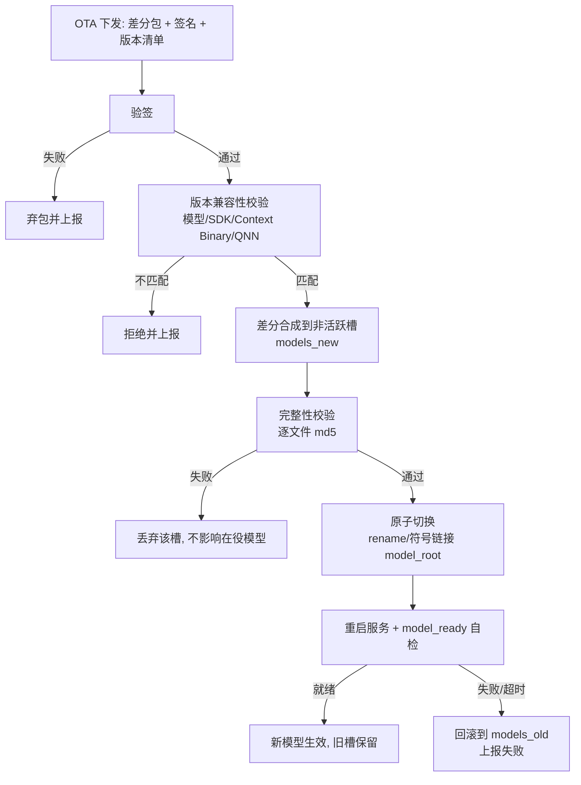
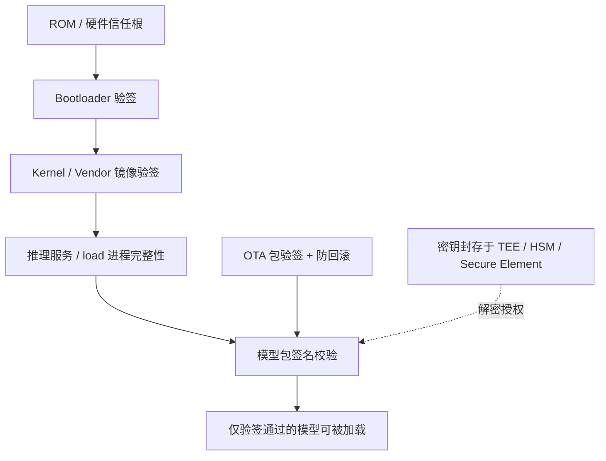

# 7. 运维、安全与功能安全

*设备安装 · 系统升级 · SELinux · 功能安全 · 数据隐私 · OTA / 模型加密 / 信任链设计 · 常用排查命令*

> [!TIP]
> **本篇讲什么**
>
> 岚图 8397 座舱 VLM 上机的**运维实操**与**安全 / 功能安全**两条线：
>
> - 设备安装与上机前置检查
> - 系统升级（刷机 / OTA）
> - SELinux（上机第一坑）
> - 功能安全（ISO 26262 / SOTIF）——遗留儿童检测是安全相关功能
> - 数据隐私（PIPL / GDPR）——舱内相机拍乘员
> - OTA 升级、模型加密与密钥管理、信任链的设计目标
> - 常用排查命令速查
>
> **分层说明（务必区分）**：
>
> - **上机实操**（第 1 / 2 / 3 / 9 节）：真实落地的运维记录，可直接照做。
> - **安全分析**（第 4 / 5 节）：基于已核实代码事实的分析与风险识别，结论可信，但对应的安全机制**尚未在车端实现**。
> - **设计目标 / future work**（第 6 / 7 / 8 节）：OTA、模型加密、信任链目前是**设计草稿，尚未落地实现**，此处按「量产应有形态」补全到可评审的深度，但仍是目标而非现状。

## 1. 设备安装与上机前置

- **硬件安装**：接线、水冷安装、USB 云机挂载
- **上机前置检查**（顺序固定）：
  - `getenforce` 确认 SELinux 状态（demo 需 Permissive，见第 3 节）
  - `adb shell curl 127.0.0.1:8090/v1/models` 确认服务端能看到模型
  - 再看 app `/health`；等就绪要 grep `"model_ready":true`（**不能只 grep `model_ready`**——它在 `false` 时也命中，会误判就绪）

## 2. 系统升级

- PCAT 刷机
- OTA 升级（模型级 OTA 的设计目标见第 6 节）

## 3. SELinux（上机第一坑）

- `/AI` 标签 `u:object_r:AI_file:s0`，策略不允许 `untrusted_app` 域 search/getattr
- 症状只有 Java 侧一句 `Model directory NOT FOUND`，而 `adb shell`（root）看得见目录、md5 全对，**极易误判成「模型没放好」或「我改坏了路径」**
- demo 需 `setenforce 0`（**重启后失效**）
- 详见 [设备部署与上车流程](device-deployment.html) §2.4 的 SELinux 对比（`android_test` 以 shell/root 跑无此问题，APK 以 `untrusted_app` 跑就撞墙）

> [!WARNING]
> **`setenforce 0` 是全局 Permissive，不是精细放行**
>
> `setenforce 0` 把**整机** SELinux 切到 permissive——所有域的强制策略全部失效，只为放行一个 `untrusted_app → AI_file` 就把整条强制链拆了。demo 阶段可接受，但它是「大锤」，不是方案。更精细的替代（量产方向，未落地）：
>
> - **自定义策略**：只给 app 所在域补一条 `allow <app域> AI_file:dir { search getattr open read }`，其余策略不动；
> - **独立域**：让该 app 不跑在 `untrusted_app`，而是定义专属 sepolicy 域，按最小权限授权。

> [!NOTE]
> **「量产 App 是 system/vendor 应用就不受限」偏乐观**
>
> system/vendor 应用跑在 `system_app` / vendor 域，权限面确实比 `untrusted_app` 大，但**不等于自动免疫**——它仍然需要：① `/AI` 目录带上正确的 file context；② 对应域策略里有对该 context 的放行规则。换了签名/预装位置只是换了域，file context 与 allow 规则这两件事一件都省不掉。上机前仍要按第 1 节流程实测可见性，不能想当然。

## 4. 功能安全（ISO 26262 / SOTIF）

> [!IMPORTANT]
> **本节是全组此前零覆盖的最大空白。** 遗留儿童检测是**安全相关功能**，但项目目前只有「效果指标」（effect-performance 篇 Recall 95.4%），没有任何安全目标、失效分析或降级策略的正式产出。以下按「量产应有形态」补出框架，**均为设计目标，未落地**。

### 4.1 为什么是安全相关功能

舱内遗留儿童检测一旦漏检，后果是儿童被单独遗留车内、高温下可能发生热伤害甚至死亡。这使它从「座舱便利功能」上升为**安全相关功能**，需要按功能安全的方法对待，而不是只看准确率/召回率。

已核实的现状数据（effect-performance 篇 §3.1，0817 报告）：

| 项 | 数值 | 安全含义 |
| :--- | :--- | :--- |
| 样本量 | 487（TP228 / TN248 / FP0 / FN11） | — |
| 准确率 | 97.7% | 高，但安全功能不看准确率 |
| **召回率** | **95.4%** | **约 4.6% 漏检，即约每 22 个在车儿童漏 1 个** |
| FP | 0 | 零误报对「宁误报勿漏报」的安全功能是好方向，但样本内 FP=0 偏理想，需在更大实车集复核 |

**核心矛盾**：报告里写「涉及安全，需极高召回率」，但实测 95.4% 的召回对一个以「避免儿童被遗留」为目标的功能而言**远远不够**——安全相关检测通常要求逼近 100% 的召回，且不能只靠单一感知通道。这个「指标现状」与「安全诉求」之间的缺口，正是功能安全要正式处理的对象。

### 4.2 安全目标（示例，需 HARA 确认）

> 以下为**示例性**安全目标，用于说明量产应建立的论证结构；正式 ASIL 定级必须走危害分析与风险评估（HARA），不能由本文档替代。

- **安全目标（示意）**：避免乘员（尤其儿童）在锁车后被遗留车内并遭受热伤害。
- **安全状态（示意）**：检测到遗留 → 触发报警 / 提醒车主 / 联动车窗或空调；功能不可用时 → 明确告知「保护未生效」，而不是静默当成「车内无人」。
- **ASIL 定级（示意判断）**：舱内遗留检测若仅做提醒，严重度高但暴露/可控性需实车评估；若联动车窗/空调/车门执行，则进入有 ASIL 等级的 E/E 功能范畴（此类场景常见 ASIL-B 量级，**非正式定级**）。

### 4.3 失效模式与影响分析（FMEA，示例框架）

| 失效模式 | 典型原因 | 影响 | 严重度 | 当前缓解 | 量产应有缓解 |
| :--- | :--- | :--- | :--- | :--- | :--- |
| **漏检（FN）** | 姿态/遮挡/光照、量化损失、长尾场景 | 儿童被遗留 | 高 | 仅靠模型召回 95.4% | 独立冗余传感（毫米波/超声）+ 更高召回目标 + 多帧确认 |
| **推理失败/超时** | native 卡死、NPU 独占、热降频 | 被空 JSON 当成「无儿童」 | 高 | 空 JSON 兜底（见 4.4） | 区分「功能不可用」与「无目标」，失败即上报降级 |
| **相机失效** | 遮挡/脏污/翻转/断电 | 图像无效 → 漏检 | 高 | 无 | 相机健康自检 + 失效告警 |
| **模型加载失败** | 路径/SELinux/权重损坏 | 功能不可用 | 中 | `model_ready` 检查 | 上电自检 + 降级提示 |
| **热降频** | 高温持续推理 | 超时/漏检 | 中 | 水冷台架 | 热降级策略与阈值 |
| **误判触发** | 对抗样本、强逆光 | 误报/漏报 | 中 | — | SOTIF 场景覆盖与验证 |

### 4.4 降级策略：空 JSON 兜底是「fail-dangerous」

genai 篇已实现「异常时传空 JSON 兜底，而非抛 Error 阻断主线程」——这对**稳定性**是对的（避免进程 Crash），但对**安全相关功能**方向反了：

> [!WARNING]
> **空 JSON = 「没检测到儿童」，推理失败被静默当成安全结论**
>
> 对遗留儿童检测，推理失败时返回空 JSON，上层会把它解读为「车内无儿童」——这是**fail-dangerous**（失效导向危险侧）。正确做法是把两类语义彻底分开：
>
> - **「无目标」**：推理正常完成，确实没看到儿童 → 可信结论；
> - **「功能不可用」**：推理失败/超时/模型未就绪 → 不能输出「无儿童」，必须上报**降级状态**，由上层决定告警、提示或切换到冗余传感。
>
> 即：**宁可报「功能降级」，不可报「确认无人」。**

### 4.5 ISO 21448（SOTIF）视角

遗留儿童检测是**感知类**功能，其风险不仅来自硬件随机失效（ISO 26262 管辖），更来自**性能不足与触发条件**（ISO 21448 / SOTIF 管辖）——漏检 FN=11 正是「性能不足」类风险。因此完整的量产安全论证需要两条线并行：

- **ISO 26262**：处理系统性失效与硬件随机失效（模型加载、NPU、供电等）；
- **ISO 21448（SOTIF）**：处理感知性能边界（遮挡、光照、姿态、长尾），通过场景覆盖、已知/未知不安全场景分析与验证来收敛风险。

> 本节结论：当前「传空 JSON」的降级只做到了稳定性兜底，**尚未上升到功能安全**；FN=11 / 召回 95.4% 的安全影响未被正式评估。以上框架是量产立项时必须补齐的安全论证骨架。

## 5. 数据隐私（PIPL / GDPR）

> [!IMPORTANT]
> 舱内相机拍摄的是**乘员本人**——包括儿童、衣着、体型（衣着识别还显式推断上衣厚度/身材特征）。这属于**个人信息**，儿童信息在多数法域还是**敏感个人信息**。项目目前没有任何隐私边界的正式产出，以下按量产应有形态列出风险点，**均为设计目标，未落地**。

### 5.1 适用法规

- **中国《个人信息保护法》（PIPL）**：处理个人信息需合法性基础、最小必要、明示告知；敏感个人信息（含不满十四周岁未成年人信息）需单独同意与更严保护。
- **欧盟 GDPR**（若车型出海）：生物特征/健康相关推断、数据最小化、存储限制、数据主体权利。

### 5.2 必须回答的边界问题

| 问题 | 关注点 | 现状 |
| :--- | :--- | :--- |
| **图像是否离车** | 舱内图是否上传云端/回传？端侧推理的价值之一正是「图不出车」，需明确并守住 | 未见明确结论，需核实 |
| **保留多久** | 原始帧/特征保留时长，是否即用即弃 | 未见保留策略 |
| **日志是否落图** | 排查日志（如 `image path:`、base64）是否把图像或可还原数据写进日志文件 | 需核查日志内容，避免日志成为图像泄露面 |
| **传输边界** | base64 图像经 HTTP 传输的监听面与加密 | 见 5.3 |

### 5.3 传输与暴露面（已核实的风险点）

- **genai 形态**：APK 侧 HTTP 服务监听 `0.0.0.0:8080`——绑到**所有网卡**，意味着同网段的任意设备都可能访问这个能消耗 NPU、且承载舱内图像的推理端点，且无鉴权。量产应收敛为仅回环或加鉴权/SELinux 域限制。
- **aiservice 形态**：`VoyahAIService` 监听 `127.0.0.1:8090`，仅回环，暴露面小得多——两形态的网络安全姿态**不一致**，迁移时应以 aiservice 的回环绑定为基线。
- **base64 明文经 HTTP**：即便仅本机回环，base64 只是编码不是加密；若未来跨进程/跨域传输，需明确加密与鉴权。

> 本节结论：端侧推理天然具备「图像不出车」的隐私优势，但**优势要靠明确的边界声明守住**——离车与否、保留时长、日志落图、传输加密，这四项必须逐条给出结论并写进对外说明，而不是默认「反正在端侧」。

## 6. OTA 升级（设计目标，未落地）

> [!NOTE]
> 现状草稿只有「提供所有模型文件 md5 → 升级前计算匹配 → 下载差异资源包 → 固定位置读取替换」。这对车规模型 OTA **过于 naive**：模型权重根目录 `/AI/VLM/models`、单个模型包动辄数百 MB，直接「原地替换」既不原子也不安全。下面补全车规 OTA 的必需件。aiservice 篇 §5.2 已提到**服务端存在 OTA 双槽 `models_new/_old`**，这是现成的落点，应纳入设计。

### 6.1 现状草稿为什么不够

- **非原子**：原地替换中途掉电，会留下「半新半旧」的模型目录，推理直接起不来，近似变砖；
- **无回滚**：新模型加载失败后没有退路；
- **无版本兼容性校验**：模型、SDK、Context Binary、QNN 版本四者强耦合，错配会在加载期才炸；
- **无验签 / 无防回滚**：包可被篡改、可被降级到有漏洞的旧版；
- **全量替换昂贵**：模型巨大，每次全量下载不现实。

### 6.2 车规 OTA 必需件

| 必需件 | 要解决的问题 | 设计要点 |
| :--- | :--- | :--- |
| **原子性 / 断电安全** | 替换中途掉电变砖 | 绝不在生效目录原地写；先写临时/备用槽，校验通过后一次切换 |
| **A/B 双槽 + 回滚** | 新包坏了要能退 | 复用服务端 `models_new/_old` 双槽：下载到非活跃槽 → 校验 → 原子切换（rename/符号链接）→ 保留旧槽作回滚 |
| **版本兼容性校验** | 模型 vs SDK vs Context Binary vs QNN 错配 | 随包携带版本清单（manifest），激活前比对兼容矩阵，不匹配直接拒绝 |
| **包签名验签** | 防篡改 | 包需签名，安装前验签，验签失败即弃包 |
| **防回滚（anti-rollback）** | 防降级到有漏洞旧版 | 单调版本号/回滚计数，拒绝低于当前最小版本的包 |
| **差分更新** | 模型巨大，全量昂贵 | 按文件 md5 定位差异 + 差分包（如 bsdiff），只下增量 |

### 6.3 目标升级流程（A/B 双槽）

> 关键不变量：**任何时刻生效目录要么是完整旧包、要么是完整新包，绝不出现中间态**；切换动作本身是一次原子 rename/链接翻转，掉电可恢复。

## 7. 模型加密与密钥管理（设计目标，未落地）

> [!NOTE]
> 现状草稿是「bin 打包成 img → load 进程 mount 得到 bin → 控制访问权限 / fd 传递」。这只解决了**路径暴露**，**完全没有回答密钥从哪来、用什么算法、以及解密后的「用态」怎么保护**——而密钥管理才是模型 IP 保护里最难、也最缺失的一块。

### 7.1 现状草稿（路径隔离）

- **打包工具**：将 bin 打包成 img（创建一个稍大的文件，再利用加密算法）
- **load 进程**：加载 img、mount 得到 bin、控制访问权限（shell 不可见）；结束时 umount
- **VLM 推理进程访问 bin 的两种方式**（二选一，待结合量产权限模型确认）：

| 方案 | 做法 | 优劣 |
| :--- | :--- | :--- |
| **固定路径** | 经 load 进程挂载后的固定路径访问，配合 SELinux/文件权限，仅 VLM 进程域可读、shell 域不可见 | 实现简单，但依赖 SELinux 域隔离 |
| **fd 传递** | 由 load 进程通过 fd（文件描述符）经 IPC 传递给 VLM 进程，bin 路径完全不暴露 | 隔离性更强，但需 load 与 VLM 进程建立 IPC 通道 |

### 7.2 诚实边界：这其实是「SELinux 域隔离」，不是「加密」

> [!WARNING]
> **mount 解密后，bin 以明文进 page cache，对同域进程是明文**
>
> img 经 mount 解密后，得到的 bin 会进入内核 page cache——**对任何落在同一 SELinux 域、或有足够权限的进程，它就是明文**。所谓「加密」实际退化成「靠 SELinux 域隔离挡住别人」。fd 传递也只是不暴露路径，fd 背后指向的仍是解密后的明文页。
>
> 因此：**真正的模型 IP 保护，要求解密密钥永不离开安全存储、或解密发生在 TEE 内部**，而不是在 normal-world 的 load 进程里解密后靠域隔离兜底。

### 7.3 密钥管理（最难的缺失，future work）

| 维度 | 现状 | 量产应有形态 |
| :--- | :--- | :--- |
| **密钥从哪来** | 未定义 | 硬件信任根：TEE / HSM / Secure Element 派生或封存，不落 normal-world 明文 |
| **信任链** | 未定义 | 依托 secure boot 信任链，仅校验通过的 load 进程可请求解密（见第 8 节） |
| **算法** | 「加密算法」未指明 | 明确对称算法与模式（如 AES-GCM），密钥派生用 KDF 绑定设备/版本 |
| **用态保护** | 明文进 page cache | 解密尽量移入 TEE；或进程内解密 + 即用即清，缩短明文驻留窗口 |
| **密钥提取防护** | 未考虑 | load 进程防 dump / 防 ptrace，密钥只在安全边界内使用 |

> 本节结论：现有 img/mount/fd 方案是「路径与域隔离」层面的设计，**可作为第一步**；但要达到「模型 IP 不被提取」的目标，必须补上密钥管理（TEE/HSM 信任根 + 算法 + 用态保护），这部分目前完全空白，列为 future work。

## 8. 信任链（Secure Boot → 模型签名 → OTA 验签）

> [!NOTE]
> 模型加密（第 7 节）与 OTA 验签（第 6 节）都依赖一条从硬件到模型的**信任链**。项目目前没有任何信任链产出，以下为量产应有的目标形态，**未落地**。

- **Secure boot / verified boot**：逐级验签，任何一级镜像被篡改则中止启动，保证 load 进程与推理服务本身可信；
- **模型签名**：模型包作为被加载的「代码/数据」，同样要签名并在加载前验签，与 OTA 包验签共用一套信任根；
- **OTA 包验签 + 防回滚**：见第 6.2 节，是信任链在升级通道的延伸；
- **解密授权**：只有信任链校验通过的 load 进程，才有资格向 TEE/HSM 请求模型解密密钥（呼应第 7.3 节）。

> 本节结论：信任链把「谁可以解密模型、谁可以加载模型、谁可以升级模型」收敛到同一条可验证的链上。当前这一整条链在车端**尚未建立**，是模型加密与 OTA 两项设计能真正成立的前提。

## 9. 常用排查命令

| 用途 | 命令 |
| :--- | :--- |
| SELinux 状态 | `getenforce` |
| 服务端模型可见性 | `adb shell curl -s 127.0.0.1:8090/v1/models` |
| 重启 AIService 服务 | `adb shell setprop ctl.restart vendor.VoyahAIService` |
| 模型是否真生效（硬证据） | `adb shell cat /proc/<pid>/maps`（看 lora `.bin` 真实路径，`loaded` 不等于生效） |
| DSP/NPU 显存占用 | `adb shell dmabuf_dump <pid>` |
| 进程 CPU 侧内存 | `adb shell dumpsys meminfo <pid>` |
| FastRPC / cDSP 内核日志 | `adb -s $D shell "dmesg \| grep -iE \"fastrpc\|cdsp\" \| tail -20"` |
| 本机联调（免写设备临时文件） | `adb forward tcp:18080 tcp:8080` 后从本机 curl |
