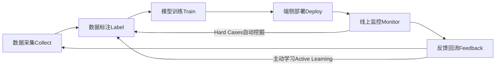
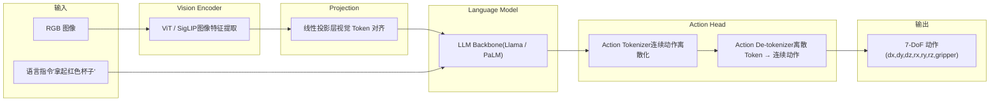
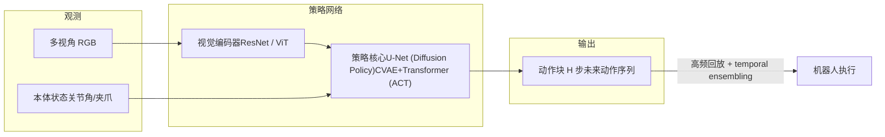
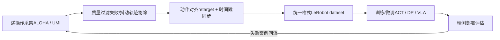
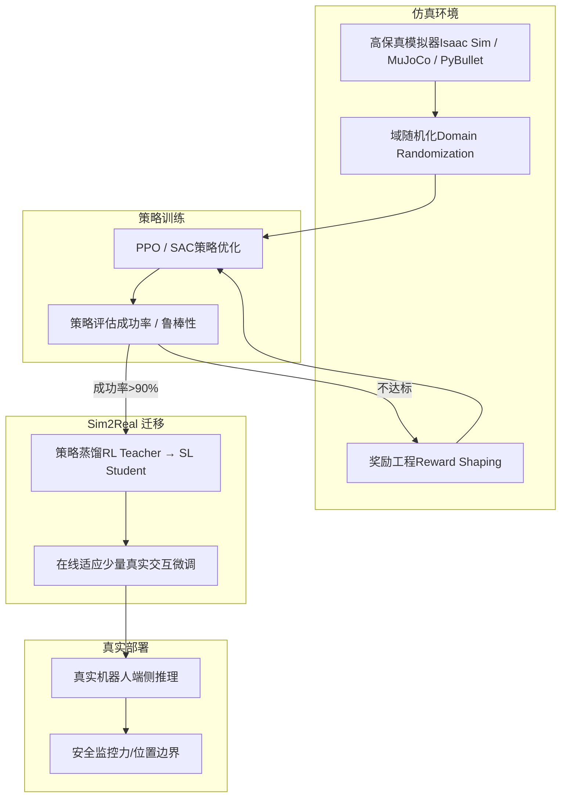
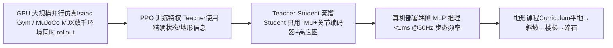
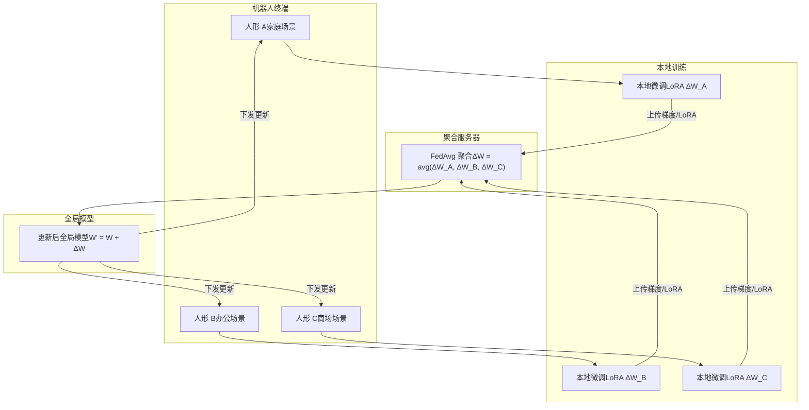
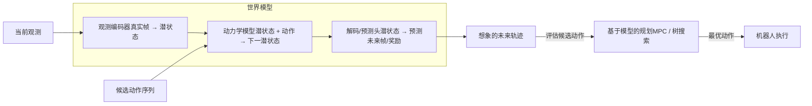

# 2. 感知与 VLA 训练

*机器人感知训练、VLA 与策略模型版图、遥操作数据管线、强化学习 Sim2Real、持续学习与世界模型*

> [!TIP]
> **本篇讲什么**
>
> 具身/人形机器人端侧 AI 的「算法层」，具身通识系列第 2 篇（共 4 篇）：
>
> - **感知模型训练**：数据飞轮、Few-shot 适配、Sim2Real 迁移策略
> - **VLA 模型**：架构解析、2024-2026 开源 VLA 版图（OpenVLA / π0 / GR00T N1 / RDT-1B / Helix）、边缘压缩 Pipeline
> - **扩散策略与 ACT**：与 VLA 并列的策略族，理解 VLA 动作头的前置知识
> - **遥操作与数据管线**：ALOHA / UMI / GELLO，真机数据是模仿学习的最大瓶颈
> - **强化学习与 Sim2Real**：策略蒸馏、域随机化、足式步态 RL
> - **持续学习与在线适应**：增量学习、灾难性遗忘、边缘联邦学习
> - **世界模型**：GAIA / Genie / UniSim / Dreamer 类模型与基于世界模型的规划
>
> 其余三篇：[端侧算力与框架](platforms.md)、[端侧部署与实时控制](deployment.md)、[端侧 Embodied Agent](embodied-agent.md)。

> [!NOTE]
> **数据口径**：本篇参数量、模型结构等为**公开数据**；推理延迟、成功率等性能数字一律为**示例参数**，仅用于演示方法，不代表实测。端侧 LLM 推导统一以公开真实模型 **Qwen3-4B**（36 层、32 Q head、8 KV head、head\_dim 128）为锚点，详见 [Embodied Agent 篇](embodied-agent.md)。

## 1. 机器人感知模型训练

### 1.1 数据飞轮

机器人感知系统的核心竞争力不在单次模型训练的精度，而在于**数据飞轮的转速**。一个高效运转的数据飞轮能够持续提升模型性能，自动发现和修复 corner case。



### 1.2 Few-shot 学习与快速适配

机器人在新环境部署时，经常遇到训练集中不存在的物体。Few-shot 学习允许用少量样本（5-20 张图）快速适配新类别：

| 方法 | 样本需求 | 适配时间 | 精度 | 是否需端侧训练 | 适用场景 |
| :--- | :--- | :--- | :--- | :--- | :--- |
| **Metric Learning** | 5-10 shot | 即时推理 | 中等 | 否（特征比对） | 物体识别 |
| **Prompt Tuning** | 1-5 shot | 即时推理 | 中-高 | 否（文本引导） | 开放词汇检测 |
| **LoRA 微调** | 10-50 | 5-30 min | 高 | 可选 (边缘训练) | 精度敏感任务 |
| **域适应 (Domain Adaptation)** | 无标注 (目标域) | 1-4 hours | 中-高 | 通常云端 | 光照/场景迁移 |

### 1.3 Sim2Real 迁移策略

仿真数据几乎无限且标注免费，但"仿真-现实差距"（Sim2Real Gap）是落地的最大障碍。核心策略：

| 策略 | 原理 | 效果 | 代价 |
| :--- | :--- | :--- | :--- |
| **域随机化 (DR)** | 在仿真中随机化纹理、光照、物理参数 | 提高泛化性 | 仿真时间增加 2-5x |
| **域适应 (DA)** | 对抗训练对齐仿真/真实特征分布 | 减少分布偏移 | 需少量真实数据 |
| **渐进式迁移** | 仿真预训练 → 小规模真实微调 | 最优精度 | 需要真实标注数据 |
| **Photo-realistic Sim** | 使用高保真渲染器 (Isaac Sim, Habitat) | 缩小视觉差距 | GPU 资源消耗大 |

> [!TIP]
> **数据质量 > 数据数量**
>
> 在机器人感知领域，**500 张高质量标注 > 50000 张噪声标注**（经验法则）。高质量意味着：标注边界精确、覆盖多样场景、包含典型 hard case。建议投入 60% 的数据预算在质量控制上，而非单纯扩大数量。自动标注工具（如 SAM + CLIP 自动标注流水线）可以在保持质量的同时降低成本。

## 2. VLA 模型训练与适配

### 2.1 VLA 架构解析

Vision-Language-Action (VLA) 模型将视觉理解、语言理解和机器人动作生成统一到一个端到端框架中。核心思想是将机器人动作"token 化"（或用扩散/流匹配头直接生成连续动作），使大模型能够直接输出机器人控制指令。



动作头有三种主流形态，直接决定推理频率与端侧可行性：

| 动作头形态 | 代表模型 | 生成方式 | 特点 |
| :--- | :--- | :--- | :--- |
| **离散 Action Token** | RT-1 / RT-2 / OpenVLA | 自回归逐 token 解码（每维约 256 bins） | 复用 LLM 词表与解码器，但多步解码慢 |
| **扩散头 (Diffusion)** | Octo / RDT-1B / GR00T N1 | 迭代去噪生成动作块 | 多模态动作分布，去噪步数是延迟旋钮 |
| **流匹配 (Flow Matching)** | π0 / π0.5 | 少量积分步生成动作块 | 比 DDPM 去噪更快，适合 50Hz 级输出 |

### 2.2 主流 VLA 模型版图

端侧部署的关键挑战是将 VLA 模型压缩到可接受的规模，同时保持操作精度。参数量为公开数据；「端侧前景」为定性判断（实际还取决于动作头形态、推理频率需求与量化容忍度）。

> [!NOTE]
> 参数量跨越 35M 到 55B 三个数量级，线性图表无法同屏呈现（mermaid xychart 也不支持对数坐标），故按**部署档位**分段列表。

**云端档（端侧不可直接部署，只能蒸馏/微调后下沉）**

| 模型 | 机构 | 参数量 | 骨干 / 动作头 | 说明 |
| :--- | :--- | :--- | :--- | :--- |
| RT-2 | Google DeepMind | 12B / 55B | PaLM-E 或 PaLI-X + 离散 action token | 首个「VLM 直接输出动作」的规模化验证；55B 版即 RT-2-X（跨本体） |
| OpenVLA | Stanford 等 | 7B | Llama-2 + DINOv2/SigLIP 双视觉编码器，离散 action token | 开源研究基线，Open X-Embodiment 数据训练；16GB+ 端侧 INT4 勉强可跑，主要作微调起点 |

**中量级开源档（量化后端侧可部署）**

| 模型 | 机构 | 参数量 | 骨干 / 动作头 | 说明 |
| :--- | :--- | :--- | :--- | :--- |
| π0 / π0.5 | Physical Intelligence | ~3B | PaliGemma + 流匹配动作专家 (~300M) | 约 50Hz 动作块输出；π0.5 强化高层推理与开放环境泛化 |
| GR00T N1 | NVIDIA | ~2B | 双系统：低频 VLM 推理 (System 2) + 高频扩散动作头 (System 1) | 面向人形机器人，Jetson 平台部署，合成+人类视频+遥操作混合训练 |
| RDT-1B | 清华 | ~1.2B | 双臂扩散 Transformer | 双臂操作，多机器人数据预训练 |

**端侧档（可在 Orin 级平台实时运行）**

| 模型 | 机构 | 参数量 | 骨干 / 动作头 | 说明 |
| :--- | :--- | :--- | :--- | :--- |
| Octo | UC Berkeley | 27M / 93M | Transformer + 扩散动作头 | Open X-Embodiment 预训练的通用小策略，端侧微调友好 |
| RT-1 | Google | 35M | EfficientNet + TokenLearner，离散 action token | 早期基线（2022），证明 Transformer 策略规模化可行 |
| Helix (S1) | Figure | ~80M (S1) + 7B (S2) | 双系统：S2 VLM 约 7-9Hz 理解场景，S1 视觉运动策略 200Hz 出动作 | 「大模型低频想 + 小模型高频动」的分频形态，是端侧人形操作的代表性工程答案 |

> [!TIP]
> **看懂版图的三个要点**
>
> 1. **参数量只是端侧可行性的第一代理指标**：动作头形态（离散 token 自回归 vs 扩散/流匹配）对推理频率的影响不亚于参数量。
> 2. **双系统架构成为共识**：GR00T N1、Helix、π0（高层推理 + 动作专家）都收敛到「低频大模型给意图、高频小模型出动作」，与实时控制的分频架构（见 [部署篇](deployment.md)）天然对齐。
> 3. **开源生态入口**：HuggingFace LeRobot 统一了数据集格式与训练脚本，OpenVLA / π0 / Octo / RDT 均有开源权重或复现，端侧实验从这里起步成本最低。

### 2.3 边缘压缩 Pipeline

将云端 VLA 模型压缩到端侧可运行的规模，需要多阶段联合优化：

| 阶段 | 技术 | 压缩率 | 精度损失 | 说明 |
| :--- | :--- | :--- | :--- | :--- |
| 1. 结构化剪枝 | 移除注意力头、FFN 通道 | 2-4x 参数减少 | 3-8% | 需要微调恢复精度 |
| 2. 知识蒸馏 | 大模型 Teacher → 小模型 Student | 5-10x 参数减少 | 2-5% | 学习中间表征效果更好 |
| 3. 量化 | INT8/INT4 权重量化 | 2-4x 内存减少 | 0.5-2% | PTQ 通常即可 |
| 4. 算子融合 | Attention + LayerNorm 融合 | 1.3-2x 速度提升 | 0% | 框架级优化 |

> [!WARNING]
> **VLA 端侧部署的现实挑战**
>
> 小型 Transformer VLA（几十 M 级，如 Octo 93M）在 Orin 级平台上单帧推理通常在几十至上百 ms 量级（示例口径，需按你的模型与平台实测），勉强满足 5-10Hz 的控制频率要求；要达到 30Hz+ 实时灵巧操作，需进一步压缩模型或改用双系统分频架构。**Action Chunking**（一次预测多步动作）是当前最有效的缓解策略 —— 模型以 5Hz 重规划、每次输出未来 10 步动作，执行器在 chunk 间隔内以 50Hz 回放动作序列。注意：这只提高**执行平滑度**，反应性仍受 5Hz 重规划频率限制；配合 **temporal ensembling**（对重叠 chunk 的预测做指数加权平均）是 ACT 的标准做法，能同时改善平滑性与反应性。

## 3. 扩散策略与 ACT

### 3.1 与 VLA 并列的策略族

Diffusion Policy 与 ACT 是**不依赖大语言模型骨干**的模仿学习策略族：直接学习「观测 → 动作块」映射，通常不带语言输入（或以语言 embedding 为条件）。它们是理解 VLA 动作头的前置知识 —— π0 的流匹配头、Octo/RDT/GR00T N1 的扩散头，本质都是把这一族的技术装进了 VLA。



### 3.2 三种策略形态对比

| 策略形态 | 代表工作 | 动作生成方式 | 优点 | 局限 | 端侧友好度 |
| :--- | :--- | :--- | :--- | :--- | :--- |
| **行为克隆 (BC)** | 经典 MLP/CNN 策略 | 单步回归 (MSE) | 最简单、推理最快 | 多模态动作被平均、误差累积 | 高 |
| **ACT** | ALOHA (Zhao et al.) | CVAE + Transformer，一次出动作块 | 双臂精细操作（穿线、开柜），动作块抑制误差累积 | 每任务需专门演示数据 | 高 |
| **Diffusion Policy** | Chi et al. | DDPM/DDIM 迭代去噪生成动作块 | 天然表达多模态动作分布、轨迹平滑 | 去噪迭代引入延迟，需减步数 | 中-高 |
| **VLA** | OpenVLA / π0 等 | 自回归 token / 扩散 / 流匹配 | 语言泛化、跨任务 | 模型大、频率低 | 中-低（压缩后） |

### 3.3 端侧部署要点

- **去噪步数是延迟旋钮**：DDPM 原始需上百步，端侧用 DDIM 采样压到 5-10 步，或用一致性蒸馏（Consistency Distillation）做到 1-2 步；π0 选流匹配正是因为它天然少步数。
- **动作块长度 H 的权衡**：H 大 → 推理频率需求低但反应迟钝；H 小 → 反应快但推理压力大。典型 H 为 8-64 步（示例口径），配合 temporal ensembling 使用。
- **训练数据需求**：单任务通常 50-200 条高质量演示即可收敛（经验值），远小于 VLA 预训练需求 —— 这是「小模型 + 专用任务」路线在端侧仍占优的根本原因。

## 4. 遥操作与真机数据管线

### 4.1 为什么遥操作是 VLA 的命门

模仿学习类模型（ACT / Diffusion Policy / VLA 微调）的上限由**真机演示数据**决定：仿真数据有 Sim2Real gap，人类视频没有动作标签。遥操作（teleoperation）是用低成本方式采集「观测-动作」配对数据的标准手段，其质量与规模直接决定策略性能。

### 4.2 主流遥操作方案

| 方案 | 代表系统 | 原理 | 成本 | 数据特点 |
| :--- | :--- | :--- | :--- | :--- |
| **主从同构臂** | ALOHA / Mobile ALOHA | 操作员拖动 leader 臂，follower 臂实时关节映射 | 中（两套同构臂） | 动作标签精确、可达 50Hz，双臂精细操作数据的事实标准 |
| **手持夹爪采集** | UMI | 手持 3D 打印夹爪 + GoPro 鱼眼相机，人直接在环境中采集，事后 SLAM 恢复位姿并 retarget 到机器人 | 低 | 摆脱机器人本体限制，可众包大规模采集；retarget 误差是主要噪声源 |
| **外骨骼映射** | GELLO | 低成本外骨骼式 leader 装置，关节一一对应 | 低 | 适合单臂操作，直觉性好 |
| **VR / 手柄遥操作** | Quest + 逆运动学 | 头显/手柄位姿 → IK 解算机械臂 | 低 | 位姿级控制，适合导航与粗操作，精细操作数据质量一般 |
| **人类视频学习** | Ego4D 类数据 | 第一视角视频 + 动作推断 | 极低（现成数据） | 无机器人动作标签，需动作重定向/推断，多用于预训练（如 GR00T N1） |

### 4.3 真机数据管线



关键工程点：

1. **统一数据格式**：HuggingFace **LeRobot** 已成为开源机器人数据的事实标准格式；跨本体大规模数据可参考 **Open X-Embodiment**（22 种机器人本体、百万级轨迹，RT-X / Octo / OpenVLA 的预训练底座）。
2. **动作对齐比数据量更关键**：遥操作记录的动作与机器人实际执行存在延迟与坐标系差异，时间戳错位会系统性污染策略（与传感器时间同步是同一类问题，见 [部署篇](deployment.md)）。
3. **数据规模经验值**：单任务 BC 约 50-200 条演示；跨任务泛化策略需要数万至百万级轨迹的混合数据集 —— 这正是「通用 VLA 是云端游戏、端侧做专用小策略」格局的数据侧原因。

## 5. 强化学习与 Sim2Real

### 5.1 RL 训练流程总览

机器人强化学习的核心难点在于样本效率和安全性 —— 真实机器人不可能像游戏 AI 那样试错百万次。因此，"仿真训练 + Sim2Real 迁移" 成为标准范式。



### 5.2 策略蒸馏：RL Teacher → SL Student

RL 策略通常是大型神经网络，且依赖仿真中的特权信息（如精确物体位姿）。策略蒸馏将其压缩为可在端侧运行的轻量模型，同时去除对特权信息的依赖：

```
# 策略蒸馏伪代码
# 1. 收集 Teacher 轨迹
teacher_policy = load_rl_policy("ppo_grasp_v3.pt")  # 大模型, 使用特权信息
trajectories = []
for episode in range(10000):
    obs_privileged = env.get_privileged_obs()  # 包含精确位姿
    obs_student = env.get_visual_obs()          # 仅 RGB 图像
    action = teacher_policy(obs_privileged)
    trajectories.append((obs_student, action))

# 2. 训练 Student (行为克隆)
student_policy = LightweightCNN(input="RGB", output="7DoF_action")
for obs, action in DataLoader(trajectories):
    pred_action = student_policy(obs)
    loss = F.mse_loss(pred_action, action)  # + 正则项
    loss.backward()
```

### 5.3 域随机化技术

域随机化通过在仿真中引入大范围的环境变化，迫使策略学习不依赖特定视觉/物理特征的鲁棒行为：

| 随机化类型 | 随机化参数 | 典型范围 | 对 Sim2Real 的影响 |
| :--- | :--- | :--- | :--- |
| **视觉随机化** | 纹理、光照方向/强度、相机位姿、背景 | 纹理:随机图案, 光照:0.2-5x, 相机:±10cm/±5° | 消除视觉域偏差，最关键 |
| **动力学随机化** | 摩擦系数、物体质量、关节阻尼 | 摩擦:0.1-2.0, 质量:0.5-2x, 阻尼:0.8-1.2x | 适应真实物理参数不确定性 |
| **物理随机化** | 重力方向微扰、仿真步长、接触刚度 | 重力:±5%, 步长:1-4ms | 提高对仿真器误差的鲁棒性 |
| **任务随机化** | 目标位置、初始构型、障碍物布局 | 全工作空间采样 | 提高泛化能力 |

### 5.4 足式与人形步态 RL

四足/人形行走是当前 RL Sim2Real 最成功的落地场景，已形成标准范式：



关键要素：

- **奖励设计**：速度指令跟踪 + 能耗/平滑性正则 + 存活奖励；奖励工程占调试时间的大头。
- **随机化重点与操作任务不同**：足式更依赖**动力学随机化**（质量、摩擦、电机延迟、推力扰动），视觉随机化次之。
- **执行器建模是成败关键**：电机延迟、齿轮背隙、力矩饱和必须显式建模或随机化，否则真机步态发散。
- **端侧形态**：蒸馏后的 Student 策略通常只是几层 MLP，推理开销可忽略 —— 与 VLA 的算力困境形成鲜明对比，这也是「RL 管腿、VLA 管手」成为人形机器人常见分工的原因。

> [!CAUTION]
> **Sim2Real Gap 是第一大挑战**
>
> 即使使用了全面的域随机化，仿真中的高成功率在真实世界通常要打明显折扣（经验上 95% 仿真成功率对应真机 60-80%，示例口径）。差距主要来自：**接触物理建模不准确**（软物体、柔性物体）、**传感器噪声模型不完善**（深度相机在反光表面失效）、**执行器延迟和响应差异**。最有效的弥补方法是在真实环境中进行少量（50-200 episodes）的微调适应。

## 6. 持续学习与在线适应

### 6.1 端侧增量学习

人形/具身机器人进入用户家中后，会不断遇到新物体和新场景。端侧增量学习允许机器人在不回传数据的情况下持续提升能力：

| 能力 | 技术方案 | 计算开销 | 内存开销 | 适用性 |
| :--- | :--- | :--- | :--- | :--- |
| 新物体识别 | 特征库扩展 + Nearest Neighbor | 极低（前向推理） | 每物体约 2KB | 所有平台 |
| 新场景适应 | Batch Norm 统计量更新 | 低（仅统计量） | 可忽略 | 所有平台 |
| 新技能学习 | LoRA 微调 + Replay Buffer | 中（需 GPU） | LoRA 约 1-5MB | Orin 级别 |
| 偏好学习 | 人类反馈 (RLHF-lite) | 中（在线更新） | 反馈缓冲区约 10MB | Orin 级别 |

### 6.2 灾难性遗忘缓解

增量学习的核心问题是**灾难性遗忘** —— 学习新任务时遗忘旧任务。三种主流缓解策略：

| 方法 | 原理 | 额外存储 | 计算开销 | 效果 |
| :--- | :--- | :--- | :--- | :--- |
| **EWC (Elastic Weight Consolidation)** | 用 Fisher 信息矩阵约束重要权重 | 与模型参数等大 | 中等 | 对简单任务序列有效 |
| **Experience Replay** | 保存旧任务小样本，混合训练 | Replay Buffer (50-500 样本) | 低 | 最实用、效果稳定 |
| **Progressive Networks** | 为新任务添加新列，通过横向连接复用旧知识 | 线性增长 | 推理时增加 | 无遗忘，但不可扩展 |

### 6.3 边缘联邦学习

多台机器人在不共享原始数据的前提下协同提升模型性能。这对进入家庭的人形机器人尤其重要 —— 用户隐私数据（家庭布局、个人物品）绝不能上传。



> [!NOTE]
> **隐私保护学习对家用人形至关重要**
>
> 进入家庭的人形机器人处理的数据包含**家庭成员面孔、居住布局、生活习惯**等高度隐私信息。联邦学习 + 差分隐私是当前最实用的技术组合：仅上传模型梯度更新（而非原始数据），并在梯度上添加可控噪声。LoRA 微调天然适合联邦学习 —— 上传的参数量仅为全量模型的 0.1-1%，通信带宽可控。

## 7. 世界模型

### 7.1 什么是世界模型

世界模型（World Model）是从数据中学习的**环境动力学模型**：给定当前状态（或观测）与候选动作，预测未来观测、状态或奖励 —— 相当于机器人脑内的「想象引擎」。它与策略模型互补：策略回答「现在该做什么」，世界模型回答「做了之后会发生什么」。



### 7.2 三条技术路线与代表工作

| 路线 | 代表工作 | 形态 | 用途 | 端侧相关性 |
| :--- | :--- | :--- | :--- | :--- |
| **视频生成式** | UniSim、Genie / Genie 2、Sora 类 | 大规模视频扩散/自回归模型，生成可交互的逼真未来帧 | 合成训练数据、策略预训练环境、评估「如果这样做画面会怎样」 | 云端为主，推理成本远超端侧预算 |
| **驾驶/具身场景式** | GAIA-1 (Wayve)、DriveDreamer、Vista | 领域视频世界模型，条件于动作/布局生成驾驶场景 | 长尾场景生成、闭环仿真评估 | 云端为主 |
| **潜空间动力学式** | Dreamer 系列 (DreamerV3)、TD-MPC2、IRIS | 紧凑潜空间模型 + 想象 rollout + 规划/策略学习 | 样本高效 RL、基于模型的规划（在潜空间评估候选动作序列） | **端侧最相关**：模型小（MLP/CNN 级），TD-MPC2 类可在嵌入式平台做短时程 MPC |

### 7.3 世界模型驱动的规划与训练

两种落地用法：

1. **基于模型的规划（Model-Based Planning）**：在潜空间对多条候选动作序列做想象 rollout，用预测奖励选最优（TD-MPC2 的 MPPI 式采样、Dreamer 的想象训练）。相比无模型 RL，样本效率高一到两个数量级（公开论文口径）。
2. **数据与训练引擎**：Genie 类可交互环境让策略在「生成的世界」里预训练；UniSim 类模型可作为神经仿真器评估策略，弥补物理仿真器的视觉失真。

> [!CAUTION]
> **诚实边界**
>
> 视频生成式世界模型目前**远未达到实时闭环控制**的要求（生成一帧的成本以秒计），「用世界模型直接驱动端侧机器人」仍处早期研究阶段。端侧可落地的形态是：轻量潜空间动力学模型做短时程规划（100ms-1s 视野），长时程预测与数据生成留在云端。面试或方案设计中，把世界模型说成「端侧已可用的规划器」是过度承诺。
