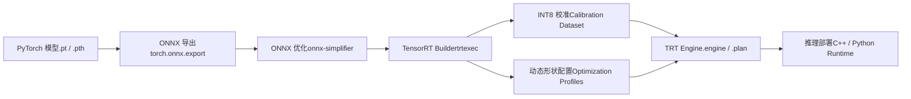
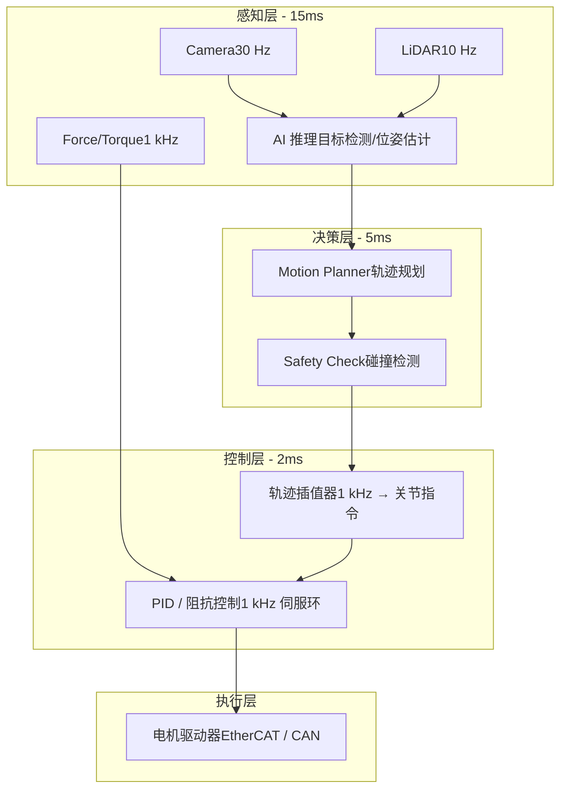
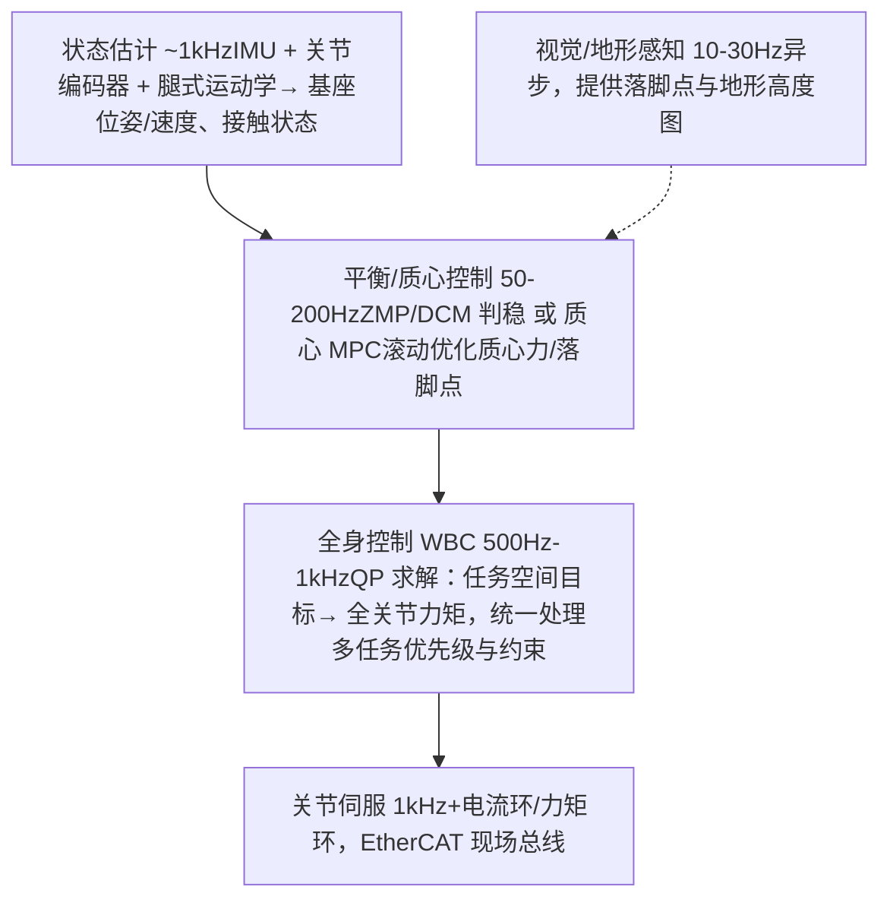
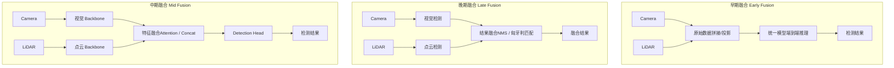
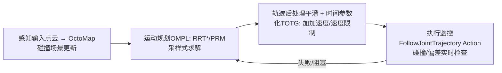
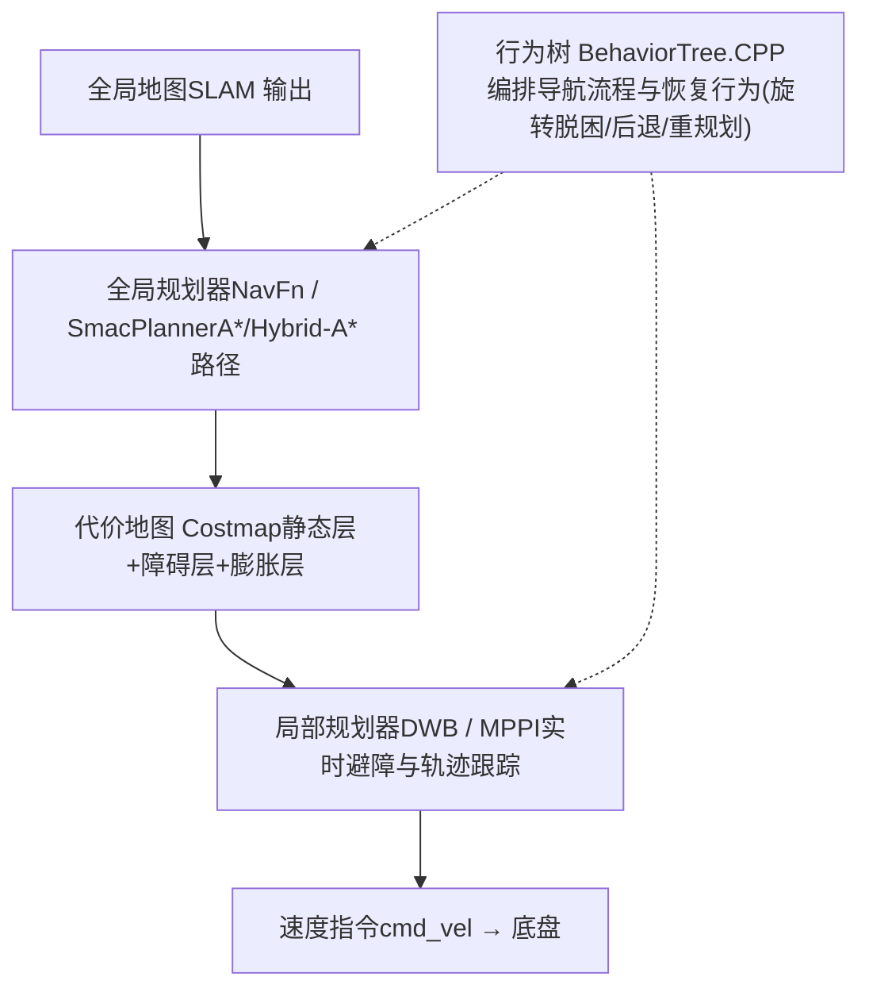

# 3. 端侧部署与实时控制

*TensorRT 部署实战、实时控制链路、传感器融合、运动规划与 MoveIt2、SLAM 与导航栈*

> [!TIP]
> **本篇讲什么**
>
> 机器人端侧 AI 的「部署与控制层」，机器人通识系列第 3 篇（共 4 篇）：
>
> - **端侧推理部署实战**：TensorRT 优化 Pipeline、INT8 校准、多模型内存规划
> - **实时控制链路**：延迟预算分配、RTOS 选型、分频架构、人形全身控制栈（WBC/MPC）
> - **传感器融合**：时间同步、早/中/晚期融合架构、传感器模态对比
> - **运动规划与 MoveIt2**：采样式规划（RRT/OMPL）、轨迹优化、MPC
> - **SLAM 与导航栈**：状态估计、视觉/激光 SLAM、Nav2 导航
>
> 其余三篇：[端侧算力与框架](platforms.md)、[感知与 VLA 训练](algorithms.md)、[端侧 Embodied Agent](embodied-agent.md)。

> [!NOTE]
> **数据口径**：本篇延迟预算、频率、内存节省比例等均为**示例参数**，用于演示预算分配与推导方法，不代表实测；芯片/传感器公开规格除外。请代入你自己的平台数据计算。

## 1. 端侧推理部署实战

### 1.1 TensorRT 优化 Pipeline

以 Jetson Orin 平台为例，从 PyTorch 训练好的模型到端侧高性能推理的完整流程：



### 1.2 关键优化技术

```
# TensorRT INT8 校准示例
import tensorrt as trt

# 1. 创建 Builder
builder = trt.Builder(TRT_LOGGER)
network = builder.create_network(1 << int(trt.NetworkDefinitionCreationFlag.EXPLICIT_BATCH))
parser = trt.OnnxParser(network, TRT_LOGGER)
parser.parse_from_file("model.onnx")

# 2. 配置 INT8 量化
config = builder.create_builder_config()
config.set_flag(trt.BuilderFlag.INT8)
config.int8_calibrator = MyCalibrator(
    data_dir="calibration_data/",  # 500-1000 张代表性图像
    batch_size=32,
    cache_file="calibration.cache"
)

# 3. 动态形状（支持不同输入尺寸）
profile = builder.create_optimization_profile()
profile.set_shape("input",
    min=(1, 3, 224, 224),     # 最小 batch
    opt=(4, 3, 640, 640),     # 最优 batch（TRT 针对此优化）
    max=(8, 3, 1280, 1280))   # 最大 batch
config.add_optimization_profile(profile)

# 4. 构建引擎
engine = builder.build_serialized_network(network, config)
```

### 1.3 多模型内存规划

机器人系统通常需要同时运行多个 AI 模型（检测、分割、位姿估计、VLM 等），GPU 内存是最稀缺的资源：

| 策略 | 描述 | 内存节省 | 延迟影响 | 适用场景 |
| :--- | :--- | :--- | :--- | :--- |
| **静态分配** | 所有模型常驻内存 | 无 | 无额外延迟 | 内存充裕 (Orin 32GB) |
| **动态加载** | 按需加载/卸载模型 | 50-70% | 首次加载 200-500ms | 内存受限，任务互斥 |
| **权重共享** | Backbone 共享，多 Head | 30-50% | 无额外延迟 | 同系列模型 |
| **CUDA Stream 并行** | 多模型在不同 Stream 并行执行 | 无（但提高利用率） | 降低总延迟 | 独立任务并行 |

> [!TIP]
> **部署检查清单**
>
> 1. 模型转换后与 PyTorch 原始输出逐层对比，判据用**相对误差或余弦相似度**（FP16 通常要求余弦相似度 >0.999；INT8 适当放宽并以下游任务指标为准），不要用固定绝对误差阈值 —— 大激活值下绝对误差天然偏大。2. 使用 `trtexec --best` 基准测试，确认达到目标 FPS。3. 用 `nsys profile` 分析 GPU 利用率，消除 CPU-GPU 同步等待。4. 监控推理过程中的内存峰值，预留 20% 安全余量。5. 长时间压力测试（24h+），检查内存泄漏和热降频。

## 2. 实时控制链路

### 2.1 延迟预算分配

机器人控制链路的端到端延迟直接决定操作精度和安全性。不同机器人类型对延迟的容忍度差异很大（下表为**示例参数**，演示预算分配方法）：

**机器人控制链路延迟预算分配 (ms)**

| 类别 | 感知推理 | 决策规划 | 控制执行 | 安全余量 | 预算上限 |
| :--- | :--- | :--- | :--- | :--- | :--- |
| 机械臂视觉伺服 @30Hz | 15 | 5 | 2 | 11 | 33 |
| 人形平衡控制环 @200Hz | 不计入（异步 10-30Hz） | 不计入（异步） | 3（状态估计 + 平衡控制） | 2 | 5 |
| 移动机器人导航 @20Hz | 30 | 10 | 5 | 5 | 50 |

> [!WARNING]
> **200Hz 环里没有视觉推理**
>
> 人形行走的 200Hz（5ms）预算是**低层平衡/全身控制环**：状态估计（IMU + 关节编码器 + 运动学）与平衡控制器（ZMP/DCM 或 WBC/MPC）。视觉感知与任务决策以 10-30Hz **异步**运行，通过共享内存向控制环提供目标与约束，**不占用这 5ms 预算** —— 把视觉推理算进 200Hz 环是常见概念错误，与 2.4 的分频架构原则一致。

### 2.2 实时操作系统选型

标准 Linux 内核的调度延迟在 1-10ms 波动，无法满足高频控制的确定性要求。三种主流方案对比：

| 方案 | 原理 | 最坏延迟 | 开发难度 | 生态兼容性 | 适用场景 |
| :--- | :--- | :--- | :--- | :--- | :--- |
| **标准 Linux** | CFS 调度器, SCHED\_FIFO 可选 | 1-10ms | 低 | 完全兼容 | 服务机器人、导航 |
| **RT-PREEMPT** | 将 Linux 内核大部分中断线程化 | 50-100us | 中 | 高（已并入主线 Linux） | 机械臂 1kHz 控制 |
| **Xenomai** | 双内核：实时内核 + Linux 内核 | 10-30us | 高 | 中（需专用 API） | 高速运动控制、CNC |

### 2.3 控制环路架构



### 2.4 不同机器人类型的实时要求

| 机器人类型 | 控制频率 | 允许最大延迟 | 实时等级 | 推荐方案 |
| :--- | :--- | :--- | :--- | :--- |
| 移动服务机器人 | 20-50 Hz | 50-100ms | 软实时 | 标准 Linux + SCHED\_FIFO |
| 协作机械臂 (6-DoF) | 500-1000 Hz | 1-2ms | 硬实时 | RT-PREEMPT |
| 人形机器人行走 | 200-500 Hz | 2-5ms | 硬实时 | RT-PREEMPT / Xenomai |
| 灵巧手操作 | 1000-5000 Hz | 0.2-1ms | 硬实时 | Xenomai / FPGA |
| 视觉伺服 | 30-60 Hz | 15-33ms | 软实时 | 标准 Linux |

> [!WARNING]
> **AI 推理与实时控制的矛盾**
>
> AI 模型推理（10-200ms）与控制环路（1-5ms）的频率差距是根本矛盾。解决方案：**分频架构** —— AI 推理以低频（5-30Hz）提供目标和约束，控制器以高频（500-1000Hz）在目标引导下进行轨迹跟踪。两者通过共享内存解耦，控制器在 AI 结果更新前使用上一帧的预测做外推。VLA 领域的双系统架构（GR00T N1、Helix，见 [算法篇](algorithms.md)）正是这一原则在模型侧的体现。

### 2.5 人形与足式：全身控制栈

人形机器人的实时控制不是单一控制器，而是一条分层栈，各层频率不同：



要点：

- **WBC（Whole-Body Control）**：以 QP（二次规划）把「质心跟踪、摆动腿轨迹、角动量调节」等多个任务按优先级统一解算为关节力矩，是人形区别于固定基座机械臂的核心控制层。
- **质心 MPC**：滚动优化未来 0.5-1s 的质心动力学，输出力/落脚点参考给 WBC；求解器需在 1-5ms 内收敛（示例口径），这是选 RT-PREEMPT/Xenomai 的直接原因。
- **学习式控制器正在替代部分栈**：端到端 RL 步态策略（见 [算法篇](algorithms.md) 5.4）可绕过 ZMP/MPC/WBC 手工栈，直接输出关节目标；当前工程实践多为「RL 出腿、WBC 出臂」的混合形态。
- **灵巧手**：触觉闭环可达 kHz 级（见 2.4 表），腱绳传动需补偿弹性与迟滞；多指协调通常降维为「抓握原语 + 力控」而非全关节独立规划。

## 3. 传感器融合 Pipeline

### 3.1 多传感器时间同步

传感器融合的第一步也是最难的一步 —— 确保不同传感器的数据在时间轴上精确对齐。典型延迟源：

| 传感器 | 典型延迟 | 频率 | 同步难点 |
| :--- | :--- | :--- | :--- |
| RGB 相机 | 30-50ms（含曝光+传输） | 30 Hz | Rolling shutter 导致帧内时间不一致 |
| 深度相机 | 50-80ms | 30 Hz | 与 RGB 帧对齐需要硬件触发 |
| 2D LiDAR | 5-20ms | 10-40 Hz | 扫描时间 25-100ms，不同角度对应不同时刻 |
| 3D LiDAR | 50-100ms | 10-20 Hz | 旋转一周的数据跨越 50-100ms 时间窗 |
| IMU | <1ms | 200-1000 Hz | 几乎无延迟，作为时间参考基准 |
| 力/力矩传感器 | <1ms | 1-8 kHz | 与控制环路同步更关键 |

### 3.2 融合架构对比



### 3.3 传感器模态对比

| 传感器 | 有效距离 | 精度 | 成本 | 天气/光照鲁棒性 | 信息维度 | 典型用途 |
| :--- | :--- | :--- | :--- | :--- | :--- | :--- |
| **RGB 相机** | 0.5-100m | 像素级 | $10-100 | 低（暗光/强光差） | 纹理、颜色、语义 | 物体识别、语义分割 |
| **深度相机** | 0.2-10m | mm 级 | $100-500 | 中（室内佳，强光差） | 3D 几何 | 抓取位姿、避障 |
| **2D LiDAR** | 0.1-30m | cm 级 | $100-500 | 高 | 2D 距离 | 导航、避障 |
| **3D LiDAR** | 0.5-200m | cm 级 | $500-10000 | 高 | 3D 点云 | 建图、3D 检测 |
| **IMU** | N/A | 高 (短期) | $5-50 | 极高 | 加速度、角速度 | 姿态估计、里程计 |
| **力/力矩传感器** | 接触 | mN 级 | $200-2000 | 极高 | 6D 力/力矩 | 力控操作、碰撞检测 |

> [!CAUTION]
> **时间同步比算法设计更难**
>
> 工程实践中，传感器融合 Bug 的大头来自时间同步而非算法本身（经验观察，非精确统计）。关键经验：1. 使用 **PTP (IEEE 1588)** 或 **硬件触发**实现微秒级同步，不要依赖软件时间戳。2. 在 ROS2 中使用 `message_filters::ApproximateTimeSynchronizer` 而非手动缓冲。3. 所有传感器数据必须带**硬件时间戳**（sensor timestamp），而非接收时间戳（arrival timestamp）。4. 建立时间同步监控告警，偏差超过阈值立即降级。

## 4. 运动规划与 MoveIt2

### 4.1 规划方法版图

运动规划回答「关节怎么动才不碰撞且满足约束」，是 AI 感知与底层控制之间的桥梁。它是 **CPU 密集型**任务，与 GPU 上的 AI 推理正交，可并行调度。

| 方法族 | 代表算法 | 原理 | 优点 | 局限 | 典型应用 |
| :--- | :--- | :--- | :--- | :--- | :--- |
| **采样式规划** | RRT / RRT\* / PRM（OMPL 库） | 在构型空间随机采样扩展树/路线图 | 高维空间（7+ DoF、双臂）可扩展，无需离散化 | 路径不平滑、随机性导致不可复现 | 机械臂点到点避障 |
| **轨迹优化** | CHOMP / TrajOpt / STOMP | 从初始轨迹出发做梯度/协方差优化 | 输出平滑、可加动力学约束 | 依赖初始解，易陷局部最优 | 采样式规划后的平滑精修 |
| **MPC** | 线性/非线性 MPC、MPPI | 滚动时域优化，每周期重规划 | 天然处理动力学约束与动态障碍 | 需求解器实时收敛（ms 级） | 高速操作、足式、移动底盘 |

### 4.2 MoveIt2 管线

MoveIt2 是 ROS2 生态的机械臂规划事实标准，完整管线：



工程要点：

1. **碰撞检测是大头**：FCL 网格碰撞在复杂场景可达 ms 级，用简化碰撞体（胶囊/凸包近似）替代精细网格。
2. **随机性治理**：RRT 结果依赖随机种子 —— 固定种子 + 超时回退（规划失败时重试或降级到预设轨迹）保证行为可复现、可测试。
3. **规划频率与执行解耦**：规划器以 1-10Hz 重规划，轨迹执行器以 100Hz+ 插值下发 —— 又一个分频架构实例。
4. **与 AI 的接口**：VLA/抓取网络输出目标位姿（SE(3)），MoveIt2 负责「怎么到达」；不要让神经网络直接输出关节轨迹去替代规划器的碰撞保证。

## 5. SLAM、状态估计与导航栈

### 5.1 状态估计

「我在哪、我多快、姿态如何」是所有移动/足式机器人的前提。核心是**多源滤波/优化融合**：

| 层级 | 方法 | 融合源 | 代表实现 |
| :--- | :--- | :--- | :--- |
| 姿态/里程计 | EKF / UKF | IMU + 轮式里程计 | robot\_localization (ROS2) |
| 视觉惯性 (VIO) | 滑窗优化 / 滤波 | 单目/双目 + IMU | VINS-Mono、ORB-SLAM3 |
| 足式状态估计 | KF + 腿式运动学 | IMU + 关节编码器 + 接触检测 | 各足式平台自研（原理同 2.5 节 L1 层） |

### 5.2 SLAM 方案选型

| 方案 | 传感器 | 代表算法 | 特点 | 端侧算力需求 |
| :--- | :--- | :--- | :--- | :--- |
| **2D 激光 SLAM** | 2D LiDAR (+IMU/里程计) | Cartographer、SLAM Toolbox | 成熟稳定，室内服务机器人标配 | 低（RK3588 级即可） |
| **视觉 SLAM** | 单目/双目/RGB-D | ORB-SLAM3、VINS | 信息丰富、可带语义；对光照/纹理敏感 | 中 |
| **激光 3D SLAM** | 3D LiDAR + IMU | LIO-SAM、FAST-LIO2 | 大场景高精度建图，退化场景需 IMU 紧耦合 | 中-高 |
| **语义/物体级 SLAM** | RGB-D + 检测/分割模型 | ConceptGraphs 类 | 输出物体级地图（"杯子在桌上"），是 Embodied Agent 空间记忆的载体 | 高（含神经网络推理） |

### 5.3 Nav2 导航栈

ROS2 的 Nav2 是移动机器人导航的事实标准框架：



要点：

- **MPPI 局部规划器**：采样式 MPC（GPU 可加速），对非完整约束底盘与动态障碍的处理优于经典 DWA，是 Nav2 近年的默认演进方向。
- **恢复行为由行为树编排**：卡住 → 旋转脱困 → 后退 → 请求全局重规划，这套「失败处理」逻辑与 Embodied Agent 的反思循环（见 [Embodied Agent 篇](embodied-agent.md)）是同构的，只是时间尺度不同。
- **与语义层衔接**：Nav2 负责「几何可达」，「去厨房拿杯子」这类语义目标由上层 Agent 分解为导航目标点序列下发。
