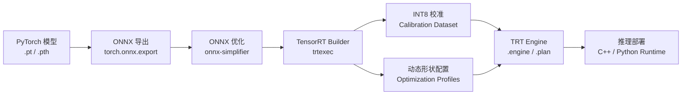
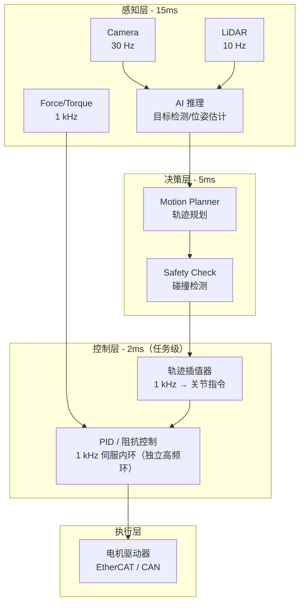
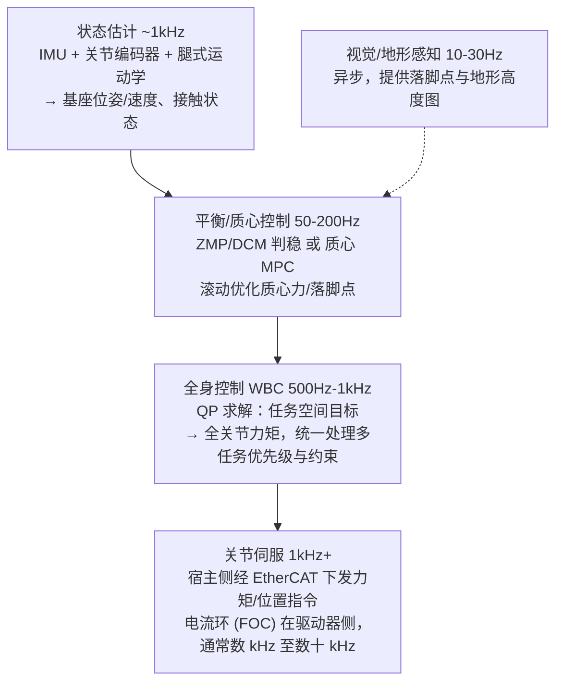
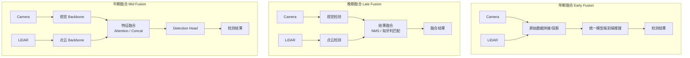
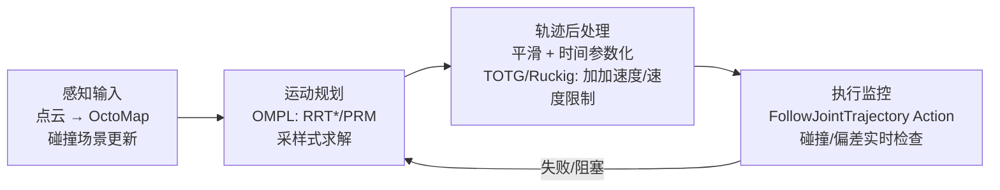
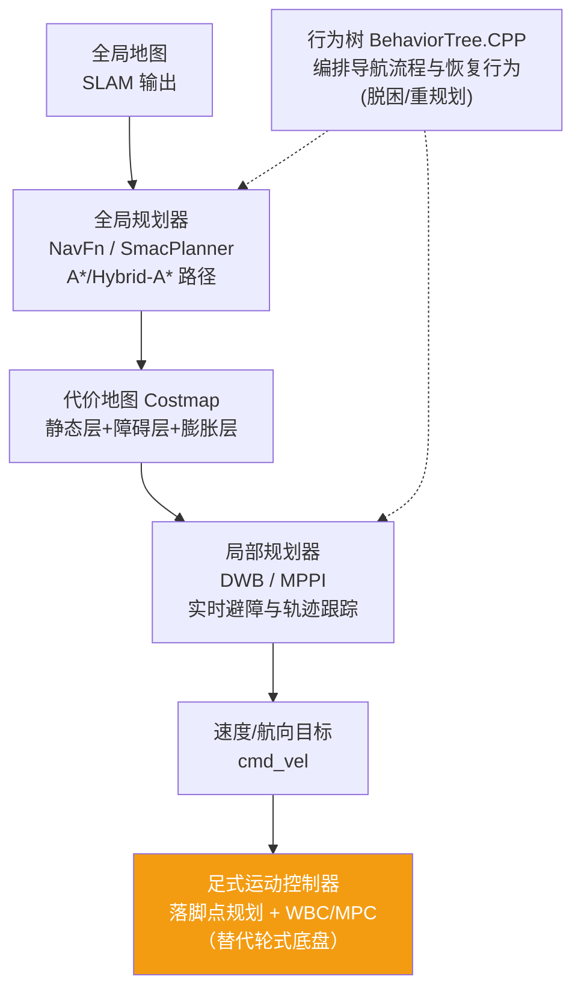

# 3. 端侧部署与实时控制

*TensorRT 部署实战、实时控制链路、传感器融合、运动规划与 MoveIt2、SLAM 与人形导航*

> [!TIP]
> **本篇讲什么**
>
> 具身/人形机器人端侧 AI 的「部署与控制层」，具身通识系列第 3 篇（共 4 篇）：
>
> - **端侧推理部署实战**：TensorRT 优化 Pipeline、INT8 校准、多模型内存规划
> - **实时控制链路**：延迟预算分配、RTOS 选型、分频架构、人形全身控制栈（WBC/MPC）
> - **传感器融合**：时间同步、早/中/晚期融合架构、传感器模态对比
> - **运动规划与 MoveIt2**：采样式规划（RRT/OMPL）、轨迹优化、MPC（具身操作）、GPU 并行规划（cuRobo 类）
> - **SLAM 与状态估计**：足式状态估计、视觉/激光 SLAM、人形导航
>
> 其余三篇：[人形端侧算力与框架](platforms.html)、[感知与 VLA 训练](algorithms.html)、[端侧 Embodied Agent](embodied-agent.html)。

> [!NOTE]
> **数据口径**：本篇延迟预算、频率、内存节省比例等均为**示例参数**，用于演示预算分配与推导方法，不代表实测；芯片/传感器公开规格除外。请代入你自己的平台数据计算。

## 1. 端侧推理部署实战

### 1.1 TensorRT 优化 Pipeline

以 Jetson Orin 平台为例，从 PyTorch 训练好的模型到端侧高性能推理的完整流程：



> [!NOTE]
> **Pipeline 的 2025-2026 变化**
>
> - **TensorRT 10.x 时代**：JetPack 6.x 已随附 TensorRT 10.x。explicit batch 成为唯一网络形态，`EXPLICIT_BATCH` 标志被标记废弃，新代码直接 `create_network()` 即可（见 1.2 示例）。
> - **ONNX 导出换轨 dynamo**：PyTorch 2.x 推出基于 dynamo 的新 ONNX 导出器（`torch.onnx.export(..., dynamo=True)`），旧 TorchScript 导出器进入废弃流程；含动态控制流或新算子的模型建议优先试新导出器。
> - **量化工具链向 ModelOpt 集中**：NVIDIA TensorRT Model Optimizer（ModelOpt）统一 PTQ/QAT 入口（INT8 SmoothQuant、INT4 AWQ、FP8 等），是 LLM/VLA 类模型量化的首选路径；视觉 CNN 仍可用 1.2 的经典 calibrator 流程。

### 1.2 关键优化技术

```
# TensorRT INT8 校准示例（TensorRT 10.x API）
import tensorrt as trt

# 1. 创建 Builder（TRT 10.x：explicit batch 是默认且唯一形态，无需再传 EXPLICIT_BATCH 标志）
builder = trt.Builder(TRT_LOGGER)
network = builder.create_network()
parser = trt.OnnxParser(network, TRT_LOGGER)
parser.parse_from_file("model.onnx")

# 2. 配置 INT8 量化
config = builder.create_builder_config()
config.set_flag(trt.BuilderFlag.INT8)
config.int8_calibrator = MyCalibrator(
    data_dir="calibration_data/",  # 500-1000 张代表性图像（覆盖典型场景/光照/目标尺度）
    batch_size=32,
    cache_file="calibration.cache"
)

# 3. 动态形状（支持不同输入尺寸）
profile = builder.create_optimization_profile()
profile.set_shape("input",
    min=(1, 3, 224, 224),     # 最小形状（batch × 分辨率）
    opt=(4, 3, 640, 640),     # 最优形状（TRT 针对此优化 kernel）
    max=(8, 3, 1280, 1280))   # 最大形状
config.add_optimization_profile(profile)
# 注意：形状范围越大，构建时的 kernel 候选越多、构建越慢；
# LLM/VLA 类部署通常改用固定形状或分桶（bucketing）多 profile。

# 4. 构建引擎
engine = builder.build_serialized_network(network, config)
```

**校准算法与低精度格式选择**：

- **`IInt8EntropyCalibrator2`**（KL 散度选阈值）：CNN 类模型的默认首选，多数视觉模型 PTQ 用它即可。
- **`IInt8MinMaxCalibrator`**：用激活 min/max 定范围，适合对离群值处理敏感的检测/分割网络，可配合 per-channel 权重量化。
- **FP8（Blackwell 世代）**：Jetson Thor 等新平台的主流低精度格式，校准需求比 INT8 更轻；Orin 世代仍以 INT8 PTQ 为主。
- LLM/VLA 的**权重量化**（W4A16 等）与视觉模型 INT8 是两条路线，见 [算力平台篇](platforms.html) §2.3。

### 1.3 多模型内存规划

机器人系统通常需要同时运行多个 AI 模型（检测、分割、位姿估计、VLM 等），GPU 内存是最稀缺的资源：

| 策略 | 描述 | 内存节省 | 延迟影响 | 适用场景 |
| :--- | :--- | :--- | :--- | :--- |
| **静态分配** | 所有模型常驻内存 | 无 | 无额外延迟 | 内存充裕 (Orin 32GB) |
| **动态加载** | 按需加载/卸载模型 | 50-70% | 首次加载 200-500ms | 内存受限，任务互斥 |
| **权重共享** | Backbone 共享，多 Head | 30-50% | 无额外延迟 | 同系列模型 |
| **CUDA Stream 并行** | 多模型在不同 Stream 并行执行 | 无（但提高利用率） | 降低总延迟 | 独立任务并行 |
| **DLA 卸载** | CNN 类模型编译到 NVDLA 执行（Orin 带 2 个 DLA 核） | 腾出 GPU 内存与算力给大模型 | DLA 吞吐低于 GPU，适合中低频 CNN | 检测/分割等 CNN 与 VLA/LLM 并存 |
| **权重流式加载** | TRT 10.x：权重驻留主机内存，GPU 按预算换页（`weight_streaming_budget_bytes`） | GPU 侧占用由预算旋钮控制 | 预算紧张时增加少量搬运延迟 | 多个大模型并存、单模型超出显存 |

> [!NOTE]
> **Jetson 的内存是统一的：「显存规划」实为系统内存规划**
>
> Orin 的 CPU/GPU 共享同一块 LPDDR（统一内存），所谓显存只是系统内存的划分 —— 多模型规划必须把这几项一起算：模型权重 + KV Cache（LLM/VLA）+ CUDA context 与引擎运行时 + 图像缓冲池 + ROS2 与 OS 开销。先扣掉安全余量（见下方清单），剩下的才是模型预算。GPU 侧的多模型并发调度（MPS/时分复用、优先级 Stream）见 [面试篇](interview.html) Q21。

> [!TIP]
> **部署检查清单**
>
> 1. 模型转换后与 PyTorch 原始输出逐层对比（工具用 `polygraphy run`），判据用**相对误差或余弦相似度**（FP16 通常要求余弦相似度 >0.999；INT8 适当放宽并以下游任务指标为准），不要用固定绝对误差阈值 —— 大激活值下绝对误差天然偏大；定位到精度损失大的层可单独回退 FP16。
> 2. 使用 `trtexec --best` 基准测试，确认达到目标 FPS。
> 3. 用 `nsys profile` 分析 GPU 利用率，消除 CPU-GPU 同步等待。
> 4. 监控推理过程中的内存峰值，预留 20% 安全余量。
> 5. 长时间压力测试（24h+），检查内存泄漏和热降频。

## 2. 实时控制链路

### 2.1 延迟预算分配

人形/具身控制链路的端到端延迟直接决定操作精度和安全性。不同任务环对延迟的容忍度差异很大（下表为**示例参数**，演示预算分配方法）：

**具身控制链路延迟预算分配 (ms)**

| 类别 | 感知推理 | 决策规划 | 控制执行 | 安全余量 | 预算上限 |
| :--- | :--- | :--- | :--- | :--- | :--- |
| 具身操作视觉伺服 @30Hz | 15 | 5 | 2 | 11 | 33 |
| 人形平衡控制环 @200Hz（示例频率，逐层划分见 §2.5） | 不计入（异步 10-30Hz） | 不计入（异步） | 3（状态估计 + 平衡控制） | 2 | 5 |
| 人形移动操作（边走边操作）@20Hz | 30 | 10 | 5 | 5 | 50 |

> [!WARNING]
> **200Hz 环里没有视觉推理**
>
> 人形行走的 200Hz（5ms）预算是**低层平衡/全身控制环**：状态估计（IMU + 关节编码器 + 运动学）与平衡控制器（ZMP/DCM 或 WBC/MPC）。视觉感知与任务决策以 10-30Hz **异步**运行，通过共享内存向控制环提供目标与约束，**不占用这 5ms 预算** —— 把视觉推理算进 200Hz 环是常见概念错误，与 2.4 的分频架构原则一致。

### 2.2 实时操作系统选型

标准 Linux 内核的调度延迟在 1-10ms 波动（示例量级），无法满足高频控制的确定性要求。三种主流方案对比：

| 方案 | 原理 | 最坏延迟 | 开发难度 | 生态兼容性 | 适用场景 |
| :--- | :--- | :--- | :--- | :--- | :--- |
| **标准 Linux** | CFS 调度器, SCHED\_FIFO 可选 | 1-10ms | 低 | 完全兼容 | 具身 Agent 推理、感知/规划（低频）|
| **RT-PREEMPT** | 完全可抢占内核：中断线程化 + 自旋锁改可睡眠 rt\_mutex + 优先级继承 | 50-100us | 中 | 高（2024 年底随 Linux 6.12 完整并入主线） | 具身操作 1kHz 力控、人形 WBC |
| **Xenomai** | 双内核：实时内核 (Cobalt) + Linux 内核 | 10-30us | 高 | 中（需专用 API） | 宿主侧 kHz 级总线主站、对抖动极严格（<20us）的场景 |

> [!TIP]
> **RT-PREEMPT 是 2025-2026 的默认首选，且「实时」远不止换内核**
>
> PREEMPT\_RT 已完整并入 Linux 主线（6.12），ROS2 生态原生兼容，人形/足式的宿主侧实时控制（状态估计 + WBC/MPC + EtherCAT 主站，500Hz-1kHz）用它即可；Xenomai 只在抖动要求极端时考虑。**关节电流环（FOC，通常数 kHz 至数十 kHz）实际跑在驱动器自带的 MCU/FPGA 上**，不在宿主 Linux —— 宿主侧的实时任务是「总线主站 + 控制律」，别把两者混为一谈。
>
> 换上 RT 内核只完成一半工作，工程清单还包括：
>
> 1. **CPU 隔离**：`isolcpus` / `nohz_full` 把控制核从普通调度中摘出，控制线程独占；
> 2. **IRQ 亲和性**：把网卡/USB 等中断绑到非控制核，避免打断实时线程；
> 3. **调度策略**：控制线程 SCHED\_FIFO + 合理的优先级规划（状态估计 > WBC > 日志），杜绝优先级反转；
> 4. **内存锁定**：`mlockall()` 防止缺页中断，启动时预热（pre-fault）堆栈；
> 5. **验证**：用 `cyclictest` 压测最坏延迟（跑数小时以上），达标线以你的控制周期为参照，而不是看平均值。

### 2.3 控制环路架构



图中 15/5/2ms 对应 §2.1 视觉伺服 @30Hz 的任务级预算；1kHz 伺服内环（力/位环）是独立的高频环，不占用任务级预算 —— 这本身就是分频架构的最小实例。

### 2.4 人形/具身各控制环的实时要求

| 控制环 | 控制频率 | 允许最大延迟 | 实时等级 | 推荐方案 |
| :--- | :--- | :--- | :--- | :--- |
| 具身操作机械臂 (6-7 DoF) | 500-1000 Hz | 1-2ms | 硬实时 | RT-PREEMPT |
| 人形机器人行走（平衡/WBC 层，逐层划分见 §2.5） | 200Hz-1kHz | 1-5ms | 硬实时 | RT-PREEMPT / Xenomai |
| 灵巧手操作（触觉/力控闭环） | 1000-5000 Hz | 0.2-1ms | 硬实时 | 手侧专用控制器（MCU/FPGA）为主；宿主侧跑 kHz 闭环则需 Xenomai 级实时 |
| 视觉伺服 | 30-60 Hz | 15-33ms | 软实时 | 标准 Linux |
| VLA 动作推理 | 2-10 Hz（重规划频率；动作块可高频回放，见 [算法篇](algorithms.html) §2.3） | 100-500ms | 软实时 | 标准 Linux + GPU（与控制核隔离） |
| LLM/VLM 任务决策（具身 Agent） | 0.1-1 Hz | 1-10s | 非实时 | 标准 Linux + GPU |

> [!WARNING]
> **AI 推理与实时控制的矛盾**
>
> AI 模型推理（10-200ms）与控制环路（1-5ms）的频率差距是根本矛盾。解决方案：**分频架构** —— AI 推理以低频（5-30Hz）提供目标和约束，控制器以高频（500-1000Hz）在目标引导下进行轨迹跟踪。两者通过共享内存解耦，控制器在 AI 结果更新前使用上一帧的预测做外推。VLA 领域的双系统架构（GR00T N1、Helix，见 [算法篇](algorithms.html)）正是这一原则在模型侧的体现；硬件落地（Orin + 实时 MCU/分区）见 [算力平台篇](platforms.html) §1.3。

### 2.5 人形与足式：全身控制栈

人形机器人的实时控制不是单一控制器，而是一条分层栈，各层频率不同：



要点：

- **WBC（Whole-Body Control）**：以 QP（二次规划）把「质心跟踪、摆动腿轨迹、角动量调节」等多个任务按优先级统一解算为关节力矩，是人形区别于固定基座机械臂的核心控制层。
- **WBC 的 QP 实时性是工程关键**：决策变量是关节加速度 + 接触力（30-60 DoF 人形约百级变量，示例口径），约束包括刚体动力学等式、摩擦锥、力矩/速度限；多任务优先级用字典序（逐层零空间投影）或加权堆叠表达。要在 1ms 级周期内稳定求解，靠的是**热启动（warm start，上一周期解作初值）+ 固定迭代上限的 anytime 求解**，求解器用 qpOASES/OSQP 类；动力学量（质量矩阵、科氏力）由 Pinocchio 类刚体库以递归牛顿-欧拉算法在微秒级算出。开源工程栈可参考 TSID（任务空间逆动力学）与 OCS2（足式 MPC）一族。
- **ZMP/DCM 与质心 MPC 的关系**：ZMP（零力矩点）是线性倒立摆模型下的准静态判稳准则；DCM（发散运动分量，即捕获点）把判稳推广到动态行走与迈步恢复。两者都基于简化模型，现代主流是**质心动力学 MPC**：滚动优化未来 0.5-1s 的质心轨迹与落脚点，输出力/落脚点参考给 WBC；求解器需在 1-5ms 内收敛（示例口径），这是选 RT-PREEMPT/Xenomai 的直接原因。
- **学习式控制器正在替代部分栈（2025-2026 主线变化）**：端到端 RL 步态策略（见 [算法篇](algorithms.html) §5.4）可绕过 ZMP/MPC/WBC 手工栈，直接输出关节目标。研究脉络从遥操作模仿全身控制（HumanPlus、OmniH2O，2024）走向纯 RL 全身控制（ExBody2、HOVER，2024-2025），再到对齐真实物理的敏捷全身技能（NVIDIA ASAP，2025）；部署形态是「RL 策略 @50Hz 出关节目标 + 关节 PD/力控内环 @1kHz」的混合环。当前工程实践多为「RL 出腿、WBC/VLA 出臂」的混合形态 —— 平衡安全网仍由传统栈兜底，全端到端（操作 + 平衡一体学习）仍处早期。
- **灵巧手**：触觉闭环可达 kHz 级（见 2.4 表，跑在手侧专用控制器），腱绳传动需补偿弹性与迟滞；多指协调通常降维为「抓握原语 + 力控」而非全关节独立规划。

> [!WARNING]
> **VLA 上人形的三个工程难题（大模型与实时控制并存）**
>
> 1. **算力争抢与隔离**：VLA 推理与感知模型共享 GPU，而 WBC/状态估计需要确定性的 CPU 实时核 —— 必须做核绑定隔离（§2.2 清单），并给 VLA 推理设**超时降级**（推理卡顿时控制器沿用上一动作块，而不是等待）。
> 2. **动作块的平滑接管**：VLA 以 2-10Hz 输出动作块（chunk），块与块切换处易出现关节目标阶跃 —— 用 temporal ensembling / 块间插值消化（见 [算法篇](algorithms.html) §2.3），切换瞬间的加速度突变还会激发躯干晃动，反过来污染状态估计。
> 3. **安全过滤与底层否决权**：VLA 输出的关节目标必须过一层确定性安全检查（关节限位、自碰撞、力矩饱和、工作空间边界）才能进入 WBC/伺服；低层控制器对不可行目标有**否决与裁剪权**，安全逻辑绝不经过神经网络（与 [Embodied Agent 篇](embodied-agent.html) §3.4 同一原则）。

> [!NOTE]
> **人形量产部署的工程现状（2025-2026，定性观察）**
>
> 低层 RL 步态已在量产四足与人形平台普及（端侧推理只是轻量 MLP，见 [算法篇](algorithms.html) §5.4）；传统 WBC/MPC 栈仍是平衡与 loco-manipulation 的安全网，两者长期共存而非谁替代谁。VLA 操作落地集中在**结构化场景**（工厂上下料、导览演示），开放环境成功率仍受数据与泛化限制，遥操作数据飞轮是各厂商的主要投入方向。跌倒检测与防护、人机安全距离、长时间运行的热管理，是量产化绕不过的工程红线 —— 演示视频与可交付产品之间的差距，主要就卡在这几件事上。

## 3. 传感器融合 Pipeline

### 3.1 多传感器时间同步

传感器融合的第一步也是最难的一步 —— 确保不同传感器的数据在时间轴上精确对齐。典型延迟源：

| 传感器 | 典型延迟 | 频率 | 同步难点 |
| :--- | :--- | :--- | :--- |
| RGB 相机 | 30-50ms（含曝光+传输） | 30 Hz | Rolling shutter 导致帧内时间不一致 |
| 深度相机 | 50-80ms | 30 Hz | 与 RGB 帧对齐需要硬件触发 |
| 2D LiDAR | 5-20ms | 10-40 Hz | 扫描时间 25-100ms，不同角度对应不同时刻 |
| 3D LiDAR | 50-100ms | 10-20 Hz | 旋转一周的数据跨越 50-100ms 时间窗 |
| IMU | <1ms | 200-1000 Hz | 自身无绝对时间（需 PTP/GPS 授时对齐），但高频低延迟，常作其他传感器的插值时间基准 |
| 力/力矩传感器 | <1ms | 1-8 kHz | 与控制环路同步更关键 |

### 3.2 融合架构对比

先分清融合的**两条主线**：本节讲的是**感知级融合**（输出检测/语义）；另一条是**状态级融合**（EKF/滑窗优化/因子图，输出位姿与速度），见 §5.1。另外，VLA 的多模态输入本质上是中期融合 —— 各模态先编码为 token，再进 Transformer 统一融合（见 [算法篇](algorithms.html) §2.1）。



### 3.3 传感器模态对比

| 传感器 | 有效距离 | 精度 | 成本 | 天气/光照鲁棒性 | 信息维度 | 典型用途 |
| :--- | :--- | :--- | :--- | :--- | :--- | :--- |
| **RGB 相机** | 0.5-100m | 像素级 | $10-100 | 低（暗光/强光差） | 纹理、颜色、语义 | 物体识别、语义分割 |
| **深度相机** | 0.2-10m | mm 级 | $100-500 | 中（室内佳，强光差） | 3D 几何 | 抓取位姿、避障 |
| **2D LiDAR** | 0.1-30m | cm 级 | $100-500 | 高 | 2D 距离 | 导航、避障 |
| **3D LiDAR** | 0.5-200m | cm 级 | $500-10000 | 高 | 3D 点云 | 建图、3D 检测 |
| **IMU** | N/A | 高 (短期) | $5-50 | 极高 | 加速度、角速度 | 姿态估计、里程计 |
| **力/力矩传感器** | 接触 | mN 级 | $200-2000 | 极高 | 6D 力/力矩 | 力控操作、碰撞检测 |
| **指尖触觉阵列** | 接触 | 亚 mm 级几何 | $50-1000（模态差异大，示例） | 极高（接触域） | 接触几何、切向力、滑移 | 灵巧手闭环、滑移检测（GelSight 类视触觉 / 电容式） |

> [!CAUTION]
> **时间同步比算法设计更难**
>
> 工程实践中，传感器融合 Bug 的大头来自时间同步而非算法本身（经验观察，非精确统计）。关键经验：
>
> 1. 使用 **PTP (IEEE 1588)** 或 **硬件触发**实现微秒级同步，不要依赖软件时间戳；主流 3D LiDAR 与工业相机普遍带 PTP/GPS/触发同步接口（具体以型号手册为准）。
> 2. 在 ROS2 中使用 `message_filters::ApproximateTimeSynchronizer` 而非手动缓冲。
> 3. 所有传感器数据必须带**硬件时间戳**（sensor timestamp），而非接收时间戳（arrival timestamp）。
> 4. **运动畸变要逐点补偿**：Rolling shutter 相机需行级时间戳（或 IMU 辅助去畸变）；LiDAR 点云在扫描窗口内机体已移动，需用 IMU/里程计对每个点做 deskew —— 人形行走时的躯干晃动会放大这一误差。
> 5. 建立时间同步监控告警，偏差超过阈值立即降级。

## 4. 运动规划与 MoveIt2

### 4.1 规划方法版图

运动规划回答「关节怎么动才不碰撞且满足约束」，是 AI 感知与底层控制之间的桥梁。传统采样式规划是 **CPU 密集型**任务，与 GPU 上的 AI 推理正交，可并行调度；GPU 并行规划（下表最后一行）正在改变这一分工。

| 方法族 | 代表算法 | 原理 | 优点 | 局限 | 典型应用 |
| :--- | :--- | :--- | :--- | :--- | :--- |
| **采样式规划** | RRT / RRT\* / PRM（OMPL 库） | 在构型空间随机采样扩展树/路线图 | 高维空间（7+ DoF、双臂）可扩展，无需离散化 | 路径不平滑、随机性导致不可复现 | 机械臂点到点避障 |
| **轨迹优化** | CHOMP / TrajOpt / STOMP | 从初始轨迹出发做梯度/协方差优化 | 输出平滑、可加动力学约束 | 依赖初始解，易陷局部最优 | 采样式规划后的平滑精修 |
| **MPC** | 线性/非线性 MPC、MPPI | 滚动时域优化，每周期重规划 | 天然处理动力学约束与动态障碍 | 需求解器实时收敛（ms 级） | 高速操作、足式、移动底盘 |
| **GPU 并行规划** | NVIDIA cuRobo / cuMotion（2024-2025） | GPU 并行 IK/碰撞检测 + 并行轨迹优化（SDF 碰撞场） | ms 级规划，支撑高频重规划与反应式避障 | 绑定 NVIDIA 生态，场景需 SDF 表征 | 人形操作的高频重规划、Orin 上的实时避障 |

### 4.2 MoveIt2 管线

MoveIt2 是 ROS2 生态的机械臂规划事实标准，完整管线：



工程要点：

1. **碰撞检测是大头**：FCL 网格碰撞在复杂场景可达 ms 级，用简化碰撞体（胶囊/凸包近似）替代精细网格；GPU 加速的 SDF 碰撞检测（cuRobo 类，见 §4.1）是 2025 起的提速方向。
2. **随机性治理**：RRT 结果依赖随机种子 —— 固定种子 + 超时回退（规划失败时重试或降级到预设轨迹）保证行为可复现、可测试。
3. **时间参数化换代**：经典 TOTG 只限速度/加速度；新版 MoveIt2 提供基于 **Ruckig** 的加加速度（jerk）受限在线轨迹生成，输出更平滑、支持执行中动态改目标，人形上肢尤其受益（jerk 突变会激发躯干晃动）。
4. **规划频率与执行解耦**：规划器以 1-10Hz 重规划，轨迹执行器以 100Hz+ 插值下发 —— 又一个分频架构实例。
5. **与 AI 的接口**：VLA/抓取网络输出目标位姿（SE(3)），MoveIt2 负责「怎么到达」；不要让神经网络直接输出关节轨迹去替代规划器的碰撞保证。

> [!WARNING]
> **MoveIt2 在人形上的边界**
>
> MoveIt2 解的是**运动学可行**（无碰撞 + 关节限位 + 平滑），不解**动力学可行**（平衡、接触、力矩约束）：它把规划链的基座当固定（人形上通常以 virtual joint 挂接浮动基座，或干脆只规划上半身 group）。因此人形上的分工是：**双臂/躯干/头部的点到点与避障规划归 MoveIt2**（多 planning group），**行走与落脚点归足式控制栈**（§2.5、§5.3），两者的耦合 —— 挥臂扰动质心、边走边操作 —— 由 WBC 按任务优先级仲裁（平衡 > 任务），或交给质心动力学感知的全身规划器（TSID/OCS2 一族，§2.5）。把「人形全身规划」整个塞给 MoveIt2，或反过来用 MoveIt2 的轨迹直接驱动行走，都是常见误用。

## 5. SLAM、状态估计与导航栈

### 5.1 状态估计

「我在哪、我多快、姿态如何」是所有移动/足式机器人的前提。核心是**多源滤波/优化融合**：

| 层级 | 方法 | 融合源 | 代表实现 |
| :--- | :--- | :--- | :--- |
| 姿态/里程计 | EKF / UKF | IMU + 轮式里程计 | robot\_localization (ROS2) |
| 视觉惯性 (VIO) | 滑窗优化 / 滤波 | 单目/双目 + IMU | VINS-Mono、ORB-SLAM3 |
| 足式状态估计 | KF + 腿式运动学 | IMU + 关节编码器 + 接触检测 | 各足式平台自研（原理同 2.5 节 L1 层） |

足式状态估计的主流实现已从标准 EKF 演进为**接触辅助的不变 EKF（InEKF）**或**滑窗因子图**（配 IMU 预积分）：前者在李群上做滤波、误差动力学与轨迹无关，一致性显著更好（打滑/腾空切换时不易发散）；后者能把接触约束、运动学约束与视觉/激光里程计统一进一个优化问题。选型上：算力紧、要确定性 → InEKF；要融合多源异构约束 → 因子图。

### 5.2 SLAM 方案选型

| 方案 | 传感器 | 代表算法 | 特点 | 端侧算力需求 |
| :--- | :--- | :--- | :--- | :--- |
| **2D 激光 SLAM** | 2D LiDAR (+IMU/里程计) | Cartographer（开发已基本停滞）、SLAM Toolbox（ROS2/Nav2 默认） | 成熟稳定，轮式底盘标配；人形少用（需 3D 与姿态感知）| 低 |
| **视觉 SLAM / VIO** | 单目/双目/RGB-D + IMU | ORB-SLAM3、VINS | 信息丰富、可带语义；人形头部相机主力，对光照/纹理敏感；深度学习 VIO（DPVO 类）仍处研究阶段，量产以经典几何法为主 | 中 |
| **激光 3D SLAM** | 3D LiDAR + IMU | LIO-SAM、FAST-LIO2 | 大场景高精度建图，退化场景需 IMU 紧耦合；2025 年四足/人形的常见组合是低成本 LiDAR（Livox Mid-360 类）+ FAST-LIO2，激光-视觉-惯性紧耦合（FAST-LIVO2 类）是新方向 | 中-高 |
| **语义/物体级 SLAM** | RGB-D + 检测/分割模型 | ConceptGraphs 类 | 输出物体级地图（"杯子在桌上"），是 Embodied Agent 空间记忆的载体 | 高（含神经网络推理）|

另有 **3D Gaussian Splatting SLAM**（SplaTAM 类，2024-2025 研究热点）输出可渲染的照片级地图，对场景记忆与仿真资产有吸引力，但端侧实时建图仍困难，暂属研究方向。

> [!NOTE]
> **人形的状态估计特殊性**
>
> 人形/足式没有轮式里程计，本体速度靠 **腿式运动学 + 接触检测** 估计（见 §5.1 足式状态估计、§2.5 L1 层），再与 VIO/激光里程计紧耦合。三个难点：
>
> 1. **接触检测是地基**：腿式运动学只在「支撑脚不打滑」假设下成立，接触状态判错（把腾空当支撑、把打滑当纯滚动）会直接污染速度估计。常用判据是力/力矩阈值、关节力矩残差与概率式接触估计的组合，而非单一阈值。
> 2. **打滑与腾空相**：打滑破坏运动学约束、腾空相没有接触约束可用，估计器必须能在线切换约束集（这正是 InEKF/因子图路线的动机，见 §5.1）。
> 3. **头部相机是恶劣的 VIO 平台**：落脚冲击带来高频振动、头部快速转动带来运动模糊与特征丢失 —— 工程对策是减振安装、全局快门相机、IMU 高频预测辅助特征跟踪。

### 5.3 人形导航：Nav2 层 + 足式运动控制

ROS2 的 Nav2 是移动导航的事实标准框架。人形/足式机器人**复用 Nav2 的导航层**（全局规划、代价地图、行为树），但把它的「速度指令」输出接到**足式运动控制器**（落脚点规划 + WBC）而非轮式底盘：



要点：

- **导航层与运动层解耦**：Nav2 负责「去哪、怎么绕障」（几何可达），足式控制器负责「怎么迈腿走过去」（动力学可行）。`cmd_vel` 是两者的接口——这也是人形能直接复用 Nav2 生态的原因。
- **但 `cmd_vel` 只是最小接口**：速度指令表达不了步态选择（走/跑/侧移/上楼梯）、落脚点约束（禁踩区、台阶边缘）、地形参数 —— 实际系统普遍在 `cmd_vel` 之外扩展自定义接口（footstep 目标、步态参数、地形模式），由导航层或上层 Agent 下发。
- **2D 代价地图不够人形用**：Nav2 默认代价地图是 2D 占据栅格，而人形的可通行性是 2.5D/3D 问题（楼梯、斜坡、软地面、悬空障碍）—— 常见升级是 2.5D 高程图/可通行性分析（elevation mapping 类）或时空体素层（STVL）作为代价地图插件。
- **导航坐标系要「防晃」**：行走时躯干存在周期性晃动与俯仰，直接拿晃动基座系投影传感器数据会污染代价地图与局部规划 —— 工程上用 IMU 平滑后的虚拟基座系（如投影到地面的稳定系）作为导航参考系。
- **MPPI 局部规划器**：采样式 MPC（GPU 可加速），对动态障碍的处理优于经典 DWA；已进入 Nav2 主线、是官方力推的新一代控制器（各发行版默认仍是 DWB，MPPI 采用率快速上升）。人形上还可把落脚点可行性纳入采样代价。
- **恢复行为由行为树编排**：卡住 → 脱困 → 请求全局重规划，这套「失败处理」逻辑与 Embodied Agent 的反思循环（见 [Embodied Agent 篇](embodied-agent.html)）是同构的，只是时间尺度不同。
- **与语义层衔接**：Nav2 负责「几何可达」，「去厨房拿杯子」这类语义目标由上层 Agent 分解为导航目标点序列下发。
