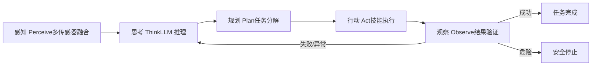
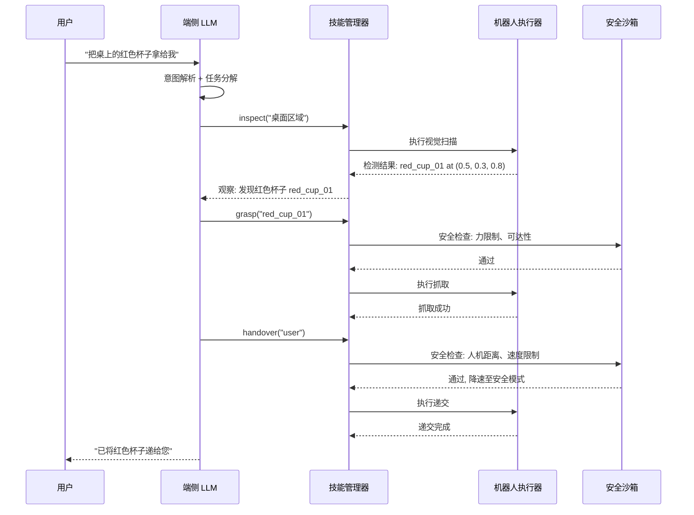
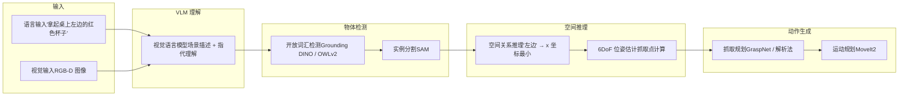
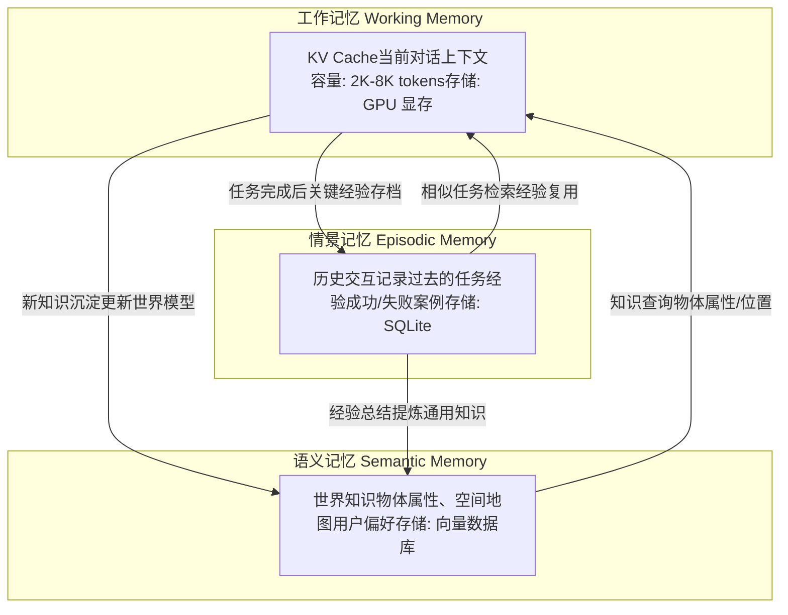

# 4. 端侧 Embodied Agent

*机器人端侧 Agent 架构、LLM 推理引擎、Tool Use 与安全沙箱、多模态接地、记忆与层次化规划*

> [!TIP]
> **本篇讲什么**
>
> 具身/人形机器人端侧 AI 的「Agent 层」，具身通识系列第 4 篇（共 4 篇）：
>
> - **Agent 架构**：Embodied Agent 循环、LLM vs 状态机、混合架构
> - **端侧 LLM 推理引擎**：llama.cpp / MLC-LLM / ExecuTorch / QNN / TensorRT-LLM 对比，decode 带宽模型与 KV Cache 内存推导
> - **Tool Use & Function Calling**：技能库抽象、动态注册、安全沙箱分级
> - **多模态接地**：视觉-语言接地、开放词汇操作、空间指代消解
> - **记忆与规划**：三层记忆架构、端侧向量数据库、层次化任务规划
>
> 其余三篇：[端侧算力与框架](platforms.md)、[感知与 VLA 训练](algorithms.md)、[端侧部署与实时控制](deployment.md)。

> [!NOTE]
> **锚点模型与数据口径**
>
> 本篇端侧 LLM 推导统一以公开真实模型 **Qwen3-4B** 为例（稠密 4B：36 层、32 个 Q head、8 个 KV head（GQA）、head\_dim 128、hidden 2560）。与全站口径一致：**只讲方法，不给标准答案** —— 文中推理速度、内存等数字一律为**示例参数**，仅用于演示推导方法，不代表实测，请代入你自己的平台与模型配置计算。

## 1. 机器人端侧 Agent 架构

### 1.1 Embodied Agent 循环

与纯软件 Agent 不同，机器人 Embodied Agent 必须与物理世界交互。每一步"行动"都有不可逆性 —— 打碎的杯子无法 undo。这使得安全性和鲁棒性成为架构设计的首要考量。



### 1.2 端侧 LLM vs 传统状态机

传统机器人使用有限状态机（FSM）或行为树（BT）进行决策，而端侧 LLM Agent 使用自然语言推理。两种范式各有优劣：

| 维度 | 传统状态机/行为树 | 端侧 LLM Agent |
| :--- | :--- | :--- |
| **灵活性** | 固定逻辑，新场景需重新编程 | 自然语言指令，零样本适配新任务 |
| **可预测性** | 高 —— 行为可枚举、可验证 | 低 —— 输出不确定，需要 guardrail |
| **开发效率** | 低 —— 大量 if-else / 状态转移 | 高 —— 自然语言描述技能和约束 |
| **计算开销** | 极低 (<1ms) | 高（decode 访存受限，每 token 数十至上百 ms 量级；估算方法见 2.2） |
| **安全性** | 可形式化验证 | 需要额外安全层 (sandbox) |
| **可解释性** | 状态图直观 | 思维链 (CoT) 部分可解释 |
| **适用阶段** | 成熟产品，安全关键 | 研发原型，开放场景 |

> [!NOTE]
> **混合架构是当前最佳实践**
>
> 推荐**"LLM 高层决策 + 状态机底层执行"**的混合架构：LLM 负责理解用户意图和高层任务规划（低频，秒级决策），状态机/行为树负责底层技能执行和安全监控（100-1000Hz）。底层安全逻辑（力限制、碰撞检测、工作空间边界）绝不经过 LLM，而是硬编码在实时控制层。这与实时控制的分频架构（见 [部署篇](deployment.md)）是同一原则在决策层的体现。

## 2. 端侧 LLM 推理引擎

### 2.1 主流引擎对比

端侧 LLM 推理引擎需要在有限算力下最大化 token 生成速度，同时控制内存占用。

| 引擎 | 核心优化 | 硬件支持 | 支持模型 | 量化支持 | 内存管理 | 特点 |
| :--- | :--- | :--- | :--- | :--- | :--- | :--- |
| **llama.cpp** | CPU SIMD, Metal, CUDA | CPU / GPU / Apple Silicon | Llama, Qwen, Phi, Gemma 等 | Q2-Q8, GGUF 格式 | mmap 按需加载 | 最广泛的模型支持，社区最活跃 |
| **MLC-LLM** | TVM 编译优化, GPU/NPU kernel | CUDA / Vulkan / OpenCL / Metal | Llama, Qwen, Phi 等 | INT4/INT8 (编译时) | 静态内存规划 | 编译优化，GPU 利用率高 |
| **ExecuTorch** | XNNPACK, CoreML, QNN delegate | CPU / GPU / NPU (delegate) | Llama 系列为主 | INT8/INT4 (PTQ) | Memory Planning | Meta 主推，与 PyTorch 生态融合 |
| **QNN LLM** | Hexagon HTP 专用优化 | Qualcomm HTP/DSP | Llama, Qwen (需转换) | INT8/INT4 (W4A16) | DSP 内存池 | 高通平台最优性能 |
| **TensorRT-LLM** | 融合 kernel、in-flight batching | Jetson Orin (JetPack 6+) / NVIDIA GPU | Llama, Qwen, Phi 等 | W4A16 / FP8 | Paged KV Cache | NVIDIA 平台性能上限最高，显存占用相对更大 |

### 2.2 推理速度：带宽模型与量级对比

端侧 LLM decode 是**访存受限**任务：每生成一个 token，都要把全部权重（以及 KV Cache）从内存读一遍。因此 decode 速度可以用一个简单的带宽模型估算：

```
# Decode 速度估算（roofline 访存侧）
# 每生成 1 token ≈ 从内存读取全部权重 + 该步 KV
tokens_per_second ≈ 有效内存带宽 (GB/s) / 每 token 读取字节数 (GB)

# 示例参数（锚点模型 Qwen3-4B, INT4 权重）:
#   权重体积 ≈ 4e9 params × 0.5 byte = 2 GB
#   假设平台有效带宽 40 GB/s（示例，请代入你的平台实测带宽）
#   decode 上限 ≈ 40 / 2 = 20 tok/s（理想值，未计 KV 读取与调度开销）
# Prefill 则相反：批量处理输入 token，是算力受限，速度随 TOPS 提升
```

各引擎在同一平台上的相对表现（**示例参数**，仅演示引擎间量级差异，非实测；实测请以你的平台 + 模型组合跑基准）：

**Qwen3-4B INT4 端侧推理量级对比（Jetson Orin NX 级平台，示例参数）**

| 引擎 | Prefill (tok/s) | Decode (tok/s) | 说明 |
| :--- | :--- | :--- | :--- |
| llama.cpp (CUDA) | 150 | 10 | 通用基线，GGUF 量化生态最灵活 |
| ExecuTorch (CUDA) | 180 | 12 | PyTorch 生态一体化 |
| MLC-LLM | 300 | 20 | TVM 编译优化，kernel 定制深 |
| TensorRT-LLM | 420 | 28 | 融合 kernel 最激进，显存占用也最大 |

decode 8-28 tok/s 对应每 token 约 36-125ms —— 这就是 1.2 节「每 token 数十至上百 ms」的由来；任何声称端侧 4B 模型「每 token 秒级」或「每 token 个位数 ms」的说法都与带宽模型矛盾，可用上式快速证伪。

### 2.3 内存优化关键技术

端侧 LLM 推理的内存瓶颈在于 KV Cache。通用公式与锚点模型推导：

```
# KV Cache 内存计算（通用公式）
# kv_cache = 2 (K/V 两份) × 层数 × KV head 数 × head_dim × 序列长度 × 每元素字节数

# 锚点模型 Qwen3-4B: 36 层, 32 个 Q head, 8 个 KV head (GQA), head_dim 128
# 序列长度 2048, FP16 存储 (2 bytes):
kv_cache_size = 2 * 36 * 8 * 128 * 2048 * 2   # bytes
# = 301,989,888 bytes ≈ 0.28 GB

# 对比：若是 MHA（32 个 KV head），体积 ×4 ≈ 1.13 GB —— 这就是 GQA 的价值
# （注意 KV Cache 只按 KV head 数计，与 32 个 Q head 无关）

# 进一步优化手段:
# 1. KV Cache INT8 量化: 再减 2x → ≈ 144 MB
# 2. Sliding Window / 驱逐 (StreamingLLM, H2O): 限制有效上下文
# 3. PagedAttention (vLLM / TensorRT-LLM 式): 分页管理消除碎片
```

> [!TIP]
> **引擎选型建议**
>
> **Jetson Orin 平台**：显存充裕时用 **TensorRT-LLM**（性能上限最高）；要灵活量化与最广模型支持用 **llama.cpp (CUDA)**，两者都是生产级默认选项，MLC-LLM 适合愿意做编译定制的团队。**Qualcomm 平台**：使用 **QNN LLM**（Hexagon HTP 独占优化）。**跨平台原型**：使用 **llama.cpp**（一份代码跑遍所有平台）。**与 PyTorch 深度集成**：使用 **ExecuTorch**（训练-部署一体化）。

## 3. 端侧 Tool Use & Function Calling

### 3.1 机器人技能库抽象

将机器人的底层控制能力抽象为 LLM 可调用的"工具函数"（技能），是 Embodied Agent 的核心设计模式。每个技能封装了完整的感知-规划-执行逻辑：

| 技能名称 | 参数 | 前置条件 | 执行时间 | 安全等级 |
| :--- | :--- | :--- | :--- | :--- |
| `grasp(object_id)` | 目标物体 ID | 物体已检测、可达 | 3-8s | 中 (力控保护) |
| `place(position)` | 目标位置 (x,y,z) | 手中有物体 | 3-6s | 中 |
| `navigate(goal)` | 目标位置/区域名 | 地图已建立 | 10-60s | 低 (避障保护) |
| `inspect(object_id)` | 目标物体 ID | 物体已检测 | 2-5s | 低 |
| `handover(target)` | 交接对象 (人/机器人) | 手中有物体 | 5-15s | 高 (人机安全) |
| `scan_area(region)` | 扫描区域 | 无 | 10-30s | 低 |

### 3.2 Tool Use 调用流程



### 3.3 动态工具注册

机器人在运行时可能获得新能力（如安装了新末端执行器），Agent 框架需要支持动态注册新技能：

```
# 动态技能注册示例
class SkillRegistry:
    def __init__(self):
        self.skills = {}

    def register(self, name, func, schema, safety_level="low"):
        """运行时注册新技能"""
        self.skills[name] = {
            "function": func,
            "schema": {          # OpenAI Function Calling 格式
                "name": name,
                "description": schema["description"],
                "parameters": schema["parameters"]
            },
            "safety_level": safety_level
        }
        # 更新 LLM 的 system prompt 中的可用工具列表
        self.update_llm_tools()

    def get_tool_descriptions(self):
        """生成 LLM 可理解的工具描述"""
        return [s["schema"] for s in self.skills.values()]

# 运行时发现新末端执行器 → 注册新技能
registry.register(
    name="vacuum_pick",
    func=vacuum_gripper.pick,
    schema={
        "description": "使用真空吸盘吸取平面物体",
        "parameters": {
            "type": "object",
            "properties": {
                "object_id": {"type": "string", "description": "目标物体ID"},
                "suction_force": {"type": "number", "description": "吸力(N)", "default": 10}
            },
            "required": ["object_id"]
        }
    },
    safety_level="medium"
)
```

### 3.4 安全沙箱机制

| 安全等级 | 描述 | 检查内容 | 确认方式 | 示例操作 |
| :--- | :--- | :--- | :--- | :--- |
| **Level 0: 安全** | 不涉及物理运动 | 无 | 自动执行 | inspect, scan, query |
| **Level 1: 低风险** | 低速运动，远离人 | 工作空间边界、碰撞检测 | 自动执行 | navigate, pick (空旷区域) |
| **Level 2: 中风险** | 力控操作、精密操作 | 力限制、速度限制、物体脆弱性 | LLM 自检 + 日志 | grasp (易碎品), pour |
| **Level 3: 高风险** | 人机交互、不可逆操作 | 人机距离、速度降档、力矩饱和 | 人工确认 | handover, cut, heat |
| **Level 4: 禁止** | 超出安全边界 | — | 拒绝执行 | 离开工作区域、高速接近人 |

> [!CAUTION]
> **安全优先原则**
>
> 机器人 Agent 与软件 Agent 的根本区别：**物理动作不可撤销**。设计原则：1. 安全检查在 LLM 之外，用确定性代码实现，不依赖 LLM 判断。2. 力矩/速度限制硬编码在控制器层，即使 LLM 发出危险指令也无法突破。3. 新技能默认 Level 3（人工确认），经验证后才降级。4. 所有操作记录审计日志，支持事后追溯。

## 4. 多模态理解与接地

### 4.1 视觉-语言接地 (Visual-Language Grounding)

"接地"(Grounding) 是将自然语言中的指代（如"红色杯子"、"左边那个"）映射到物理世界中具体物体或位置的过程。这是 Embodied Agent 能否正确执行指令的关键环节。



### 4.2 开放词汇操作

传统机器人只能操作训练集中见过的物体类别。结合视觉-语言模型，机器人可以理解和操作从未见过的物体：

| 技术 | 原理 | 优点 | 局限 | 端侧可行性 |
| :--- | :--- | :--- | :--- | :--- |
| **CLIP + Detection** | CLIP 特征匹配 + 检测框 | 零样本，无需训练 | 空间分辨率低 | 高 (CLIP ViT-B 约 150M) |
| **Grounding DINO** | 文本引导的检测器 | 精确定位，开放词汇 | 模型较大 (172M) | 中 (需 INT8 量化) |
| **OWLv2** | 开放世界检测器 | one-shot 支持 | 速度中等 | 中 |
| **SAM + CLIP** | SAM 分割所有 + CLIP 分类 | 最强泛化 | 两阶段，延迟高 | 低 (需 Orin 级别) |

### 4.3 空间推理与指代消解

用户指令中的空间关系（"左边"、"上面"、"靠近"）需要在 3D 空间中解析。关键处理步骤：

```
# 空间指代消解示例
class SpatialReasoner:
    def resolve_reference(self, text, detections, camera_params):
        """将语言中的空间指代解析为具体物体"""
        # 1. 提取空间关系词
        relations = self.parse_spatial_relations(text)
        # e.g., {"attribute": "红色", "relation": "左边", "anchor": "桌子"}

        # 2. 属性过滤
        candidates = [d for d in detections
                       if self.match_attribute(d, relations["attribute"])]

        # 3. 空间关系过滤
        if relations["relation"] == "左边":
            # 在相机坐标系中，左边 = x 坐标较小
            anchor = self.find_object(detections, relations["anchor"])
            candidates = [c for c in candidates
                          if c.position_3d.x < anchor.position_3d.x]

        # 4. 歧义消解：如果仍有多个候选，选最近的
        if len(candidates) > 1:
            candidates.sort(key=lambda c: c.distance_to_robot)

        return candidates[0] if candidates else None
```

> [!TIP]
> **接地精度直接决定操作成功率（逐步累积推导）**
>
> 端到端成功率可按步骤累积估算：若每步接地/执行成功率为 p，n 步任务的整体成功率约为 pⁿ。p=90% 时，3 步任务 ≈ 0.9³ ≈ 73%；要把整体成功率拉到 90%+，单步需达到约 97%（0.97³ ≈ 91%）。**提升接地精度 10% 比提升运动规划精度 10% 对最终成功率的贡献大得多** —— 建议投入更多工程资源在感知和接地环节，而非纯粹的控制算法优化。

## 5. Agent 记忆与规划

### 5.1 三层记忆架构

长时间运行的机器人 Agent 需要结构化的记忆系统，而非仅依赖 LLM 的上下文窗口。三层记忆架构是当前最实用的设计：



### 5.2 各层记忆实现细节

| 记忆层 | 存储介质 | 数据格式 | 容量 | 检索方式 | 更新频率 |
| :--- | :--- | :--- | :--- | :--- | :--- |
| **工作记忆** | GPU 显存 | KV Cache (FP16/INT8) | 2K-8K tokens | Attention 自动 | 每个 token |
| **情景记忆** | eMMC/SSD (SQLite) | 结构化记录 (JSON) | 10K-100K 条 | SQL 查询 + 向量相似度 | 每个任务 |
| **语义记忆** | eMMC/SSD (向量库) | 嵌入向量 + 元数据 | 10K-1M 向量 | ANN 近似最近邻 | 按需 |

语义记忆中的空间地图与 [部署篇](deployment.md) 的语义 SLAM 直接衔接：物体级地图（"杯子在桌上"）就是语义记忆的物理载体。

### 5.3 层次化任务规划

复杂任务（如"整理桌面"）需要多层次分解：LLM 进行高层语义规划，中层选择技能序列，底层执行运动控制。

```
# 层次化任务规划示例
# 用户指令: "把桌上的东西整理到柜子里"

# Level 1: LLM 高层规划 (自然语言)
"""
计划:
1. 扫描桌面，识别所有物体
2. 对每个物体:
   a. 判断其类别和归属位置
   b. 抓取物体
   c. 放置到对应柜子隔层
3. 确认桌面已清空
"""

# Level 2: 技能序列 (函数调用)
plan = [
    {"skill": "scan_area", "params": {"region": "table_top"}},
    # 返回: [cup_01, book_02, pen_03, phone_04]
    {"skill": "grasp", "params": {"object_id": "cup_01"}},
    {"skill": "place", "params": {"position": "cabinet_shelf_1"}},
    {"skill": "grasp", "params": {"object_id": "book_02"}},
    {"skill": "place", "params": {"position": "cabinet_shelf_2"}},
    # ... 对每个物体重复
    {"skill": "scan_area", "params": {"region": "table_top"}},
    # 确认: 桌面无物体 → 完成
]

# Level 3: 运动控制 (轨迹点)
# 由 MoveIt2 / 运动规划器生成（见部署篇）
# grasp("cup_01") → 50 个关节角度指令 @100Hz
```

### 5.4 端侧向量数据库

语义记忆需要高效的向量检索能力。端侧可用的轻量级方案：

| 方案 | 索引类型 | 内存占用 | 检索速度 (10K 向量) | 持久化 | 适用场景 |
| :--- | :--- | :--- | :--- | :--- | :--- |
| **FAISS (flat)** | 暴力搜索 | 低 | <1ms | 手动序列化 | 小规模 (<10K) |
| **Hnswlib** | HNSW 图索引 | 中 | <0.1ms | 支持 | 中规模 (10K-1M) |
| **SQLite + VSS** | SQLite 向量扩展 | 低 | <5ms | 原生 | 与结构化数据融合 |
| **LanceDB** | Lance 列存 + IVF | 低 (磁盘存储) | <2ms | 原生 | 多模态数据 |

> [!NOTE]
> **记忆管理是长时任务的关键差异化能力**
>
> 短任务（<1 分钟）LLM 的上下文窗口足够支撑。但长时任务（整理整个房间、持续数小时的家务/装配）需要跨对话的记忆能力。关键设计原则：1. **选择性记忆**：不是所有信息都值得存储，按"对未来任务有用"的标准过滤。2. **记忆衰减**：旧的、不再准确的信息逐渐降权（物体可能已被移动）。3. **主动回忆**：在任务开始前，主动检索相关历史经验，注入工作记忆。4. **失败记忆优先**：失败经验比成功经验更有学习价值。
