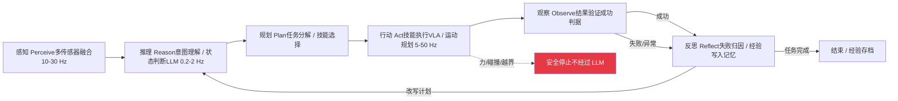
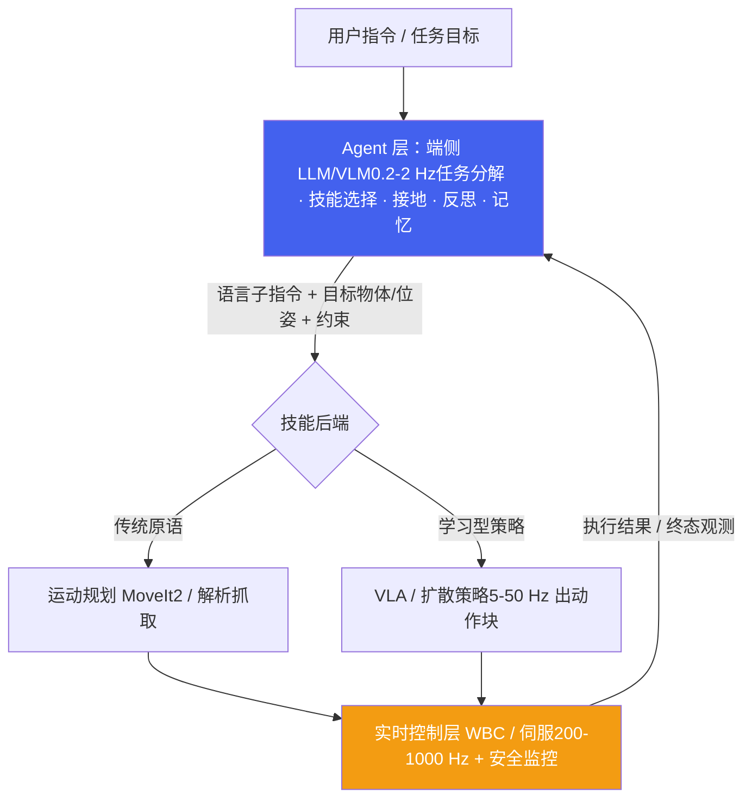
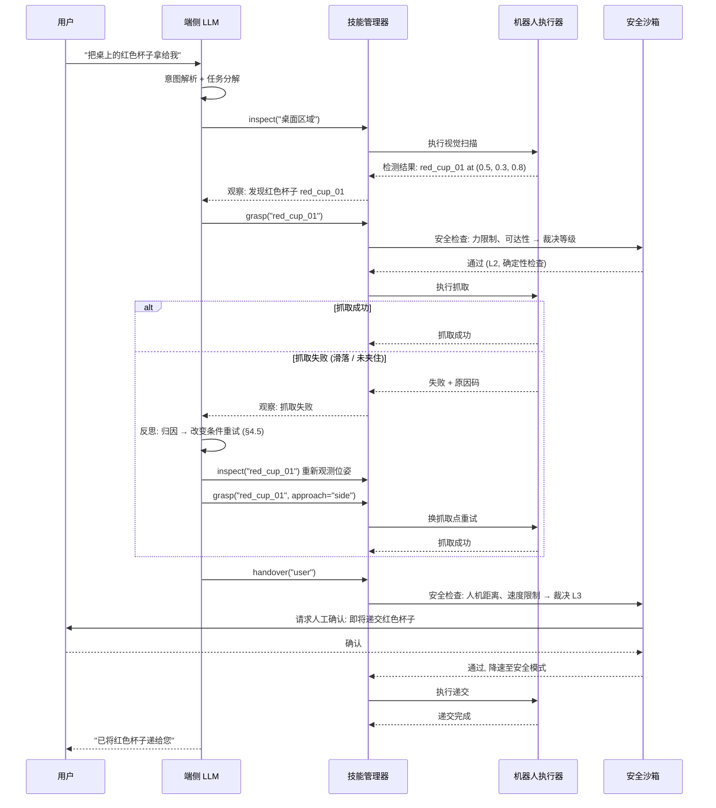
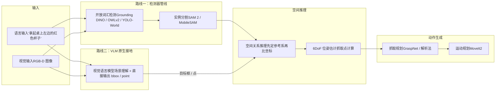
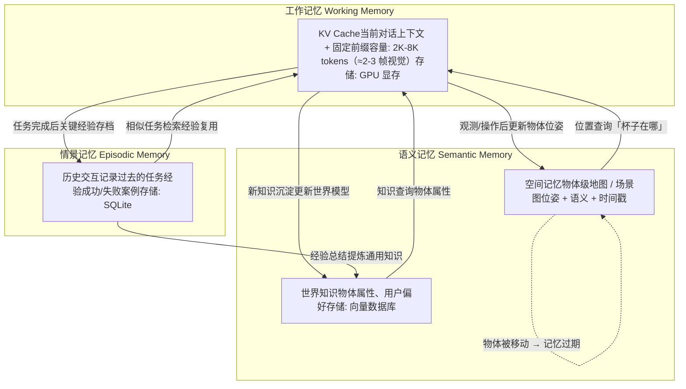

# 4. 端侧 Embodied Agent

*机器人端侧 Agent 架构、LLM 推理引擎、Tool Use 与安全沙箱、多模态接地、记忆与层次化规划*

> [!TIP]
> **本篇讲什么**
>
> 具身/人形机器人端侧 AI 的「Agent 层」，具身通识系列第 4 篇（共 4 篇）：
>
> - **Agent 架构**：Embodied Agent 循环（含反思）、LLM vs 状态机、混合架构、**Agent 与 VLA 的分工（2025-2026 融合形态）**
> - **端侧 LLM 推理引擎**：llama.cpp / MLC-LLM / ExecuTorch / QNN(QAIRT) / TensorRT-LLM 对比，decode 带宽模型与 KV Cache 内存推导，**前缀缓存 / 约束解码 / 投机采样在 Agent 场景的真实收益**
> - **Tool Use & Function Calling**：技能库抽象、动态注册、安全沙箱分级、**一轮工具调用的端侧延迟账**
> - **多模态接地**：视觉-语言接地、开放词汇操作、**2D→3D 接地链与误差预算**、空间指代消解与参考系
> - **记忆与规划**：三层记忆架构、**空间记忆（物体级地图/场景图）**、端侧向量数据库、层次化任务规划
>
> 其余三篇：[端侧算力与框架](platforms.html)、[感知与 VLA 训练](algorithms.html)、[端侧部署与实时控制](deployment.html)。
>
> 本篇只讲 **Agent 层**的推理账；LLM 推理原理（Roofline、FlashAttention、KV 结构级压缩）与服务化优化（前缀缓存、投机采样、约束解码）的完整推导见座舱板块 [端侧推理原理](../../cockpit/general/infer-principles.html) 与 [端侧解码与服务化优化](../../cockpit/general/infer-serving.html) —— 两处的带宽/KV 口径与本篇一致，只是平台锚点不同（车机 HTP vs 机器人 Jetson）。

> [!NOTE]
> **锚点模型与数据口径**
>
> 本篇端侧 LLM 推导统一以公开真实模型 **Qwen3-4B** 为例（稠密 4B：36 层、32 个 Q head、8 个 KV head（GQA）、head\_dim 128、hidden 2560）。与全站口径一致：**只讲方法，不给标准答案** —— 文中推理速度、内存等数字一律为**示例参数**，仅用于演示推导方法，不代表实测，请代入你自己的平台与模型配置计算。

## 1. 机器人端侧 Agent 架构

### 1.1 Embodied Agent 循环

与纯软件 Agent 不同，机器人 Embodied Agent 必须与物理世界交互。每一步"行动"都有不可逆性 —— 打碎的杯子无法 undo。这使得安全性和鲁棒性成为架构设计的首要考量。



循环的五个阶段跑在**三个数量级不同的时间尺度**上，这是具身 Agent 与软件 Agent 最本质的结构差异：

| 阶段 | 典型频率 | 承载者 | 关键约束 |
| :--- | :--- | :--- | :--- |
| 感知 Perceive | 10-30 Hz | 检测/分割/位姿/VLM | 与 [部署篇](deployment.html) §3 的传感器同步一致 |
| 推理 + 规划 Reason/Plan | 0.2-2 Hz | 端侧 LLM（本篇 §2） | 每轮数百 ms 至数秒，**不可进入实时环** |
| 行动 Act | 5-50 Hz（技能级）→ 200-1000 Hz（伺服） | VLA / 运动规划 / WBC | 分频架构，见 §1.3 与 [部署篇](deployment.html) §2.4 |
| 观察 Observe | 事件驱动 | 成功判据（确定性代码） | 判据必须可机器验证，不能问 LLM「你觉得成功了吗」 |
| 反思 Reflect | 每任务 / 每次失败 | LLM + 记忆写入（§5） | 离线或低优先级，不与控制抢带宽 |

> [!IMPORTANT]
> **反思（Reflect）不是可选装饰，而是成功率的乘数项**
>
> 单次开环执行的成功率按 §4.5 的乘积模型衰减得很快；把「观察 → 归因 → 改写计划 → 重试」闭起来，等效于给每一步加上一次重试机会（`p → 1-(1-p)²`）。工程上反思要落三件事：**失败归因**（是接地错、技能失败还是环境变化）、**计划改写**（换技能/换参数/求助人类）、**经验写入**（进 §5 的情景记忆，下次同类任务先检索）。注意反思本身要花 LLM 推理时间，因此**只在失败或任务边界触发**，不要每步都做。
>
> 安全停止路径（图中虚线）**必须绕过整个 Agent 循环**：力矩饱和、碰撞检测、工作空间越界由实时层的确定性代码直接触发，延迟在 ms 级 —— 等 LLM「思考」出停止指令，机器人已经撞上了。

### 1.2 端侧 LLM vs 传统状态机

传统机器人使用有限状态机（FSM）或行为树（BT）进行决策，而端侧 LLM Agent 使用自然语言推理。两种范式各有优劣：

| 维度 | 传统状态机/行为树 | 端侧 LLM Agent |
| :--- | :--- | :--- |
| **灵活性** | 固定逻辑，新场景需重新编程 | 自然语言指令，零样本适配新任务 |
| **可预测性** | 高 —— 行为可枚举、可验证 | 低 —— 输出不确定，需要 guardrail |
| **开发效率** | 低 —— 大量 if-else / 状态转移 | 高 —— 自然语言描述技能和约束 |
| **计算开销** | 极低 (<1ms) | 高（decode 访存受限，每 token 数十至上百 ms 量级；估算方法见 2.2） |
| **安全性** | 可形式化验证 | 需要额外安全层 (sandbox) |
| **可解释性** | 状态图直观 | 思维链 (CoT) 部分可解释 |
| **适用阶段** | 成熟产品、安全关键、行为可枚举 | 开放场景、长尾任务、需要自然语言交互；2025-2026 起进入量产演示与受限场景，但安全关键部分仍由状态机兜底 |

> [!NOTE]
> **混合架构是当前最佳实践**
>
> 推荐**"LLM 高层决策 + 状态机底层执行"**的混合架构：LLM 负责理解用户意图和高层任务规划（低频，秒级决策），状态机/行为树负责底层技能执行和安全监控（100-1000Hz）。底层安全逻辑（力限制、碰撞检测、工作空间边界）绝不经过 LLM，而是硬编码在实时控制层。这与实时控制的分频架构（见 [部署篇](deployment.html)）是同一原则在决策层的体现。

### 1.3 Agent 与 VLA 的分工（2025-2026 的融合形态）

「Embodied Agent」与「VLA」在 2024 年前后是两条独立技术线：Agent 线（LLM 编排 + 硬编码技能原语）解决**长时程任务分解**，VLA 线解决**接触丰富的连续控制**。2025 年起两者开始融合 —— VLA 越来越多地充当 Agent 的**动作后端**（一个「技能」就是一个策略网络），而 Agent 层负责 VLA 做不了的事。



三种落地形态（按工程成熟度排序）：

| 形态 | 结构 | 代表 | 优点 | 端侧代价 |
| :--- | :--- | :--- | :--- | :--- |
| **A. LLM 编排 + 硬编码技能** | Agent 调 MoveIt2/解析抓取等确定性技能 | SayCan / Code as Policies 一脉（2022-2024 主流） | 技能行为可枚举、可测试、可形式化验证 | 最低；但技能泛化差，新物体/新场景要写代码 |
| **B. LLM 编排 + VLA 当技能** | 每个技能是一个策略网络，Agent 只给语言子指令与目标 | GR00T N1 双系统、Helix（S2 理解 + S1 出动作）、π0 系（见 [算法篇](algorithms.html) §2.2） | 技能本身具备泛化性；Agent 层保持可解释 | 高：VLA 与 LLM **抢同一份显存与带宽**（见下方推导） |
| **C. VLA 内置高层推理** | 同一模型先出子任务文本、再出低层动作（分层推理） | π0.5 的 hierarchical inference、Gemini Robotics 1.5 一类「VLM 规划 + VLA 执行」组合（具体结构**需核实**） | 单一模型、语义与动作对齐好 | 最高：模型常驻，且高层与低层难以分频调度 |

> [!IMPORTANT]
> **形态 B/C 的真实瓶颈是内存带宽，不是算力 —— 用 §2.2 的模型直接算**
>
> VLA 每次前向也要把权重读一遍。以 ~3B 参数、INT4 权重（≈1.5 GB/趟，示例参数）为例：
>
> ```text
> 逐帧推理 @10 Hz  → 1.5 GB × 10 = 15 GB/s   （已占 Orin NX 级有效带宽的一大块）
> 逐帧推理 @50 Hz  → 1.5 GB × 50 = 75 GB/s   （超过平台可用带宽，物理上做不到）
> Action Chunking：5 Hz 重规划、每次出 10 步动作块 → 1.5 GB × 5 = 7.5 GB/s，控制仍是 50 Hz
> ```
>
> 所以 [算法篇](algorithms.html) §2.3 讲的 **Action Chunking 不只是「让动作平滑」，它首先是端侧的带宽优化** —— 把「每控制周期读一遍权重」降为「每 chunk 读一遍」。同理，Agent 层的 LLM decode 与 VLA 推理**并发时互相拖慢**（两者都是访存受限、共享同一条 LPDDR），工程上通常做**分时调度**：Agent 思考时 VLA 保持上一动作块/停在安全位姿，VLA 执行时 Agent 不 decode。§2.2 的「带宽共享折扣」就是为这件事留的。

> [!NOTE]
> **分工边界：什么该留给 Agent 层，什么该交给 VLA**
>
> - **留给 Agent（LLM/VLM）**：分钟-小时级任务分解、跨技能调度与排序、开放词汇接地与指代消解（§4）、失败归因与重试策略（§1.1 反思）、长时记忆读写（§5）、与人的自然语言交互与确认。这些都需要**世界知识与常识**，是策略网络的盲区。
> - **交给 VLA/策略**：秒级、接触丰富、需要高频闭环的操作（插拔、擦拭、抓取易变形物体）。这些用 LLM 逐步指挥必然失败 —— 延迟差两个数量级。
> - **谁都不能碰的**：力矩/速度限位、碰撞检测、急停。它们属于实时层的确定性代码（[部署篇](deployment.html) §2.4），VLA 输出的动作同样要过这道闸，不因「是神经网络出的」而免检。
> - **接口契约**：Agent → VLA 传「语言子指令 + 目标物体 ID/位姿 + 约束（速度档、力上限）」；VLA → Agent 返回「成功/失败 + 终态观测摘要」，**不要**把关节轨迹回灌进 LLM 上下文（既无用又吃 KV，见 §5.2）。

## 2. 端侧 LLM 推理引擎

### 2.1 主流引擎对比

端侧 LLM 推理引擎需要在有限算力下最大化 token 生成速度，同时控制内存占用。

| 引擎 | 核心优化 | 硬件支持 | 支持模型 | 量化支持 | 内存管理 | 特点 |
| :--- | :--- | :--- | :--- | :--- | :--- | :--- |
| **llama.cpp** | CPU SIMD, Metal, CUDA, Vulkan | CPU / GPU / Apple Silicon | Llama, Qwen, Phi, Gemma 等 | Q2-Q8, GGUF 格式 | mmap 按需加载 | 最广泛的模型支持，社区最活跃；VLM（Qwen-VL 系）支持也在跟进 |
| **MLC-LLM** | TVM 编译优化, GPU/NPU kernel | CUDA / Vulkan / OpenCL / Metal | Llama, Qwen, Phi 等 | INT4/INT8 (编译时) | 静态内存规划 | 编译优化，GPU 利用率高 |
| **ExecuTorch** | XNNPACK, CoreML, MPS, CUDA, QNN delegate | CPU / GPU / NPU (delegate) | Llama / Qwen / Phi（export 路径） | INT8/INT4 (PTQ) | Memory Planning | Meta 主推，与 PyTorch 生态融合，训练-部署一体化 |
| **QNN / QAIRT（Genie）** | Hexagon HTP 专用优化 | Qualcomm HTP/DSP | Llama, Qwen (需转换) | INT8/INT4 (W4A16) | DSP 内存池 + KV ring buffer | 高通平台最优性能；QAIRT 是新一代统一运行时，Genie 是其 LLM 对话运行时（口径见 [座舱推理原理](../../cockpit/general/infer-principles.html) §7） |
| **TensorRT-LLM** | 融合 kernel、in-flight batching | Jetson Orin (JetPack 6+) / Thor / NVIDIA GPU | Llama, Qwen, Phi 等 | W4A16 / FP8 | Paged KV Cache | NVIDIA 平台性能上限最高，显存占用相对更大 |

> [!NOTE]
> **引擎选型其实是「平台决定」，不是「性能决定」**
>
> 上表五个引擎在各自平台上都是「最优解」，跨平台比较意义不大：Jetson 选 TensorRT-LLM/llama.cpp，高通选 QAIRT/Genie，Apple Silicon 开发机选 llama.cpp/MLX。真正要做的是**确认引擎对 Agent 工作负载的支持**：① 是否支持你用的模型结构（尤其 VLM 的视觉编码器与投影层）；② 是否支持**前缀缓存**（Agent 的技能库 system prompt 是长固定前缀，见 §2.4）；③ 是否支持**约束解码**（工具调用的 JSON/grammar 约束，见 §3.5）；④ 能否与感知/VLA **分时共享显存**。2025-2026 的新变量：Android 底座的机器人可用 **LiteRT-LM / MediaPipe LLM Inference**（Google 端侧 LLM 栈，面向 Gemini Nano 类小模型，具体模型与算子支持**需核实**）；Jetson Thor（Blackwell）把 TensorRT-LLM 的 FP8/FP4 能力带进人形（规格见 [算力篇](platforms.html) §1.2）。

### 2.2 推理速度：带宽模型与量级对比

端侧 LLM decode 是**访存受限**任务：每生成一个 token，都要把全部权重（以及 KV Cache）从内存读一遍。因此 decode 速度可以用一个简单的带宽模型估算（与 [座舱推理原理](../../cockpit/general/infer-principles.html) §2.3 同一口径，只是平台锚点换成 Jetson）：

```text
decode 理论上限 = 有效带宽 ÷ 每 token 读取字节

① 每 token 读取字节（锚点 Qwen3-4B, W4A16）:
   权重   = INT4 transformer 权重 + 保留 FP16 的 embedding/LM head
          ≈ (4.0e9 − 0.39e9 词表) × 0.5 B + 151936 × 2560 × 2 B
          ≈ 1.8 GB + 0.78 GB ≈ 2.6 GB          ← 主导项
   KV     = 2×36层×8 KV头×128×seq_len×dtype
          = 144 KB/token (FP16)；seq_len=2048 时 ≈ 0.29 GB
   激活等 = 数 MB，可忽略
   → 短上下文每 token ≈ 2.6 GB；2048 上下文 FP16 KV ≈ 2.9 GB

② 有效带宽（关键：别拿峰值带宽直接除）:
   有效带宽 = 峰值带宽 × 内存效率(~0.7) × 带宽共享折扣 × 调度折扣
   Orin NX 16GB 峰值 ~102 GB/s、AGX Orin 64GB ~205 GB/s（公开规格，需核实 SKU/功耗模式）
   · 独占（无感知/VLA 并发）: ~102 × 0.7 ≈ 70 GB/s
   · 机器人真实场景（与感知/VLA 共享，折扣 ~0.55）: ≈ 40 GB/s（示例）

③ decode 上限（示例参数）:
   独占:   70 / 2.6 ≈ 27 tok/s
   并发:   40 / 2.6 ≈ 15 tok/s（短上下文）；2048 FP16 KV 时 40 / 2.9 ≈ 14 tok/s
```

> [!WARNING]
> **两个常被忽略的项，都会把「理想上限」往下拉**
>
> 1. **LM head/embedding 不是 INT4**：词表对精度敏感，通常保留 FP16。Qwen3-4B 词表 15 万级，单这一项就 ≈0.78 GB，占每 token 读取的 ~30% —— 所以「4B INT4 = 2 GB」是低估，真实每 token 读取 ≈2.6 GB（embedding 与 LM head tied 时；若两张独立表还要再加一份，见 [座舱推理原理](../../cockpit/general/infer-principles.html) §2.3 WARNING）。这也是 LM head 量化/词表裁剪能直接提速的原因。
> 2. **机器人上 LLM 从不独占带宽**：感知、VLA、SLAM 都在同一条 LPDDR 上跑。§1.3 已算过 VLA 的带宽账；decode 速度必须按「共享折扣后」的有效带宽估，否则会系统性高估 1.5-2 倍。**低功耗模式（nvpmodel）还会直接降内存频率** —— 电池供电的人形在节能档 decode 会明显变慢，这是功耗与推理速度的直接权衡。

Prefill 则相反：批量处理输入 token，是**算力受限**，速度随有效 TOPS 提升：`prefill 上限 ≈ 有效算力 ÷ (2 × 非嵌入参数量)`，Qwen3-4B 约 7.2 GFLOP/token。注意 Agent 场景的 prompt 里含**长 system prompt + 技能库描述**（可达数千 token），注意力的 N² 项不可忽略，实测 prefill 通常远低于算力 roofline。

各引擎在同一平台上的相对表现（**示例参数**，仅演示引擎间量级差异，非实测；decode 列已按上面「并发口径上限 ~15 tok/s」约束，任何引擎数字不应超过它——若你看到的基准超过，先怀疑它用的是独占带宽或非 4B/INT4 口径）：

**Qwen3-4B INT4 端侧推理量级对比（Jetson Orin NX 级平台、与感知/VLA 并发的真实场景，示例参数）**

| 引擎 | Prefill (tok/s) | Decode (tok/s) | 说明 |
| :--- | :--- | :--- | :--- |
| llama.cpp (CUDA) | 150 | 7 | 通用基线，GGUF 量化生态最灵活 |
| ExecuTorch (CUDA) | 180 | 8 | PyTorch 生态一体化 |
| MLC-LLM | 300 | 11 | TVM 编译优化，kernel 定制深 |
| TensorRT-LLM | 420 | 13 | 融合 kernel 最激进，显存占用也最大 |

decode 7-13 tok/s 对应每 token 约 77-143 ms（并发口径）；独占带宽时上限约 27 tok/s（≈37 ms/token）。这就是 1.2 节「每 token 数十至上百 ms」的由来；任何声称端侧 4B 模型「每 token 秒级」或「每 token 个位数 ms」的说法都与带宽模型矛盾，可用上式快速证伪。

### 2.3 内存优化关键技术

端侧 LLM 推理的内存瓶颈在于 KV Cache。通用公式与锚点模型推导：

```text
# KV Cache 内存计算（通用公式）
# kv_cache = 2 (K/V 两份) × 层数 × KV head 数 × head_dim × 序列长度 × 每元素字节数

# 锚点模型 Qwen3-4B: 36 层, 32 个 Q head, 8 个 KV head (GQA), head_dim 128
# 每 token KV: FP16 = 2×36×8×128×2 = 144 KB/token；INT8 = 72 KB/token
# 序列长度 2048, FP16 存储 (2 bytes):
kv_cache_size = 2 * 36 * 8 * 128 * 2048 * 2   # bytes
# = 301,989,888 bytes ≈ 0.28 GB (GiB 口径；十进制 ≈ 0.30 GB)

# 对比：若是 MHA（32 个 KV head），体积 ×4 ≈ 1.13 GB —— 这就是 GQA 的价值
# （注意 KV Cache 只按 KV head 数计，与 32 个 Q head 无关）

# 进一步优化手段:
# 1. KV Cache INT8 量化: 再减 2x → ≈ 144 MB
# 2. Sliding Window / 驱逐 (StreamingLLM, H2O): 限制有效上下文
# 3. PagedAttention (vLLM / TensorRT-LLM 式): 分页管理消除碎片
# 4. 结构级压缩 (2025 起): MLA / 混合线性注意力 —— 从源头改小每 token KV，
#    推导与端侧可得性见座舱推理原理 §3.4（能否在你的运行时上编出来需核实）
```

> [!IMPORTANT]
> **具身 Agent 的 KV 要按「帧」规划，不是按「对话轮数」**
>
> 机器人 Agent 的上下文里视觉 token 占绝对大头：一帧画面按 ~576-1024 个视觉 token 计（取决于分辨率与 patch 合并策略），单帧 KV ≈ 576 × 144 KB ≈ **81 MB（FP16）/ 41 MB（INT8）**。也就是说 **2048 token 的上下文只装得下 2-3 帧画面 + 指令**；多相机（头部 + 腕部）或连续视频流下，几秒就能把 KV 预算吃光。对策与座舱篇同口径：视觉 token 用完即弃（不入长期缓存）、只对视觉 token 做滑窗、关键帧选择而非全帧入上下文。这条约束直接决定了 §5.2 工作记忆的容量口径。

端侧 Agent 的**总内存预算**（Orin NX 16GB 级平台，量级示例，非实测）：

| 常驻项 | 量级 | 说明 |
| :--- | :--- | :--- |
| LLM/VLM 权重（4B, W4A16） | ~2.6 GB | §2.2 口径，含 FP16 词表 |
| KV Cache（2048, INT8） | ~0.15 GB | 多帧视觉输入下按上方 IMPORTANT 的「按帧」口径重算 |
| 视觉编码器 / 感知模型（检测·分割·位姿） | ~1-2 GB | 见 §4 与 [部署篇](deployment.html) §1.3 |
| VLA / 策略模型（~3B, INT4） | ~1.5-2 GB | 形态 B/C 才需要，见 §1.3 |
| CUDA context / 运行时 / 框架开销 | ~1-2 GB | 多引擎共存时各自有一份 |
| 系统 + ROS2 + 地图 + 日志 | ~2-4 GB | 语义地图规模见 §5.3 |
| **合计** | **~9-14 GB** | 16GB 平台已无余量 → 多模型并发是人形选 AGX Orin 64GB 的直接原因（[算力篇](platforms.html) §1.4） |

### 2.4 Agent 工作负载的解码优化：优先级与聊天场景不同

Agent 的推理负载有三个特征：**多轮短输出**（每轮只吐一个工具调用）、**长固定前缀**（system prompt + 技能库 schema）、**结构化输出**（JSON/grammar 可约束）。因此优化优先级与「长回复聊天」完全不同 —— 完整推导见 [座舱解码与服务化优化](../../cockpit/general/infer-serving.html)，这里只给具身场景的排序与理由：

| 手段 | 在 Agent 场景的作用 | 端侧真实收益 | 注意 |
| :--- | :--- | :--- | :--- |
| **输出长度控制（N_out）** | 每 token 77-143 ms（§2.2），输出 200 token 的自由 CoT ≈ 15-30 s | **最大杠杆**：把每轮输出压到几十 token 的结构化调用，单轮从十几秒降到 1-3 s | CoT 要么限预算，要么交给 §1.3 的分层结构，不要让 LLM 边想边说 |
| **前缀缓存 (Prefix Caching)** | 技能库 schema + system prompt 是数千 token 的固定前缀，每轮都要重放 | **Agent 场景收益远大于聊天场景**：命中即跳过这段 prefill，TTFT 大幅下降 | 视觉 token 不被文本前缀缓存覆盖；§3.3 的动态注册会使前缀失效 → 注册要**批量、低频**，别每轮改工具表 |
| **约束解码 (GBNF / JSON Schema)** | 保证工具调用格式与取值域合法 | 消除「格式错误 → 整轮重试」；4B 级小模型的 function calling 可靠性显著低于云端大模型，这项在端侧**不是可选项** | 必须验证运行时**真的**在约束（构造一个会被 grammar 拦住的输入试试）—— 座舱实测过「缺 EBNF 时只 warn 一条日志就静默降级」的坑 |
| **投机采样** | 加速 decode | 端侧优先级：**n-gram / prompt-lookup**（技能指令高度模板化、命中率天然高、零草稿成本）> **jump-forward**（grammar 确定段直接写入）> **EAGLE 类共享 LM head**（内存可行，但受 LM head 读取的硬下界压到 ~1.5× 量级）> 独立草稿模型 / 原版 Medusa（大词表下单头就数百 MB，**不推荐**） | 加速比要按草稿成本 c 打折、再按 Amdahl 折到端到端，公式与端侧结论见 [座舱篇 §2](../../cockpit/general/infer-serving.html) |
| **Continuous Batching** | 多请求并发提吞吐 | 端侧 Agent 通常单请求（B=1），收益有限；仅在「多机协同 / 反思与执行并发」时有意义 | batching 抬高算术强度，会挤占投机采样的算力余量，两者抢同一份资源 |

> [!NOTE]
> **一句话排序**
>
> 端侧具身 Agent 先把 **N_out 压短 + 前缀缓存 + 约束解码** 做满（三项都不依赖模型改动、收益确定），再考虑投机采样；KV 结构级压缩（MLA / 混合线性注意力）属于「换模型」级别的决策，见 §2.3。

> [!TIP]
> **引擎选型建议**
>
> **Jetson Orin 平台**：显存充裕时用 **TensorRT-LLM**（性能上限最高）；要灵活量化与最广模型支持用 **llama.cpp (CUDA)**，两者都是生产级默认选项，MLC-LLM 适合愿意做编译定制的团队。**Qualcomm 平台**：使用 **QNN / QAIRT + Genie**（Hexagon HTP 独占优化）。**跨平台原型**：使用 **llama.cpp**（一份代码跑遍所有平台）。**与 PyTorch 深度集成**：使用 **ExecuTorch**（训练-部署一体化）。

## 3. 端侧 Tool Use & Function Calling

### 3.1 机器人技能库抽象

将机器人的底层控制能力抽象为 LLM 可调用的"工具函数"（技能），是 Embodied Agent 的核心设计模式。每个技能封装了完整的感知-规划-执行逻辑：

| 技能名称 | 参数 | 前置条件 | 执行时间 | 安全等级（§3.4） |
| :--- | :--- | :--- | :--- | :--- |
| `grasp(object_id)` | 目标物体 ID | 物体已检测、可达 | 3-8s | L1-L2（力控/易碎时 L2） |
| `place(position)` | 目标位置 (x,y,z) | 手中有物体 | 3-6s | L1-L2 |
| `navigate(goal)` | 目标位置/区域名 | 地图已建立 | 10-60s | L1（避障保护） |
| `inspect(object_id)` | 目标物体 ID | 物体已检测 | 2-5s | L0 |
| `handover(target)` | 交接对象 (人/机器人) | 手中有物体 | 5-15s | L3（人机安全） |
| `scan_area(region)` | 扫描区域 | 无 | 10-30s | L0 |

> [!IMPORTANT]
> **安全等级不是技能的静态属性，而是「技能 × 上下文」的函数**
>
> 同一个 `grasp`：抓空旷桌面上的塑料杯是 L1，抓人旁边的玻璃杯就是 L3。等级应在**调用时**由确定性规则计算（物体脆弱性 + 人机距离 + 工作空间占用 + 是否不可逆），而不是写死在技能注册表里。表中的等级只是「典型上下文下的基线」；实际放行与否由 §3.4 的沙箱在每次调用时裁决。这与 [驾驶 Agent 安全](../../ad/general/agent-safety.html) 里「安全等级由严重度×暴露度×可控性组合决定」是同一思想。

### 3.2 Tool Use 调用流程



> [!NOTE]
> **图里三个容易被忽略的细节**
>
> 1. **安全检查是独立参与者**，不是技能管理器内部的一个 if —— 它必须能拒绝技能管理器的调用（§3.4 原则 1）。
> 2. **L3 动作要真的去问人**：`handover` 是 L3，沙箱向用户请求确认后才放行；很多实现只在日志里写「需确认」却直接执行，等于没有这一级。
> 3. **失败路径要回到 LLM 反思**，并且重试**改变条件**（重新观测 + 换抓取点），而不是原样重发同一条指令（§4.5 要点 3）。

### 3.3 动态工具注册

机器人在运行时可能获得新能力（如安装了新末端执行器），Agent 框架需要支持动态注册新技能：

```
# 动态技能注册示例
class SkillRegistry:
    def __init__(self):
        self.skills = {}

    def register(self, name, func, schema, safety_level="L3"):
        """运行时注册新技能。默认 L3（人工确认）—— 新技能未经验证，
        按 §3.4 CAUTION 的原则从严，跑通并复盘后才允许降级。"""
        self.skills[name] = {
            "function": func,
            "schema": {          # OpenAI Function Calling 格式
                "name": name,
                "description": schema["description"],
                "parameters": schema["parameters"]
            },
            "safety_level": safety_level
        }
        # 更新 LLM 的 system prompt 中的可用工具列表
        self.update_llm_tools()

    def get_tool_descriptions(self):
        """生成 LLM 可理解的工具描述"""
        return [s["schema"] for s in self.skills.values()]

# 运行时发现新末端执行器 → 注册新技能
registry.register(
    name="vacuum_pick",
    func=vacuum_gripper.pick,
    schema={
        "description": "使用真空吸盘吸取平面物体",
        "parameters": {
            "type": "object",
            "properties": {
                "object_id": {"type": "string", "description": "目标物体ID"},
                # 取值域写进 schema（enum / minimum / maximum），
                # 约束解码才能直接用它做 grammar（§2.4、§3.5）
                "suction_force": {"type": "number", "description": "吸力(N)",
                                  "minimum": 0, "maximum": 30, "default": 10}
            },
            "required": ["object_id"]
        }
    },
    safety_level="L3"   # 新技能默认最严，验证后再降
)
```

> [!NOTE]
> **动态注册的三个工程副作用**
>
> 1. **前缀缓存失效**：工具表在 system prompt 里，改一次就让整段前缀 KV 作废（§2.4）。所以注册要**批量、低频**（如启动时扫描末端执行器一次性注册），不要每轮对话动态增删。
> 2. **prompt 膨胀**：每多一个技能就多几十到上百 token 的 schema，直接推高每轮 TTFT 与 KV 占用。技能数超过几十个时应做**检索式工具选择**（先按任务语义召回 top-k 技能，只把这 k 个的 schema 放进上下文），而不是全量塞进去。
> 3. **跨进程/跨厂商发现**：技能可能来自不同进程甚至不同设备（另一台机器人、云端服务）。2025 年起 **MCP（Model Context Protocol）** 一类的标准协议被用于工具发现与调用（座舱侧实践见 [Agent 协议](../../cockpit/projects/agent-framework/agent-protocols.html)）；端侧要注意其传输与进程开销，以及**跨进程调用不能绕过 §3.4 的沙箱**——安全检查必须在执行器所在进程内做，不能信任调用方。

### 3.4 安全沙箱机制

| 安全等级 | 描述 | 检查内容 | 确认方式 | 示例操作 |
| :--- | :--- | :--- | :--- | :--- |
| **Level 0: 安全** | 不涉及物理运动 | 无 | 自动执行 | inspect, scan, query |
| **Level 1: 低风险** | 低速运动，远离人 | 工作空间边界、碰撞检测 | 自动执行 | navigate, pick (空旷区域) |
| **Level 2: 中风险** | 力控操作、精密操作 | 力限制、速度限制、物体脆弱性 | **确定性检查**（力/速度阈值）+ 日志；LLM 自检只作辅助、不作闸门 | grasp (易碎品), pour |
| **Level 3: 高风险** | 人机交互、不可逆操作 | 人机距离、速度降档、力矩饱和 | 人工确认 | handover, cut, heat |
| **Level 4: 禁止** | 超出安全边界 | — | 拒绝执行 | 离开工作区域、高速接近人 |

> [!NOTE]
> **与「三级制」口径的对应关系**
>
> 不少资料（含同板块 [面试篇](interview.html) Q26）用 **L1 信息查询 / L2 可逆操作 / L3 不可逆操作** 的三级制。它与上表的对应是：L1(查询) ≈ **Level 0**、L2(可逆) ≈ **Level 1**、L3(不可逆) ≈ **Level 2-3**（再按「是否涉及人」拆成两级）。五级制多出来的两档正是机器人最需要的：**Level 3 的「人工确认」**（不可逆 + 涉人）与 **Level 4 的「直接拒绝」**（越界指令连确认都不给）。面试或写方案时先说明用的是哪套编号，避免「L3」在两套口径里含义不同。

> [!CAUTION]
> **安全优先原则**
>
> 机器人 Agent 与软件 Agent 的根本区别：**物理动作不可撤销**。设计原则：
>
> 1. **安全检查在 LLM 之外**，用确定性代码实现，不依赖 LLM 判断（LLM 可以「建议」，但不能「放行」）。
> 2. **力矩/速度限制硬编码在控制器层**，即使 LLM 发出危险指令也无法突破。
> 3. **参数校验同样在 LLM 之外**：关节限位、速度上限、力上限、工作空间边界逐参数校验，超限直接拒绝并返回结构化错误（让 LLM 看到错误去改参数），而不是指望它「自己注意」。
> 4. **新技能默认 Level 3**（人工确认），经验证后才降级（§3.3 的注册默认值就是这个原则）。
> 5. **L2 以上动作可先预演**：在仿真/数字孪生里跑一遍，检查碰撞、自碰撞与稳定性，通过后再上真机 —— 这是把「不可撤销」变成「可撤销」的唯一办法。
> 6. **急停优先级最高**，可中断任何技能，包括 Agent 认为「必须完成」的动作；恢复必须由人确认。
> 7. **技能要可恢复**：执行到一半被急停/断电后，重启要能判断当前物理状态（手里有没有物体、在哪、夹爪是否闭合）并回到安全态，而不是盲目续跑上一次的计划。
> 8. **所有操作记录审计日志**（指令原文、LLM 输出、参数校验结果、放行等级、执行结果），支持事后追溯与复盘 —— 这也是 §5 情景记忆的数据来源。

### 3.5 一轮工具调用的端侧延迟账

Agent 循环的每一轮都要付一次 LLM 推理的钱。把 §2.2 的带宽模型代入 Agent 负载，就能算出「端侧 Agent 到底能不能用」：

```text
单轮开销 = TTFT + N_out × TPOT
  TTFT ≈ 未命中前缀的 prefill token 数 ÷ prefill 吞吐（+ 视觉编码时间）
  TPOT ≈ 77-143 ms/token（§2.2 并发口径）

示例参数（Qwen3-4B INT4，Orin NX 级，prefill 取 300 tok/s）:
  技能库 + system prompt ≈ 3000 token（固定前缀）
  本轮新增观测/历史     ≈ 300 token

  ① 前缀缓存命中：TTFT ≈ 300/300 = 1 s；N_out = 40（结构化调用）→ decode ≈ 4 s
     单轮 ≈ 5 s，5 步任务 ≈ 25 s        ← 可用（慢但能干活）
  ② 前缀缓存未命中：TTFT ≈ 3300/300 = 11 s → 单轮 ≈ 15 s，5 步任务 ≈ 75 s   ← 不可用
  ③ 放任 LLM 输出 200 token 自然语言推理：decode ≈ 20 s → 单轮 ≈ 21 s        ← 不可用
```

结论是三条硬约束，而不是「优化建议」：

1. **前缀缓存 + 短结构化输出是「能不能用」的分界线**（② 与 ① 差 3-4 倍）。技能库 schema 必须放在固定前缀里、不要每轮重排；输出必须是紧凑的工具调用，CoT 要么砍掉要么限预算（§2.4）。
2. **观测注入比文本贵一个量级**：每轮塞一张原图 = 576-1024 个视觉 token 的 prefill + KV（§2.3）。所以 §3.2 的时序图里，技能返回给 LLM 的是**结构化文本观测**（`red_cup_01 at (0.5, 0.3, 0.8)`）而不是图像 —— 这是刻意的设计选择：让 §4 的检测/接地管线把像素压成几十个 token 的事实，LLM 只在需要视觉判断时才收关键帧。
3. **LLM 不能阻塞等技能执行**：技能耗时 3-60 s（§3.1）通常远大于 LLM 单轮推理，必须用异步接口（ROS2 Action Server，见 [算力篇](platforms.html) §3.4）下发并提供进度反馈、超时与取消；同时**接触丰富的高频闭环不能等 Agent** —— 动作一旦开始就由 VLA/控制器闭环完成，Agent 只在 chunk 边界或失败时介入（§1.3）。

## 4. 多模态理解与接地

### 4.1 视觉-语言接地 (Visual-Language Grounding)

"接地"(Grounding) 是将自然语言中的指代（如"红色杯子"、"左边那个"）映射到物理世界中具体物体或位置的过程。这是 Embodied Agent 能否正确执行指令的关键环节。



> [!NOTE]
> **两条接地路线，2025-2026 的实践是混用**
>
> - **路线一（检测器 + 分割 + VLM 语义）**：定位精度高、每个模块可单独量化与替换、失败可定位到具体环节；代价是多模型常驻（内存与带宽，§2.3）、级联延迟叠加、对文本 prompt 的写法敏感。
> - **路线二（VLM 原生输出坐标）**：Qwen-VL 系、Molmo（pointing）一类模型能直接吐 bbox/point，把「语言理解 + 视觉定位」统一在一个模型里 —— 省一份权重与一次推理，且天然支持复杂指代（"那个像小猫的玩具"）。代价是**坐标精度与小物体定位弱于专用检测器**、输出坐标的归一化/像素口径必须与标定一致、量化后坐标漂移会直接变成抓空，且视觉 token 吃 KV（§2.3）。
> - **工程上常见的组合**：VLM 出粗定位与语义判断 → 专用检测器/SAM 2 精修框与掩码 → 位姿估计出抓取点。纯路线二在精细操作上仍不占优。

> [!NOTE]
> **2025-2026 的另一个变量：全模态（Omni）端侧模型**
>
> Qwen-Omni 系（Qwen2.5-Omni 3B/7B、Qwen3-Omni 的 MoE 形态等，具体规格与端侧可得性**需核实**）把语音、视觉、文本放进同一个模型。对机器人的直接价值：① 省掉「ASR → LLM → TTS」级联的延迟与错误累积，语音指令连同语气、停顿一起理解；② 视觉与语言在同一上下文里，模糊指代（"把那个拿过来"）不必额外触发检测管线。端侧要重新算三笔账：**活跃参数量**才是 §2.2 带宽公式的输入（MoE 的总参数 ≠ 每 token 读取量，要按活跃参数算）；**音频与视觉 token 都进 KV**（§2.3 的「按帧规划」要扩展成「按帧 + 音频秒」）；**语音交互的实时性**要求首 token 数百 ms，比工具调用轮次（§3.5）更紧。开源具身/VLA 生态入口（LeRobot 等）见 [算法篇](algorithms.html) §2.2。

### 4.2 开放词汇操作

传统机器人只能操作训练集中见过的物体类别。结合视觉-语言模型，机器人可以理解和操作从未见过的物体：

| 技术 | 原理 | 优点 | 局限 | 端侧可行性 |
| :--- | :--- | :--- | :--- | :--- |
| **CLIP + Detection** | CLIP 特征匹配 + 检测框 | 零样本，无需训练 | 空间分辨率低 | 高 (CLIP ViT-B 约 150M) |
| **Grounding DINO（1.5/1.6 系）** | 文本引导的检测器 | 精确定位，开放词汇 | Swin-T 版约 172M；含文本骨干与可变形注意力，NPU 编译不友好 | 中（GPU 上 FP16/INT8 可跑，见下方 WARNING） |
| **OWLv2** | 开放世界检测器 | one-shot 支持 | 速度中等 | 中 |
| **YOLO-World** | 开放词汇版 YOLO | 速度快、算子常规、部署友好 | 长尾/复杂描述弱于 DINO 系 | **高**（端侧开放词汇检测的常见首选；S/M 变体数十 M 级，**需核实**） |
| **SAM 2 / MobileSAM / EfficientSAM** | 提示式分割（点/框 → 掩码） | 掩码质量高；轻量变体 40M 级 | 需要提示（来自检测器或 VLM）；两阶段延迟 | **中-高**（轻量变体端侧可跑；SAM ViT-H 636M 不建议，SAM 2 Hiera-T/S 约 40-50M 级，**需核实**） |
| **VLM 原生接地** | VLM 直接输出 bbox/point | 单模型统一语义与定位，支持复杂指代 | 坐标精度弱于专用检测器；视觉 token 吃 KV | 中-高（4B 级 VLM 已在端侧射程内，见 §4.1 路线二） |

> [!WARNING]
> **接地模型量化的端侧难点：算子、动态 shape 与「框漂移」**
>
> 1. **算子不友好**：Grounding DINO 一类的跨模态检测器含文本骨干（BERT 系）、可变形注意力、多尺度特征融合，这些在 NPU/HTP 的静态图编译器上支持度差，常常整段回退到 GPU 甚至 CPU —— 结果是「模型不大但跑不快」。上 Jetson 前先确认算子覆盖，别只看参数量。
> 2. **动态 shape 与静态编译图冲突**：文本 prompt 长度可变、query/框数量可变，而端侧编译图通常是固定 shape（[座舱推理原理](../../cockpit/general/infer-principles.html) §7）。对策是固定文本长度（padding）+ 固定 top-k 输出，代价是浪费一些算力。
> 3. **量化误差的判据不是 mAP，是「抓不抓得到」**：检测框漂移 1-2 cm 对 mAP 影响很小，对抓取是致命的（夹爪张不开那么准、或撞到旁边物体）。所以接地模型量化后必须用**下游任务指标**（抓取成功率、位姿误差）验收，而不是只看检测精度 —— 与 [部署篇](deployment.html) §1.3 的「以下游任务指标为准」同一原则。
> 4. **深度与标定误差常常主导**：见 §4.3 的误差预算。

### 4.3 从 2D 框到 3D 抓取：接地链与误差预算

检测器给的是**像素框**，机械臂要的是**基座坐标系下的 SE(3) 抓取位姿**。中间这条链每一环都引入误差，且**逐级累积**——这是接地从「看得见」到「抓得到」之间最容易翻车的地方：


各环节的误差来源与量级（**示例口径**，用于演示误差预算方法，非实测）：

| 环节 | 主要误差来源 | 量级（示例） | 端侧注意点 |
| :--- | :--- | :--- | :--- |
| 检测框定位 | 模型量化漂移、遮挡、小物体 | 数像素 | §4.2 WARNING：用抓取成功率验收 |
| 深度反投影 | 深度相机噪声、反光/黑色/透明表面失效 | mm-cm 级，失效时 cm+ | 近距离结构光 vs ToF 取舍；失效要有降级（放弃/换视角） |
| 手眼标定 | 标定残差，随臂展放大 | mm 级 → 末端 cm 级 | eye-in-hand / eye-to-hand 选型；定期重标定 |
| 6DoF 位姿 | 对称物体绕对称轴旋转不可观测 | 角度误差大 | 抓取策略要对称鲁棒，别依赖绝对朝向 |
| 抓取规划 | 夹爪容差、碰撞 | cm 级 | 与上面误差叠加后必须 < 夹爪容差 |

> [!IMPORTANT]
> **误差预算的用法：先算总和，再决定优化哪一环**
>
> 把各环节误差按最坏情况叠加，得到抓取点的总不确定度；若它**超过夹爪容差**，那换更大的检测模型也白搭 —— 此时应优先修**标定与深度**（便宜且收益大），而不是堆感知算力。反之，若总误差远小于夹爪容差，接地精度就不是瓶颈，资源应转向规划与执行。这个「先算账、再优化」的顺序能避免在错误的环节投入 —— 与 §4.5 的乘积模型是同一思想：**先定位最弱一环**。
>
> 6DoF 位姿估计的端侧代表方法：渲染对比类（FoundationPose / MegaPose / GigaPose 一脉，2024-2025，需已知物体模型或单图注册，算力需求见 [算力篇](platforms.html) §1.5）、点云配准类、以及类别无关的抓取检测（GraspNet / AnyGrasp 类，直接出抓取位姿、跳过物体位姿）。对称、未知、堆叠物体仍是公认难点。

### 4.4 空间推理与指代消解

用户指令中的空间关系（"左边"、"上面"、"靠近"）需要在 3D 空间中解析。关键处理步骤：

```
# 空间指代消解示例
class SpatialReasoner:
    def resolve_reference(self, text, detections, robot_base_T_camera):
        """将语言中的空间指代解析为具体物体"""
        # 1. 提取空间关系词
        relations = self.parse_spatial_relations(text)
        # e.g., {"attribute": "红色", "relation": "左边", "anchor": "桌子"}

        # 2. 属性过滤
        candidates = [d for d in detections
                       if self.match_attribute(d, relations["attribute"])]

        # 3. 空间关系过滤 —— 注意：必须先把所有位置变换到统一参考系
        #    （这里是机器人基座系），再比较坐标。"左边"到底是谁的左边，
        #    由参考系决定：用户视角 / 机器人基座 / 锚点物体自身朝向，三者答案不同。
        if relations["relation"] == "左边":
            anchor = self.find_object(detections, relations["anchor"])
            frame = self.resolve_reference_frame(relations)  # 明确参考系
            candidates = [c for c in candidates
                          if frame.left_of(c, anchor)]       # 在参考系内判断

        # 4. 歧义消解：如果仍有多个候选，选最近的
        if len(candidates) > 1:
            candidates.sort(key=lambda c: c.distance_to_robot)

        return candidates[0] if candidates else None
```

> [!WARNING]
> **空间关系的头号陷阱：参考系，而不是「左 = x 小」**
>
> 「左边」在**相机坐标系**里是 x 较小，但用户说的「左边」通常指**用户自己的左边**或**场景的左边** —— 相机一转头、机器人一转身，「相机系的左」就和「用户的左」对不上了。所以：① 所有空间判断必须先把检测/位姿统一变换到**同一个明确参考系**（通常是机器人基座系），再比较；② 参考系的选择要显式建模（用户视角 / 基座 / 锚点物体朝向），不能默认等于相机系；③ 移动机器人的相机在动，相机系下的坐标每帧都在变，只有基座系/世界系下的坐标才可跨帧比较（与 [部署篇](deployment.html) 的坐标变换、SLAM 同一套）。
>
> 另一个经验：**别让 VLM 直接回答「哪个在左边」**。VLM 对左右/镜像类空间关系的判断是已知弱项，且不可验证。更稳的做法是上面代码的路子 —— 让 VLM/检测器出**物体与坐标**，把「谁在谁的左边」这类**关系判断交给确定性代码在 3D 里算**。LLM 负责语义（"红色杯子"），几何交给几何。

### 4.5 成功率预算：乘积模型与闭环重试

接地精度最终要落到「任务成功率」上才算数。端到端成功率可按步骤累积估算：

```text
开环执行（每步只做一次，步骤独立）:
  P = ∏ p_i ≈ p^n        （各步成功率相近时）
  p=0.90, n=3 → 0.90³ ≈ 73%
  要把 3 步任务做到 90%+ → 单步需 ≈ 97%（0.97³ ≈ 91%）

闭环执行（每步允许 k 次重试，重试条件独立）:
  单步有效成功率 p' = 1 − (1−p)^(k+1)
  p=0.90, 重试 1 次 → p' = 1 − 0.01 = 0.99；3 步 → 0.99³ ≈ 97%
```

> [!TIP]
> **三条要点（以及一个常见误用）**
>
> 1. **同样的绝对提升，作用在「最弱一环」收益最大**：`P = ∏ p_i`，把某一步的 `p_i` 提高 δ，整体相对增益是 `δ / p_i` —— p_i 越小，增益越大。实践中接地/感知常常是最弱环（框漂移、深度失效、指代歧义），所以优先投感知与接地；但这是**「最弱环优先」，不是「接地永远比规划重要」** —— 如果你的系统里规划才是那个 60% 的环节，就先修规划。先测出各环节的 p_i，再决定投入。
> 2. **闭环重试是端侧最便宜的成功率杠杆**：一次重试的代价是几秒（§3.5），换来的是把单步失败率从 `(1-p)` 压到 `(1-p)²` 量级 —— 这正是 §1.1 反思环节的量化价值。前提有两个：重试必须**安全**（可逆动作才能重试，洒了的水不能重试）、**可判定**（观察环节要有确定性成功判据，不能问 LLM「你觉得成功了吗」）。
> 3. **独立性假设是乐观的**：真实步骤的误差高度相关（同一片反光导致连续几步深度都失效、同一个物体形状导致抓取反复失败），所以 `pⁿ` 只是**上界**，实际成功率通常更低。对策是让重试**改变条件**（换视角、换抓取点、换技能、请求人工），而不是原样重复 —— 在相关误差下原样重复几乎必然再次失败。

## 5. Agent 记忆与规划

### 5.1 三层记忆架构

长时间运行的机器人 Agent 需要结构化的记忆系统，而非仅依赖 LLM 的上下文窗口。三层记忆架构是当前最实用的设计：



### 5.2 各层记忆实现细节

| 记忆层 | 存储介质 | 数据格式 | 容量 | 检索方式 | 更新频率 |
| :--- | :--- | :--- | :--- | :--- | :--- |
| **工作记忆** | GPU 显存 | KV Cache (FP16/INT8) | 2K-8K tokens（多模态下 ≈2-3 帧画面 + 指令，见 §2.3） | Attention 自动 | 每个 token |
| **情景记忆** | eMMC/SSD (SQLite) | 结构化记录 (JSON) | 10K-100K 条 | SQL 查询 + 向量相似度 | 每个任务 |
| **语义记忆** | eMMC/SSD (向量库) | 嵌入向量 + 元数据 | 10K-1M 向量 | ANN 近似最近邻 | 按需 |
| **空间记忆** | 内存索引 + SSD 持久化 | 物体条目（ID/类别/位姿/置信度/时间戳）+ 关系边 | 1K-100K 物体条目 | 空间查询（半径/区域）+ 语义查询 | 每次观测/操作 |

> [!NOTE]
> **工作记忆的两个端侧特有约束**
>
> 1. **固定前缀也占工作记忆**：system prompt + 技能库 schema（数千 token）常驻上下文，是前缀缓存的对象（§2.4）。规划容量时要把它算进去 —— 「8K 上下文」里可能有 3K 是工具表，真正留给观测与历史的只有 5K。
> 2. **超窗时必须主动换页，而不是截断**：长时任务的上下文一定会超窗。做法是把旧片段**摘要后写回情景记忆**再从 KV 里驱逐（MemGPT/Letta 一类的「主存-外存换页」思想，2025 年已是软件 Agent 的常见组件），而不是简单丢掉最旧的 token —— 丢掉的往往正是「刚才把杯子放哪了」这类关键事实。视觉 token 优先驱逐（§2.3）。

### 5.3 空间记忆：物体级地图与场景图

机器人的语义记忆有一半是**空间的**：「杯子在桌上」「充电器在沙发右边」这类事实必须绑定 3D 位置才有用。它与 [部署篇](deployment.html) §5.2 的语义/物体级 SLAM 直接衔接 —— 物体级地图就是空间记忆的物理载体。

| 层次 | 内容 | 端侧实现 | 与 Agent 的接口 |
| :--- | :--- | :--- | :--- |
| **度量层** | 位姿、占据栅格、点云 | SLAM 输出（[部署篇](deployment.html) §5） | 导航目标点、可达性判断 |
| **物体层** | 物体 ID、类别、位姿、可抓取性、置信度、最后观测时间 | 检测/分割/位姿结果写入物体表（SQLite + 空间索引） | `where_is("红色杯子")` → 位姿 |
| **关系层（场景图）** | 「杯子 **在** 桌上」「桌子 **靠近** 沙发」等边 | ConceptGraphs 一类的开放词汇场景图（**需核实**具体实现） | 指代消解的锚点（§4.4）、区域级指令（"整理桌面"） |

> [!IMPORTANT]
> **空间记忆的核心难题是「过期」，不是「存储」**
>
> 文本知识（"杯子是易碎的"）几乎不会失效，但**位姿会**：人把杯子挪走了、机器人自己把它拿起来了、光照变化导致上次检测是误检。所以每条空间记忆都必须带 **时间戳 + 置信度**，并遵循三条规则：
>
> 1. **观测即刷新**：每次看到该物体就更新位姿与时间戳，而不是新增一条。
> 2. **置信度随时间/距离衰减**：久未观测或远离当前视角的条目降权；低于阈值时，Agent 应**先去看一眼**（主动感知）再行动，而不是直接按记忆伸手 —— 这是「记忆驱动抓取」最常见的失败模式。
> 3. **重定位后要对齐**：SLAM 回环/重定位会修正全局坐标系，历史物体位姿必须跟着变换，否则整张记忆地图会整体漂移。
>
> 端侧预算：1K-100K 物体条目（每条含位姿、语义嵌入、元数据）在百 MB 量级，落在 §2.3 的内存预算「系统 + 地图」项里；嵌入向量检索见 §5.5。家庭场景的空间记忆还涉及**隐私**（居住布局、个人物品），端侧存储 + 不上云是默认要求，与 [算法篇](algorithms.html) §6.3 的隐私口径一致。

### 5.4 层次化任务规划

复杂任务（如"整理桌面"）需要多层次分解：LLM 进行高层语义规划，中层选择技能序列，底层执行运动控制。

```
# 层次化任务规划示例
# 用户指令: "把桌上的东西整理到柜子里"

# Level 1: LLM 高层规划 (自然语言)
"""
计划:
1. 扫描桌面，识别所有物体
2. 对每个物体:
   a. 判断其类别和归属位置
   b. 抓取物体
   c. 放置到对应柜子隔层
3. 确认桌面已清空
"""

# Level 2: 技能序列 (函数调用)
plan = [
    {"skill": "scan_area", "params": {"region": "table_top"}},
    # 返回: [cup_01, book_02, pen_03, phone_04]
    {"skill": "grasp", "params": {"object_id": "cup_01"}},
    {"skill": "place", "params": {"position": "cabinet_shelf_1"}},
    {"skill": "grasp", "params": {"object_id": "book_02"}},
    {"skill": "place", "params": {"position": "cabinet_shelf_2"}},
    # ... 对每个物体重复
    {"skill": "scan_area", "params": {"region": "table_top"}},
    # 确认: 桌面无物体 → 完成
]

# Level 3: 技能内部执行 (轨迹点 / 动作块)
# 两种后端（见 §1.3）：
#   · 传统：MoveIt2 / 运动规划器生成轨迹（见部署篇 §4）
#   · 学习型：VLA / 扩散策略以 5-50 Hz 出动作块，控制器高频回放
# grasp("cup_01") → 50 个关节角度指令 @100Hz
```

> [!NOTE]
> **规划层的三个工程要点**
>
> 1. **语义合理 ≠ 当前可行**：LLM 会给出「把杯子放进柜子」这种语义正确的计划，但此刻柜子门关着、杯子被书挡住。所以候选计划要乘上一个**可行性打分**（当前状态下的技能前置条件是否满足、成功率估计），SayCan 一脉的「LLM 提议 × 可行性评分」就是这个思想；2025 年的做法是用仿真预演（§3.4 原则 5）或策略模型的成功率预测来打分。
> 2. **惰性展开，别一次规划到底**：长时程任务（整理整个房间）不要在最开始就把 50 步全展开 —— 环境会变、记忆会过期（§5.3）。只展开到「下一个可验证的里程碑」，执行完再重规划。
> 3. **重规划要有触发条件与预算**：触发条件是「技能失败 / 成功判据不满足 / 观测与预期不符 / 人工打断」；同时限制重规划次数（如每任务 ≤3 次），超限就升级求助人类，避免 Agent 在原地反复试错（每次重试都是 §3.5 的几秒 + 物理风险）。

### 5.5 端侧向量数据库

语义记忆需要高效的向量检索能力。端侧可用的轻量级方案（检索速度列为**量级示例**，取决于维度与核数，用下方公式自己算）：

| 方案 | 索引类型 | 内存占用 | 检索速度 (10K 向量, 量级) | 持久化 | 适用场景 |
| :--- | :--- | :--- | :--- | :--- | :--- |
| **FAISS (flat)** | 暴力搜索 | 低（只存向量本身） | ~1-10ms | 手动序列化 | 小规模 (<10K)、要求 100% recall |
| **Hnswlib** | HNSW 图索引 | 中（向量 + 图结构） | <1ms | 支持 | 中规模 (10K-1M)、在线增量 |
| **SQLite + 向量扩展** | 线性/IVF（视扩展而定） | 低 | 数 ms | 原生（事务/WAL） | 与结构化数据融合（物体表 + 嵌入同库） |
| **LanceDB** | Lance 列存 + IVF | 低 (磁盘存储) | 数 ms | 原生 | 多模态数据、磁盘大于内存 |

```text
# 检索延迟的推导方法（别背数字）
暴力检索每次查询要扫全部向量:
  读取字节 = 向量数 × 维度 × 每元素字节
  延迟     ≈ 读取字节 ÷ 有效带宽（距离计算本身通常不是瓶颈）

示例：10K 向量 × 512 维 × FP32 = 20 MB/查询
  单核 ARM（有效 ~2-5 GB/s） → 4-10 ms
  多核 NEON / GPU（~20 GB/s+）→ ~1 ms
  → 表中「~1ms」隐含多核 SIMD；维度 1536 或单核时要按上式重算

HNSW 只访问 O(log N) 量级的节点 → 亚 ms，代价是多存图结构（每节点 M 条邻居边）
PQ / SQ8 量化把每向量压到 8-32 字节级 → 内存与带宽同时降一个量级，代价是 recall
```

> [!WARNING]
> **端侧向量库的三个真实约束**
>
> 1. **掉电一致性**：机器人会被急停、会没电、会看门狗重启。索引必须**边写边持久化**（事务/WAL），不能「退出时统一保存」—— 否则一次异常断电就丢掉整段记忆。这也是 SQLite 系方案在机器人上比纯内存索引更受欢迎的原因。
> 2. **增量写入是常态**：物体识别、经验积累都要求在线添加向量（[算法篇](algorithms.html) §6.1 的增量学习）。HNSW 支持增量插入；IVF 类索引增量插入会退化（聚类中心不更新），需要定期重建 —— 重建要安排在充电/空闲时段。
> 3. **维度直接决定成本**：嵌入维度从 1536 降到 512，内存与检索延迟同时降到 1/3。端侧选嵌入模型时，**维度与检索延迟要和精度一起看**，别默认用最大的那个。

> [!NOTE]
> **记忆管理是长时任务的关键差异化能力**
>
> 短任务（<1 分钟）LLM 的上下文窗口足够支撑。但长时任务（整理整个房间、持续数小时的家务/装配）需要跨对话的记忆能力。关键设计原则：
>
> 1. **选择性记忆**：不是所有信息都值得存储，按"对未来任务有用"的标准过滤。
> 2. **记忆衰减**：旧的、不再准确的信息逐渐降权（物体可能已被移动）—— 空间记忆的时间戳/置信度机制（§5.3）就是这条原则的落地。
> 3. **主动回忆**：在任务开始前，主动检索相关历史经验，注入工作记忆。
> 4. **失败记忆优先**：失败经验比成功经验更有学习价值 —— 它们是 §1.1 反思环节的直接产出。
>
> 2025-2026 的软件 Agent 侧已沉淀出可复用的记忆组件：**分层记忆管理框架**（MemGPT/Letta 一类的「主存-外存换页」）、**时序知识图谱记忆**（Zep/Graphiti 一类，把事实带上有效期与时间边）、**自动记忆抽取**（Mem0 一类，从对话里自动提炼长期偏好）。机器人侧可直接借用它们「换页、有效期、自动抽取」三个思想，但**空间位姿记忆与物理一致性校验是机器人独有的**，没有现成软件方案可抄。家庭场景下这些记忆默认端侧存储、不上云（[算法篇](algorithms.html) §6.3）。
