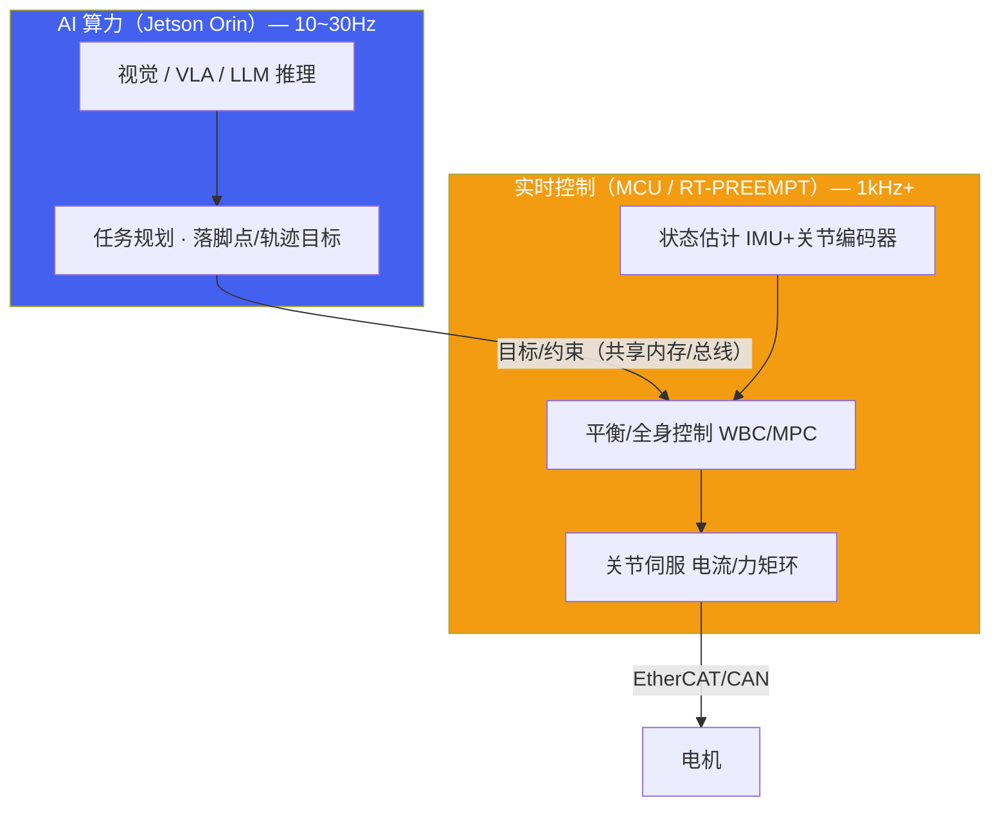
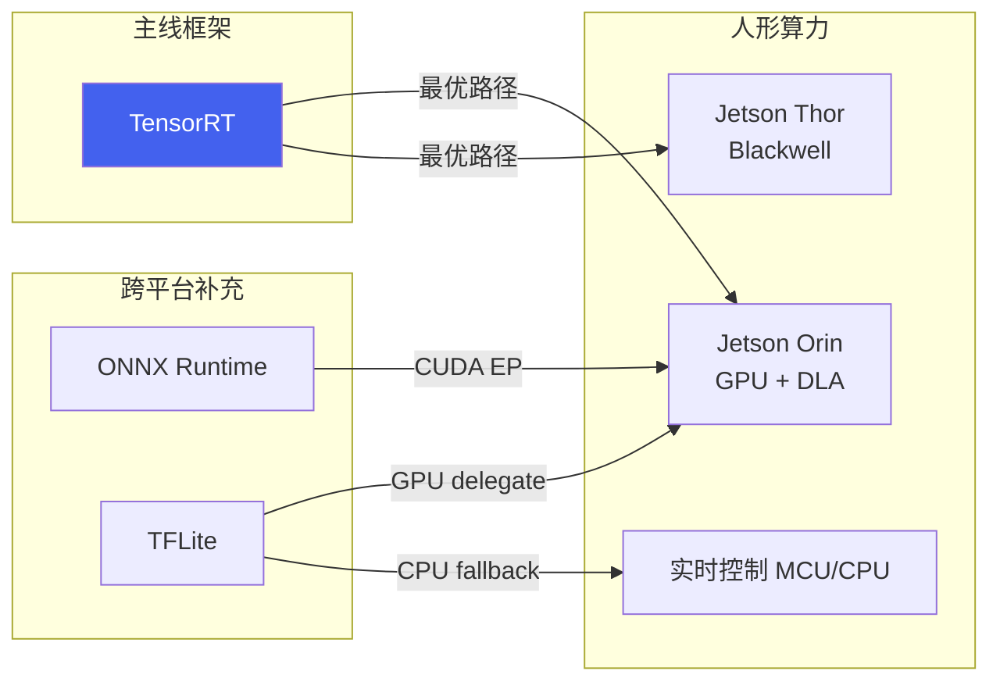
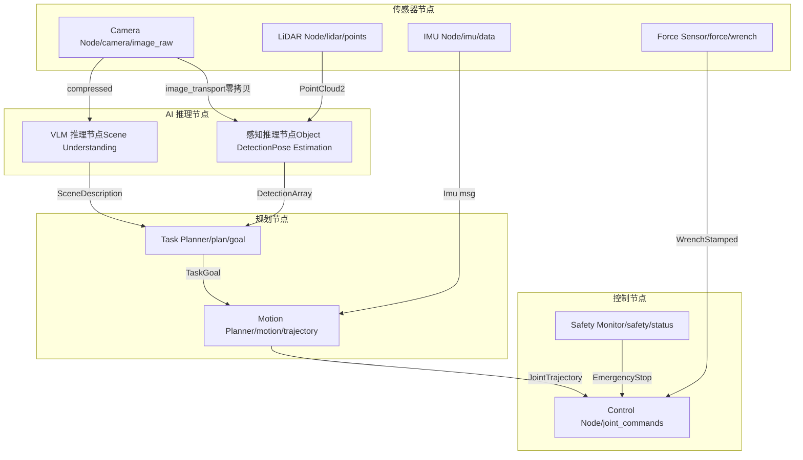

# 1. 人形端侧算力与框架

*人形/具身机器人端侧算力平台选型、推理框架对比与 ROS2 集成模式*

> [!TIP]
> **本篇讲什么**
>
> 具身/人形机器人端侧 AI 的「平台层」，具身通识系列第 1 篇（共 4 篇）：
>
> - **人形算力平台**：Jetson Orin 系（Orin NX / AGX Orin / Thor）与人形特有的「AI 算力 + 实时控制」双计算架构
> - **推理框架对比**：TensorRT 为主线，ONNX Runtime / TFLite 为跨平台补充，量化精度权衡
> - **ROS2 集成**：AI 推理节点架构、零拷贝传输、DDS QoS 配置策略
>
> 其余三篇：[感知与 VLA 训练](algorithms.md)、[端侧部署与实时控制](deployment.md)、[端侧 Embodied Agent](embodied-agent.md)。

> [!NOTE]
> **本板块数据口径与锚点模型（具身通识）**
>
> robot 板块是纯领域通识，不绑定任何具体项目，与全站口径一致：**只讲方法，不给「标准答案」式性能数字**。
>
> - **公开规格**（芯片 TOPS、功耗包络、模型参数量等）直接引用，属公开数据；
> - 文中出现的其余性能数字一律为**示例参数**，仅用于演示推导方法本身（延迟预算分配、KV Cache 公式、decode 带宽模型等），不代表实测，请代入你自己的平台与模型配置计算；
> - **锚点模型 · Qwen3-4B**：端侧 LLM 相关推导统一以公开真实的稠密 4B 模型 Qwen3-4B 为例 —— 36 层、32 个 Q head、8 个 KV head（GQA）、head\_dim 128、hidden 2560。

## 1. 人形端侧算力平台全景

### 1.1 为什么人形算力选型与「泛机器人」不同

人形/具身机器人对端侧算力有三条**同时成立**的硬约束，这决定了它的选型逻辑与扫地机、巡检车、工业臂截然不同：

1. **大模型上机**：VLA（π0/OpenVLA/GR00T 量级）、端侧 LLM/VLM（4B 级）、视觉基础模型（SAM/CLIP/DINOv2）要同时或分时跑在一块板子上，显存与算力需求远超「YOLO + 简单导航」。
2. **全身实时控制**：人形行走/平衡是 200Hz–1kHz 的硬实时环（见 [部署篇](deployment.md) §2.5），AI 算力之外必须有确定性的实时控制通路。
3. **功耗与散热包络**：人形靠电池供电、算力舱空间狭小，功耗墙（而非峰值算力）往往是真实瓶颈。

因此人形端侧的主流是 **NVIDIA Jetson Orin 系**（CUDA/TensorRT 生态 + 足够显存跑 VLA/LLM），并普遍采用 **「AI 算力 + 实时控制」双计算架构**。

### 1.2 Jetson Orin 系（人形主流）

| 平台 | AI 算力 | 显存/内存 | 功耗包络 | CPU/GPU | 人形定位 |
| :--- | :--- | :--- | :--- | :--- | :--- |
| **Jetson Orin NX 16GB** | 100 TOPS INT8（8GB 版 70）| 16GB LPDDR5 | 10-25W | 8-core A78AE + 1024-core Ampere + 2×NVDLA | 入门/上肢操作：轻量 VLA + 4B LLM（INT4）|
| **Jetson AGX Orin 64GB** | 275 TOPS INT8 | 64GB LPDDR5 | 15-60W | 12-core A78AE + 2048-core Ampere + 2×NVDLA | 全尺寸人形主流：多模型并发 + 7B 级 VLA/LLM |
| **Jetson Thor（新一代）** | ~2000 TOPS FP8 级（Blackwell）| 128GB LPDDR5X | 40-130W | Neoverse-V3AE + Blackwell GPU | 物理 AI 旗舰：GR00T 类大模型端侧化 |

> [!WARNING]
> **Orin NX ≠ AGX Orin：算力数字勿混用**
>
> 网上资料常把 **275 TOPS** 安到 Orin NX 头上 —— 那是更大一号的 **Jetson AGX Orin 64GB** 的规格。Orin NX 16GB 实为 **100 TOPS**（8GB 版 70 TOPS）。人形若需要更大算力与显存（如跑 7B 级 VLA/LLM 或多模型并发），应选 AGX Orin 64GB 或 Thor，而不是假设 NX 有 275 TOPS。Thor 的 FP8 算力口径与 Orin 的 INT8 口径不同，跨代比较时注意精度基准（Thor 规格以 NVIDIA 官方为准）。

### 1.3 人形特有的「双计算」架构

人形很少用「一块板子包打天下」，而是把**慢的 AI 决策**与**快的实时控制**拆到两套算力上：



- **AI 算力**（Orin）跑感知/VLA/LLM，以 10-30Hz 输出**目标与约束**（落脚点、质心参考、抓取位姿），不进入硬实时环。
- **实时控制**（独立 MCU 或同 SoC 上的 RT-PREEMPT 分区）跑状态估计 + WBC/MPC + 关节伺服，1kHz+ 硬实时。
- 两者通过共享内存/现场总线解耦——这正是 [部署篇](deployment.md) §2.4「分频架构」的硬件落地。把视觉推理算进 1kHz 伺服环是常见概念错误。

### 1.4 选型决策框架

> [!TIP]
> **按人形任务画像选型**
>
> **上肢操作 / 轻量具身**（VLA 抓取 + 4B LLM，INT4）：**Orin NX 16GB** 起步，100 TOPS + 16GB 显存够跑轻量 VLA 与端侧 LLM。
>
> **全尺寸人形 / 多模型并发**（感知 + VLA + LLM + 全身控制）：**AGX Orin 64GB**，64GB 显存支撑多模型常驻与 7B 级模型，是当前量产人形的主流选择。
>
> **大模型端侧化 / 物理 AI 旗舰**（GR00T 类、世界模型短时程预测）：**Jetson Thor**，Blackwell 架构 + 128GB 内存，面向下一代人形。
>
> 无论哪档，**实时控制都要独立算力/分区**（MCU 或 RT-PREEMPT），不要指望 AI 算力兼顾 1kHz 伺服。

### 1.5 算力需求参考

不同具身任务对算力的需求差异巨大。下表为**量级参考**（示例参数），实际取决于具体模型与精度要求：

| 任务类型 | 典型模型 | 所需算力 (TOPS, 量级) | 延迟/频率要求 | 备注 |
| :--- | :--- | :--- | :--- | :--- |
| 2D 物体检测 | YOLOv8s 级 | 0.5-2 | <30ms | 轻量，Orin NX 富余 |
| 6DoF 位姿估计 | FoundationPose 级 | 5-15 | <50ms | 抓取前置，需较强 GPU |
| 语义场景理解 | SAM + CLIP | 20-50 | <100ms | Orin 级别算力 |
| 轻量 VLA | Octo (93M) / π0 (~3B) 级 | 5-20 | 5-10Hz 控制（action chunking）| Orin NX 即可；RT-2 (12B-55B) 这类大 VLA 属云端模型，端侧不可直接部署，只能蒸馏成小模型 |
| 端侧 LLM (4B 级) | Qwen3-4B INT4 | decode 主要受内存带宽限制，TOPS 非首要瓶颈 | 首 token <500ms | prefill 阶段算力受限，decode 阶段带宽受限（估算方法见 [Embodied Agent 篇](embodied-agent.md)）|
| 全身控制 WBC/MPC | QP 求解器（非神经网络）| CPU 密集，几乎不占 GPU | 500Hz-1kHz | 跑在实时控制算力上，与 AI 推理正交 |

## 2. 端侧推理框架对比

### 2.1 框架全景（人形以 TensorRT 为主线）

人形端侧算力以 Jetson Orin 为主，因此推理框架的主线是 **TensorRT**；ONNX Runtime / TFLite 作为跨平台补充（快速原型、多平台部署）。其他厂商专用框架（QNN/RKNN）在人形上非主流，本板块不展开。

| 框架 | 绑定硬件 | 量化支持 | 自定义算子 | 易用性 | 性能 (相对) | 人形定位 |
| :--- | :--- | :--- | :--- | :--- | :--- | :--- |
| **TensorRT** | NVIDIA GPU/DLA | FP16/INT8/INT4, PTQ+QAT | Plugin API, 复杂但灵活 | 中等 | 极高 (基准线) | **主线**：Orin 上 VLA/视觉/LLM 的首选 |
| **ONNX Runtime** | 跨平台 (多 EP) | INT8/FP16, 通过 ONNX quantizer | Custom Op 注册 | 高 | 中-高 (取决于 EP) | 跨平台原型；CUDA EP 下接近 TensorRT |
| **TFLite** | 跨平台 (CPU/GPU/NPU delegate) | INT8/FP16, PTQ+QAT | Custom Op, 较简单 | 高 | 中等 | 轻量模型/多平台兼容补充 |

> [!NOTE]
> **端侧 LLM 推理引擎是另一条线**
>
> 上表是**视觉/动作模型**的推理框架。端侧 **LLM/VLM**（Agent 大脑、VLA 的语言骨干）有专门的推理引擎（llama.cpp / MLC-LLM / TensorRT-LLM 等），涉及 KV Cache、连续批处理、投机采样等 LLM 特有优化，详见 [Embodied Agent 篇](embodied-agent.md) §2。

### 2.2 框架与硬件映射关系

人形端侧的「最优路径」高度集中：Jetson Orin → TensorRT。跨平台框架作为补充，适合快速原型验证。



### 2.3 量化精度与性能权衡

量化是端侧部署的核心技术。不同量化级别对模型精度和推理速度的影响：

| 量化级别 | 模型大小 (相对 FP32) | 推理加速 | 精度损失 | 校准复杂度 | 推荐场景 |
| :--- | :--- | :--- | :--- | :--- | :--- |
| FP32 | 1x | 1x | 无 | 无 | 训练、调试基准 |
| FP16 | 0.5x | 1.5-2x | 极小 | 无 | Orin GPU 默认精度 |
| INT8 PTQ | 0.25x | 2-4x | 小 (通常 <1%) | 需校准数据集 | 视觉/动作模型生产部署首选 |
| INT8 QAT | 0.25x | 2-4x | 极小 | 需重训练 | 精度敏感任务 |
| INT4 (W4A16) | 0.125x | 3-6x | 中等 (1-3%) | 高 | LLM/VLA 权重量化 |

> [!WARNING]
> **实践建议**
>
> 视觉/动作模型优先尝试 **INT8 PTQ**，90% 的情况下精度损失可接受。仅在 PTQ 精度不达标时才使用 QAT（训练成本增加约 30%）。对于 LLM/VLA 类模型，端侧 decode 是**访存受限**而非算力受限，主流方案是 **weight-only 量化 W4A16**（INT4 权重 + FP16 激活参与计算，GPTQ/AWQ 式）—— 压缩权重直接减少每 token 需要从内存搬运的字节数，正中瓶颈。W4A8/W8A8 这类激活量化方案更适合 prefill 或算力受限场景，不是端侧 decode 的默认选择。

## 3. ROS2 + 端侧 AI 集成

### 3.1 ROS2 节点架构设计

在人形/具身系统中，AI 推理通常作为一个独立的 ROS2 节点存在，通过 DDS 话题和服务与其他节点通信。关键设计决策包括：推理节点是同步还是异步、消息传输是否使用零拷贝、QoS 如何配置。



### 3.2 零拷贝与共享内存传输

图像和点云数据量大（640x480 RGB 图约 900KB，VGA 深度图约 600KB），传统消息序列化会引入 1-3ms 的延迟。ROS2 支持基于共享内存的零拷贝传输（Loaned Messages + iceoryx 类传输层）：

```
// 使用 Loaned Messages 实现零拷贝发布
auto loaned_msg = publisher->borrow_loaned_message();
auto & image = loaned_msg.get();
// 直接写入共享内存，无需拷贝
fill_image_data(image);
publisher->publish(std::move(loaned_msg));

// 配置 DDS 使用共享内存传输
// fastdds_profile.xml:
// <transport_descriptors>
//   <transport_descriptor>
//     <transport_id>shm_transport</transport_id>
//     <type>SHM</type>
//     <segment_size>10485760</segment_size>
//   </transport_descriptor>
// </transport_descriptors>
```

### 3.3 DDS QoS 配置策略

不同数据流对可靠性和时效性的要求不同，需要差异化的 QoS 策略：

| 数据流 | Reliability | History Depth | Deadline | Liveliness | 理由 |
| :--- | :--- | :--- | :--- | :--- | :--- |
| 相机图像 | BEST\_EFFORT | 1 | 33ms (30Hz) | AUTOMATIC | 丢帧可接受，保证时效性 |
| LiDAR 点云 | BEST\_EFFORT | 1 | 100ms (10Hz) | AUTOMATIC | 数据量大，优先最新帧 |
| 检测结果 | RELIABLE | 5 | 50ms | AUTOMATIC | 规划依赖，不可丢失 |
| 关节指令 | BEST\_EFFORT | 1 | 2ms (500Hz) | MANUAL\_BY\_TOPIC | 高频实时流：过期指令应立即丢弃而非重传（迟到的关节指令比丢失更危险），RELIABLE 重传会引入抖动；硬实时伺服环通常走 EtherCAT 等现场总线，DDS 只承载低频目标 |
| 安全状态 | RELIABLE | 10 | 10ms | MANUAL\_BY\_TOPIC | 急停信号，绝对可靠 |

### 3.4 AI 推理节点设计模式

推理节点的回调模式直接影响系统吞吐和延迟：

| 模式 | 实现方式 | 优点 | 缺点 | 适用场景 |
| :--- | :--- | :--- | :--- | :--- |
| **同步回调** | 在 subscription callback 中直接推理 | 实现简单，延迟确定 | 阻塞回调线程，可能丢帧 | 推理 <10ms 的轻量模型 |
| **异步 Executor** | MultiThreadedExecutor + 推理线程池 | 不阻塞回调，高吞吐 | 实现复杂，需处理竞态 | 重模型 (VLM, VLA) |
| **Action Server** | ROS2 Action 接口，长时任务 | 支持反馈和取消 | 开销较大 | LLM 生成式推理 |

> [!NOTE]
> **ROS2 vs ROS1 核心差异（AI 集成视角）**
>
> **DDS 中间件**：ROS2 原生支持实时通信，不依赖 roscore 单点。**生命周期节点**：支持 Configuring → Inactive → Active 状态机，便于 AI 模型热加载。**Component 组合**：多个推理节点可以合并为同进程 Component，避免进程间通信开销。**Action 接口**：原生支持长时异步任务（如 LLM 推理），提供进度反馈和取消能力。
