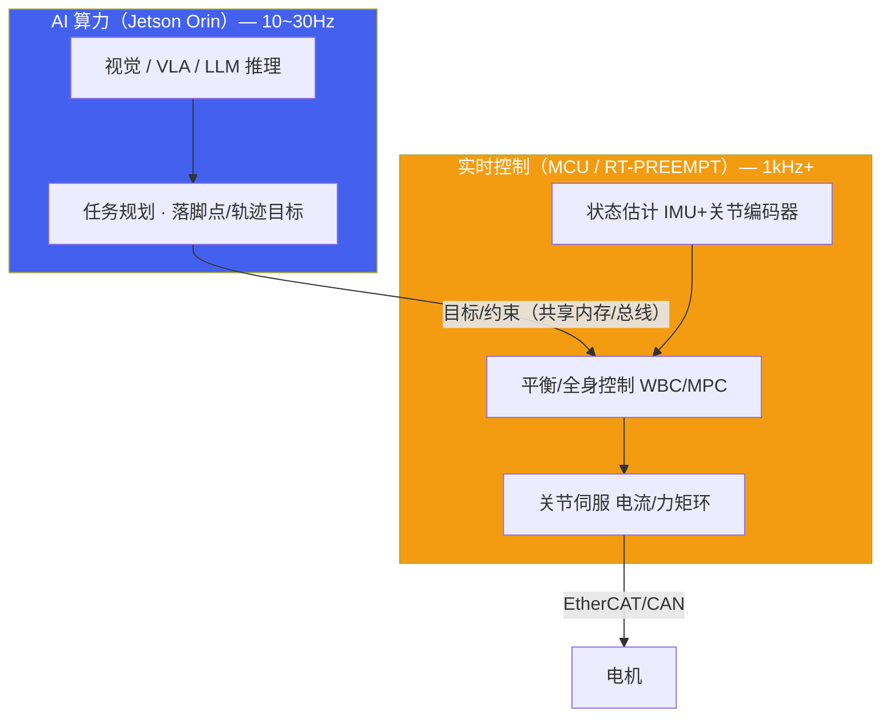
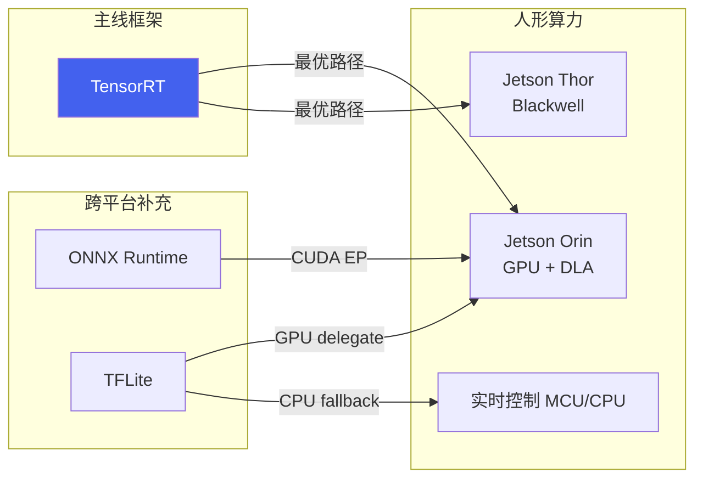
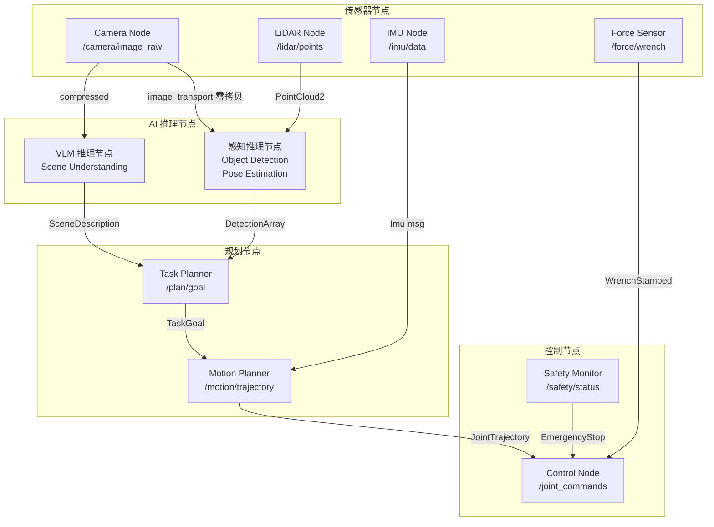

# 人形端侧算力与框架

*人形/具身机器人端侧算力平台选型、推理框架对比与 ROS2 集成模式*

> [!TIP]
> **本篇讲什么**
>
> 具身/人形机器人端侧 AI 的「平台层」，具身通识系列第 1 篇（共 4 篇）：
>
> - **人形算力平台**：Jetson Orin 系（Orin NX / AGX Orin / Thor）与人形特有的「AI 算力 + 实时控制」双计算架构
> - **推理框架对比**：TensorRT 为主线，ONNX Runtime / TFLite 为跨平台补充，量化精度权衡
> - **ROS2 集成**：AI 推理节点架构、零拷贝传输、DDS QoS 配置策略
>
> 其余三篇：[感知与 VLA 训练](algorithms.html)、[端侧部署与实时控制](deployment.html)、[端侧 Embodied Agent](embodied-agent.html)。

> [!NOTE]
> **本板块数据口径与锚点模型（具身通识）**
>
> robot 板块是纯领域通识，不绑定任何具体项目，与全站口径一致：**只讲方法，不给「标准答案」式性能数字**。
>
> - **公开规格**（芯片 TOPS、功耗包络、模型参数量等）直接引用，属公开数据；
> - 文中出现的其余性能数字一律为**示例参数**，仅用于演示推导方法本身（延迟预算分配、KV Cache 公式、decode 带宽模型等），不代表实测，请代入你自己的平台与模型配置计算；
> - **锚点模型 · Qwen3-4B**：端侧 LLM 相关推导统一以公开真实的稠密 4B 模型 Qwen3-4B 为例 —— 36 层、32 个 Q head、8 个 KV head（GQA）、head\_dim 128、hidden 2560。

## 1. 人形端侧算力平台全景

### 1.1 为什么人形算力选型与「泛机器人」不同

人形/具身机器人对端侧算力有四条**同时成立**的硬约束，这决定了它的选型逻辑与扫地机、巡检车、工业臂截然不同：

1. **大模型上机**：VLA（π0/OpenVLA/GR00T 量级）、端侧 LLM/VLM（4B 级）、视觉基础模型（SAM/CLIP/DINOv2）要同时或分时跑在一块板子上，显存与算力需求远超「YOLO + 简单导航」。
2. **全身实时控制**：人形行走/平衡是 200Hz–1kHz 的硬实时环（见 [部署篇](deployment.html) §2.5），AI 算力之外必须有确定性的实时控制通路。
3. **功耗与散热包络**：人形靠电池供电、算力舱空间狭小且伴随振动，功耗墙（而非峰值算力）往往是真实瓶颈。更关键的是，人形的功耗预算是「**电机优先，算力吃余量**」：关节电机（尤其行走/跳跃瞬态）的峰值功耗远大于算力板，留给 SoC 的持续功耗是「整机功耗 − 电机 − 散热」之后的余量，因此算力板要按**持续功耗包络**而不是峰值 TOPS 来选。
4. **内存带宽**：端侧 LLM/VLA 的 decode 是**访存受限**而非算力受限——每生成一个 token/动作块都要把权重从内存读一遍，吞吐 ≈ 有效带宽 ÷ 每步读取字节（roofline 推导见 [Embodied Agent 篇](embodied-agent.html) §2.2）。因此「TOPS 够」不代表「跑得快」，**带宽与显存容量才是大模型档位的真门槛**。

> [!NOTE]
> **为什么人形不能像轮式机器人那样用低算力芯片**
>
> 扫地机/巡检车的感知是「固定管线 + 小模型」（SLAM + 避障 + 分类），算力需求在个位数到十几 TOPS 级，且**轮式底盘天然稳定**——停下来就安全，控制环可以低频甚至降频。人形则相反：双足是**欠驱动、天然失稳**的系统，控制环一旦降频或算力不足就是摔倒，1kHz 的平衡环没有「省算力」的余地；同时它还要额外承载 VLA/LLM/视觉基础模型这类大模型负载。这两点叠加，使人形必须站在「百 TOPS 级 + 大显存 + 高带宽」的档位上选型，低算力传统芯片不在候选之列（低算力 ADAS/机器人 SoC 仅作对照，口径见 [自动驾驶 SoC 篇](../../ad/general/soc-platform.html)）。

### 1.2 Jetson Orin 系（人形主流）

| 平台 | AI 算力 | 显存/内存 | 内存带宽 | 功耗包络 | CPU/GPU | 人形定位 |
| :--- | :--- | :--- | :--- | :--- | :--- | :--- |
| **Jetson Orin NX 16GB** | 100 TOPS INT8（8GB 版 70）| 16GB LPDDR5 | 102.4 GB/s | 10-25W | 8-core A78AE + 1024-core Ampere + 2×NVDLA | 入门/上肢操作：轻量 VLA + 4B LLM（INT4）|
| **Jetson AGX Orin 64GB** | 275 TOPS INT8 | 64GB LPDDR5 | 204.8 GB/s | 15-60W | 12-core A78AE + 2048-core Ampere + 2×NVDLA | 全尺寸人形主流：多模型并发 + 7B 级 VLA/LLM |
| **Jetson Thor（2025 量产）** | ~1000 TOPS FP8（稀疏；稠密 ~500）| 128GB LPDDR5X | 273 GB/s | 40-130W | 14-core Neoverse-V3AE + Blackwell GPU | 物理 AI 旗舰：GR00T 类大模型端侧化 |

> [!NOTE]
> **表中规格为 NVIDIA 公开口径，选型以官方规格书为准**
>
> - **Thor** 的 FP8 口径与 Orin 的 INT8 口径不同，且 NVIDIA 宣传中另有「2000 TOPS」说法（含 FP4/不同配置），跨代比较务必写清精度基准；
> - **内存带宽列是端侧大模型的真门槛**：decode 吞吐 ≈ 有效带宽 ÷ 每 token 读取字节（推导见 [Embodied Agent 篇](embodied-agent.html) §2.2），从 Orin NX（102.4 GB/s）到 AGX Orin（204.8 GB/s）再到 Thor（273 GB/s），带宽的代际提升对 LLM/VLA decode 的意义不亚于 TOPS。

> [!WARNING]
> **Orin NX ≠ AGX Orin ≠ 车规 DRIVE Orin：三套算力数字勿混用**
>
> 网上资料常把 **275 TOPS** 安到 Orin NX 头上 —— 那是更大一号的 **Jetson AGX Orin 64GB** 的规格。Orin NX 16GB 实为 **100 TOPS**（8GB 版 70 TOPS）。人形若需要更大算力与显存（如跑 7B 级 VLA/LLM 或多模型并发），应选 AGX Orin 64GB 或 Thor，而不是假设 NX 有 275 TOPS。另一处常见混用：车规 **DRIVE Orin 是 254 TOPS**，与同 die 的 Jetson 模组（AGX Orin 275 / Orin NX 100）是不同产品形态，引用时务必写清是哪一款（口径详见 [自动驾驶 SoC 篇](../../ad/general/soc-platform.html)）。

> [!CAUTION]
> **峰值 TOPS ≠ 人形可用的持续算力**
>
> 厂商 TOPS 是**理想口径**（INT8/FP8、稀疏加速、峰值频率），真实模型的有效算力常常只有标称的一到三成（经验量级，随模型结构/编译器/调度差异很大）。在人形上还要再打两层折扣：
>
> 1. **热降频**：算力舱密闭、靠电池供电、被动或有限风冷，持续负载下 SoC 会因温度墙降频——峰值算力往往只在短时 boost 下可达。选型要看**功耗包络内的持续算力（TOPS/W）**，而不是峰值 TOPS。
> 2. **功耗预算被电机挤占**：行走/跳跃瞬态的关节电机功耗远大于算力板，整机功耗预算是「电机优先」，留给 SoC 的是余量。这意味着同一颗 AGX Orin 装在轮式底盘上能跑满 60W，装在人形上可能只能持续跑在更低的功耗档位。
>
> 工程结论：人形算力选型先定**持续功耗包络与散热方案**，再在该包络内比算力/带宽/显存；并预留热设计余量，否则实验室跑通的模型在整机连续作业时会因降频而超时。

### 1.3 人形特有的「双计算」架构

人形很少用「一块板子包打天下」，而是把**慢的 AI 决策**与**快的实时控制**拆到两套算力上：



- **AI 算力**（Orin）跑感知/VLA/LLM，以 10-30Hz 输出**目标与约束**（落脚点、质心参考、抓取位姿），不进入硬实时环。
- **实时控制**（独立 MCU 或同 SoC 上的 RT-PREEMPT 分区）跑状态估计 + WBC/MPC + 关节伺服，1kHz+ 硬实时。
- 两者通过共享内存/现场总线解耦——这正是 [部署篇](deployment.html) §2.4「分频架构」的硬件落地。把视觉推理算进 1kHz 伺服环是常见概念错误。

**三种落地形态**（隔离性与通信开销此消彼长）：

| 形态 | 实时侧载体 | AI↔RT 通信 | 隔离性 | 适用 |
| :--- | :--- | :--- | :--- | :--- |
| **单 SoC 内分区** | 同一颗 Orin 上跑 RT-PREEMPT/Xenomai + CPU 核隔离 | 进程间共享内存（最快，无总线延迟）| 弱：AI 侧的 GPU/内存压力仍可能干扰实时侧 | 算力/成本受限、控制频率要求不极端 |
| **Orin + 独立 MCU**（最常见）| STM32/ESP32/实时 RISC-V 等 MCU | SPI / 以太网 / CAN-FD（需序列化，有总线延迟）| 强：物理隔离，AI 崩溃不影响平衡环 | 全尺寸人形主流形态 |
| **Orin + 实时 SoC/FPGA** | 独立实时 Linux SoC 或 FPGA | 千兆以太网 / PCIe | 最强：可承载灵巧手 kHz 级多轴力控 | 高自由度灵巧手、高动态运动 |

> [!WARNING]
> **双计算架构的真实成本在「通信与同步」，不在「拆分」本身**
>
> 把 AI 与实时控制拆到两套算力，换来的是确定性，但引入四个必须显式处理的工程问题：
>
> 1. **异步 + 外推，而非等待**：AI 侧目标以 10-30Hz 到达且有抖动，1kHz 的实时环**绝不能阻塞等待** AI 结果。标准做法是实时环在 AI 结果更新前沿用上一帧目标做外推（或保持），AI 结果一到就平滑切换；否则 AI 侧的任何卡顿都会直接传导成控制环超时。
> 2. **时钟域对齐**：AI 侧（非实时 Linux）与实时侧（MCU/RTOS）是两个时钟域，目标必须带**硬件时间戳**并做 PTP/同步对齐，否则「这个落脚点对应哪个时刻的机器人状态」会错位，错位在高速运动下被放大成跟踪误差。
> 3. **无锁/双缓冲防撕裂**：共享内存传目标时，实时环可能读到 AI 写了一半的数据（撕裂读）。用双缓冲 + 原子切换（或无锁环形队列），保证实时环每次读到的都是完整一致的一帧。
> 4. **AI 失效的安全兜底**：实时侧必须能在 AI 算力看门狗超时（失联）时**独立**进入安全姿态（下蹲/锁定/缓降），不能依赖 AI 参与——这是双计算架构在安全上的核心价值，也是「一块板子包打天下」做不到的。
>
> 跨芯片形态（Orin + MCU）的通信延迟与序列化开销，要计入 [部署篇](deployment.html) §2.1 的延迟预算；同 SoC 分区形态省掉总线延迟，但隔离性弱，需额外做 CPU 核隔离与 GPU 资源配额。

### 1.4 选型决策框架

> [!TIP]
> **按人形任务画像选型**
>
> **上肢操作 / 轻量具身**（VLA 抓取 + 4B LLM，INT4）：**Orin NX 16GB** 起步，100 TOPS + 16GB 显存够跑轻量 VLA 与端侧 LLM。
>
> **全尺寸人形 / 多模型并发**（感知 + VLA + LLM + 全身控制）：**AGX Orin 64GB**，64GB 显存支撑多模型常驻与 7B 级模型，是当前量产人形的主流选择。
>
> **大模型端侧化 / 物理 AI 旗舰**（GR00T 类、世界模型短时程预测）：**Jetson Thor**（2025 量产），Blackwell 架构 + 128GB 内存 + 273 GB/s 带宽，面向下一代人形。
>
> 无论哪档，**实时控制都要独立算力/分区**（MCU 或 RT-PREEMPT），不要指望 AI 算力兼顾 1kHz 伺服。
>
> 选型时把**功耗/散热/电池**当作与算力同级的一等轴：先定整机功耗预算里算力板能分到的持续包络与散热方案（见 §1.2 的 CAUTION），再在该包络内比算力/带宽/显存——而不是反过来先堆峰值 TOPS。

**2025-2026 人形整机算力方案的几条路线（定性）**

算力平台的选型不只是「挑一颗 SoC」，还取决于团队背景与整机形态。当前可见四条路线（均为定性判断，具体整机配置以厂商公开资料为准）：

| 路线 | 特征 | 优势 | 代价 |
| :--- | :--- | :--- | :--- |
| **Jetson Orin/Thor + 独立实时 MCU** | NVIDIA 生态（CUDA/TensorRT/Isaac/GR00T）+ 模组化，2025 起 Thor 进入旗舰档并配套 Isaac GR00T 人形基础模型与仿真栈 | 生态最成熟、显存/带宽够跑 VLA/LLM，科研与量产人形的默认选择 | BOM 高、依赖单一供应商 |
| **车企系复用自驾芯片** | 有自驾 SoC 自研能力的团队（如 Tesla Optimus 路线）把人形算力栈复用自驾芯片与工具链 | 车规可靠性 + 量产供应链，软硬件协同深 | 生态封闭，机器人中间件需自建 |
| **国产平台替代** | 地平线、华为昇腾、瑞芯微等在服务/工业机器人有落地；在「百 TOPS + 大显存 + 高带宽」的人形大模型档位上仍处追赶阶段 | 供应安全、成本可控 | 大模型档位的规格与生态成熟度仍在验证期 |
| **端云协同** | 家用/服务人形受成本与功耗墙限制，把大模型推理（长程规划、VLM 理解）放云端/边缘服务器，端侧只保留实时控制与轻量感知 | 绕开端侧功耗/成本墙，可用更大模型 | 网络依赖 + 隐私/安全问题（见 [Embodied Agent 篇](embodied-agent.html)）|

> [!NOTE]
> **趋势判断**：全尺寸人形的主流仍是 Jetson Orin 级（生态 + 显存 + 带宽），2025 年起 Thor 在旗舰档逐步上量；车企系与国产平台是两条值得持续跟踪的替代路线；家用人形则更可能走端云协同。选型时应先明确自己落在哪条路线，再回到 §1.2 的档位表里选具体平台。

### 1.5 算力需求参考

不同具身任务对算力的需求差异巨大。下表为**量级参考**（示例参数），实际取决于具体模型与精度要求：

| 任务类型 | 典型模型 | 所需算力 (TOPS, 量级) | 延迟/频率要求 | 备注 |
| :--- | :--- | :--- | :--- | :--- |
| 2D 物体检测 | YOLOv8s 级 | 0.5-2 | <30ms | 轻量，Orin NX 富余 |
| 6DoF 位姿估计 | FoundationPose 级 | 5-15 | <50ms | 抓取前置，需较强 GPU |
| 语义场景理解 | SAM + CLIP | 20-50 | <100ms | Orin 级别算力 |
| 轻量 VLA | Octo (93M) / π0 (~3B) 级 | 5-20 | 5-10Hz 控制（action chunking）| Orin NX 即可；RT-2 (12B-55B) 这类大 VLA 属云端模型，端侧不可直接部署，只能蒸馏成小模型 |
| 端侧 LLM (4B 级) | Qwen3-4B INT4 | decode 主要受内存带宽限制，TOPS 非首要瓶颈 | 首 token <500ms | prefill 阶段算力受限，decode 阶段带宽受限（估算方法见 [Embodied Agent 篇](embodied-agent.html)）|
| 全身控制 WBC/MPC | QP 求解器（非神经网络）| CPU 密集，几乎不占 GPU | 500Hz-1kHz | 跑在实时控制算力上，与 AI 推理正交 |

> [!TIP]
> **这张表按 TOPS 排，但选型要按「显存 → 带宽 → TOPS」的顺序看**
>
> 上表的「所需算力」只对**视觉前向/位姿估计**这类算力受限任务有直接意义。一旦负载里出现端侧 LLM/VLA，真正的门槛顺序是：
>
> 1. **显存容量**：模型权重 + KV Cache + 多模型常驻 + 框架/运行时开销，决定「装不装得下」。4B INT4 权重约 2GB，但加上 KV Cache、视觉编码器、动作头与运行时，16GB 平台跑「VLA + LLM 并发」会很快见顶（KV Cache 推导见 [Embodied Agent 篇](embodied-agent.html) §2.3）。
> 2. **内存带宽**：决定 decode/动作块生成的吞吐上限（§1.1 约束 4）。
> 3. **TOPS**：主要影响 prefill 与视觉前向，是三者里最后才成为瓶颈的。
>
> 因此「Orin NX 100 TOPS 够不够」这个问题，对纯视觉任务答案常是够，对「VLA + 4B LLM 并发」则要先算显存与带宽，而不是看 TOPS。

## 2. 端侧推理框架对比

### 2.1 框架全景（人形以 TensorRT 为主线）

人形端侧算力以 Jetson Orin 为主，因此推理框架的主线是 **TensorRT**；ONNX Runtime / TFLite 作为跨平台补充（快速原型、多平台部署）。其他厂商专用框架（QNN/RKNN）在人形上非主流，本板块不展开。

| 框架 | 绑定硬件 | 量化支持 | 自定义算子 | 易用性 | 性能 (相对) | 人形定位 |
| :--- | :--- | :--- | :--- | :--- | :--- | :--- |
| **TensorRT** | NVIDIA GPU/DLA | FP16/INT8/INT4, PTQ+QAT；Thor/Blackwell 上另支持 FP8 | Plugin API, 复杂但灵活 | 中等 | 极高 (基准线) | **主线**：Orin 上 VLA/视觉/LLM 的首选 |
| **ONNX Runtime** | 跨平台 (多 EP) | INT8/FP16, 通过 ONNX quantizer | Custom Op 注册 | 高 | 中-高 (取决于 EP) | 跨平台原型；CUDA EP 下接近 TensorRT |
| **TFLite** | 跨平台 (CPU/GPU/NPU delegate) | INT8/FP16, PTQ+QAT | Custom Op, 较简单 | 高 | 中等 | 轻量模型/多平台兼容补充 |

> [!NOTE]
> **端侧 LLM 推理引擎是另一条线**
>
> 上表是**视觉/动作模型**的推理框架。端侧 **LLM/VLM**（Agent 大脑、VLA 的语言骨干）有专门的推理引擎（llama.cpp / MLC-LLM / TensorRT-LLM 等），涉及 KV Cache、连续批处理、投机采样等 LLM 特有优化，详见 [Embodied Agent 篇](embodied-agent.html) §2。

> [!WARNING]
> **VLA 不能照搬「视觉模型 → TensorRT 单引擎」的套路**
>
> VLA 是「视觉编码器 + LLM 骨干 + 迭代式动作头（扩散/流匹配）」三段式结构（见 [算法篇](algorithms.html) §2.1），其中动作头要**循环执行 N 步去噪/积分**，每步都是一次前向。把它整体塞进一个 TensorRT 引擎并不自然，常见做法是：
>
> 1. **分段编译**：视觉编码器与 LLM 骨干各自编译成引擎，动作头单独处理；中间张量常驻显存，避免段间回拷主机内存。
> 2. **动作头用 CUDA Graph 消除 launch 开销**：去噪循环是「同一个小网络重复 N 次」，kernel launch 开销占比高，用 CUDA Graph 把整段循环录制成图一次下发，是端侧把动作头跑到实时的关键手段。
> 3. **LLM 骨干走专用引擎**：自回归骨干用 TensorRT-LLM / llama.cpp（见上 NOTE），不要用视觉模型的 TensorRT 流程硬套。
> 4. **或直接复用官方推理栈**：NVIDIA 为 GR00T 类人形基础模型提供的部署路径（Isaac/GR00T 推理栈）已处理好分段与调度，自研三段式 VLA 时可参考其切分方式。
>
> 时效性提醒：Orin 上的 TensorRT 主线随 **JetPack 6.x**（Ubuntu 22.04 + CUDA 12 系）演进，TensorRT 10.x 起对 FP8/INT4 与大模型相关算子的支持持续增强；Thor 需要更新的 JetPack/CUDA 版本，跨平台迁移时以 NVIDIA 官方发布为准。

### 2.2 框架与硬件映射关系

人形端侧的「最优路径」高度集中：Jetson Orin → TensorRT。跨平台框架作为补充，适合快速原型验证。



### 2.3 量化精度与性能权衡

量化是端侧部署的核心技术。不同量化级别对模型精度和推理速度的影响（加速比与精度损失为**示例量级**，实际随模型结构与平台差异很大）：

| 量化级别 | 模型大小 (相对 FP32) | 推理加速 | 精度损失 | 校准复杂度 | 推荐场景 |
| :--- | :--- | :--- | :--- | :--- | :--- |
| FP32 | 1x | 1x | 无 | 无 | 训练、调试基准 |
| FP16 | 0.5x | 1.5-2x | 极小 | 无 | Orin GPU 默认精度 |
| FP8 (E4M3/E5M2) | 0.25x | 2-4x | 小 | 需校准 | Thor/Blackwell 原生精度，大模型 prefill/decode 兼顾；Orin（Ampere）无 FP8 Tensor Core，不适用 |
| INT8 PTQ | 0.25x | 2-4x | 小 (通常 <1%) | 需校准数据集 | 视觉/动作模型生产部署首选 |
| INT8 QAT | 0.25x | 2-4x | 极小 | 需重训练 | 精度敏感任务 |
| INT4 (W4A16) | 0.125x | 3-6x | 中等 (1-3%) | 高 | LLM/VLA 权重量化 |

> [!TIP]
> **实践建议**
>
> 视觉/动作模型优先尝试 **INT8 PTQ**，多数情况下精度损失可接受。仅在 PTQ 精度不达标时才使用 QAT（训练成本明显增加）。对于 LLM/VLA 类模型，端侧 decode 是**访存受限**而非算力受限，主流方案是 **weight-only 量化 W4A16**（INT4 权重 + FP16 激活参与计算，GPTQ/AWQ 式）—— 压缩权重直接减少每 token 需要从内存搬运的字节数，正中瓶颈。W4A8/W8A8 这类激活量化方案更适合 prefill 或算力受限场景，不是端侧 decode 的默认选择。FP8 则是有 Blackwell/Thor 硬件时的折中档：比 INT8 精度更稳、比 FP16 更省带宽。

## 3. ROS2 + 端侧 AI 集成

### 3.1 ROS2 节点架构设计

在人形/具身系统中，AI 推理通常作为一个独立的 ROS2 节点存在，通过 DDS 话题和服务与其他节点通信。关键设计决策包括：推理节点是同步还是异步、消息传输是否使用零拷贝、QoS 如何配置。



### 3.2 零拷贝与共享内存传输

图像和点云数据量大（640x480 RGB 图约 900KB，VGA 深度图约 600KB），传统消息序列化 + 跨进程拷贝会引入毫秒级延迟（**示例量级**，实际取决于消息大小与 DDS 实现）。ROS2 支持基于共享内存的零拷贝传输（Loaned Messages + iceoryx 类传输层；2025 起 Eclipse **iceoryx2**（Rust 重写版）与 Cyclone DDS 的集成是这条线的主流演进方向）：

```
// 使用 Loaned Messages 实现零拷贝发布
auto loaned_msg = publisher->borrow_loaned_message();
auto & image = loaned_msg.get();
// 直接写入共享内存，无需拷贝
fill_image_data(image);
publisher->publish(std::move(loaned_msg));

// 配置 DDS 使用共享内存传输
// fastdds_profile.xml:
// <transport_descriptors>
//   <transport_descriptor>
//     <transport_id>shm_transport</transport_id>
//     <type>SHM</type>
//     <segment_size>10485760</segment_size>
//   </transport_descriptor>
// </transport_descriptors>
```

> [!WARNING]
> **零拷贝不是「打开开关就有」：消息类型必须是定长 POD**
>
> 真正的零拷贝（loaned message 直接落在共享内存）要求消息是**固定大小、无变长成员**的 POD 类型。而 `sensor_msgs/Image`、`PointCloud2` 都含变长数组（`data`、`height×width` 不定的点云），**不能直接零拷贝**——DDS 会退化成「借出内存 + 拷贝」。常见绕法：
>
> 1. 用**定长自定义消息**（固定分辨率/固定点数上限）承载图像/点云，使其满足 POD 条件；
> 2. 走 `image_transport` 的共享内存插件，或把大块数据放独立共享内存段、DDS 只传句柄/指针；
> 3. 接受「借出 + 一次拷贝」的折中——它仍省掉了序列化与跨进程传输，只是不是严格零拷贝。
>
> 另外，零拷贝要求**发布/订阅在同一主机**且 DDS 配置一致；跨主机时共享内存路径不生效，会回落到网络传输。验证是否真的零拷贝，应实测大消息的端到端延迟与 CPU 拷贝开销，而不是只看配置项。

### 3.3 DDS QoS 配置策略

不同数据流对可靠性和时效性的要求不同，需要差异化的 QoS 策略：

| 数据流 | Reliability | History Depth | Deadline | Liveliness | 理由 |
| :--- | :--- | :--- | :--- | :--- | :--- |
| 相机图像 | BEST\_EFFORT | 1 | 33ms (30Hz) | AUTOMATIC | 丢帧可接受，保证时效性 |
| LiDAR 点云 | BEST\_EFFORT | 1 | 100ms (10Hz) | AUTOMATIC | 数据量大，优先最新帧 |
| 检测结果 | RELIABLE | 5 | 50ms | AUTOMATIC | 规划依赖，不可丢失 |
| 关节指令 | BEST\_EFFORT | 1 | 2ms (500Hz) | MANUAL\_BY\_TOPIC | 高频实时流：过期指令应立即丢弃而非重传（迟到的关节指令比丢失更危险），RELIABLE 重传会引入抖动；硬实时伺服环通常走 EtherCAT 等现场总线，DDS 只承载低频目标 |
| 安全状态 | RELIABLE | 10 | 10ms | MANUAL\_BY\_TOPIC | 急停信号，绝对可靠 |

> [!WARNING]
> **QoS 不兼容会「静默不通信」，而不是报错**
>
> DDS 的 QoS 遵循 **RxO（Requested vs Offered）兼容规则**：订阅方请求的等级不能高于发布方提供的等级。最常见的坑是 **发布方 BEST\_EFFORT + 订阅方 RELIABLE → 不兼容**，结果是话题**完全没有数据**，而 ROS2 不会抛错，只在日志里留一条 warning，极易被误判成「模型没输出」或「传感器坏了」。Deadline 同理：发布方提供的周期必须 ≤ 订阅方请求的周期。
>
> 排查手段：`ros2 topic info <topic> -v` 会打印两端各自的 QoS，对照即可定位不匹配项；`ros2 doctor` 可检查更广泛的配置问题。设计原则：**输入端（传感器→推理）用 BEST\_EFFORT + KEEP\_LAST(1) 保时效，输出端按下游需求选**；不要给推理节点的输入设 RELIABLE + KEEP\_ALL，那会在推理慢于发布时让消息队列无限堆积，最终内存溢出或延迟暴增。

### 3.4 AI 推理节点设计模式

推理节点的回调模式直接影响系统吞吐和延迟：

| 模式 | 实现方式 | 优点 | 缺点 | 适用场景 |
| :--- | :--- | :--- | :--- | :--- |
| **同步回调** | 在 subscription callback 中直接推理 | 实现简单，延迟确定 | 阻塞回调线程，可能丢帧 | 推理 <10ms 的轻量模型 |
| **异步 Executor** | MultiThreadedExecutor + 推理线程池 | 不阻塞回调，高吞吐 | 实现复杂，需处理竞态 | 重模型 (VLM, VLA) |
| **Action Server** | ROS2 Action 接口，长时任务 | 支持反馈和取消 | 开销较大 | LLM 生成式推理 |

> [!TIP]
> **背压（backpressure）：推理慢于传感器时必须主动丢帧**
>
> 重模型（VLM/VLA）的推理耗时常常大于传感器发布周期，这时**绝不能让消息排队**——排队意味着延迟单调累积，机器人永远在响应「几帧前」的世界。正确做法：
>
> 1. **QoS 层**：输入用 KEEP\_LAST(1) + BEST\_EFFORT，让 DDS 只保留最新一帧（见 §3.3）；
> 2. **应用层**：回调里先查时间戳，**超过时效阈值的旧帧直接丢弃**，只对最新帧推理；
> 3. **结构层**：用「单槽最新值」缓冲（推理线程始终取最新观测），而不是无界队列；推理线程与回调线程解耦，回调只负责更新缓冲、不阻塞。
>
> 这与 §1.3 双计算架构的「异步 + 外推」是同一原则在 ROS2 层的体现：宁可丢帧用最新数据，也不要为了「不丢」而累积延迟。

> [!NOTE]
> **ROS2 vs ROS1 核心差异（AI 集成视角）**
>
> **DDS 中间件**：ROS2 原生支持实时通信，不依赖 roscore 单点。**生命周期节点**：支持 Configuring → Inactive → Active 状态机，便于 AI 模型热加载。**Component 组合**：多个推理节点可以合并为同进程 Component，避免进程间通信开销。**Action 接口**：原生支持长时异步任务（如 LLM 推理），提供进度反馈和取消能力。
