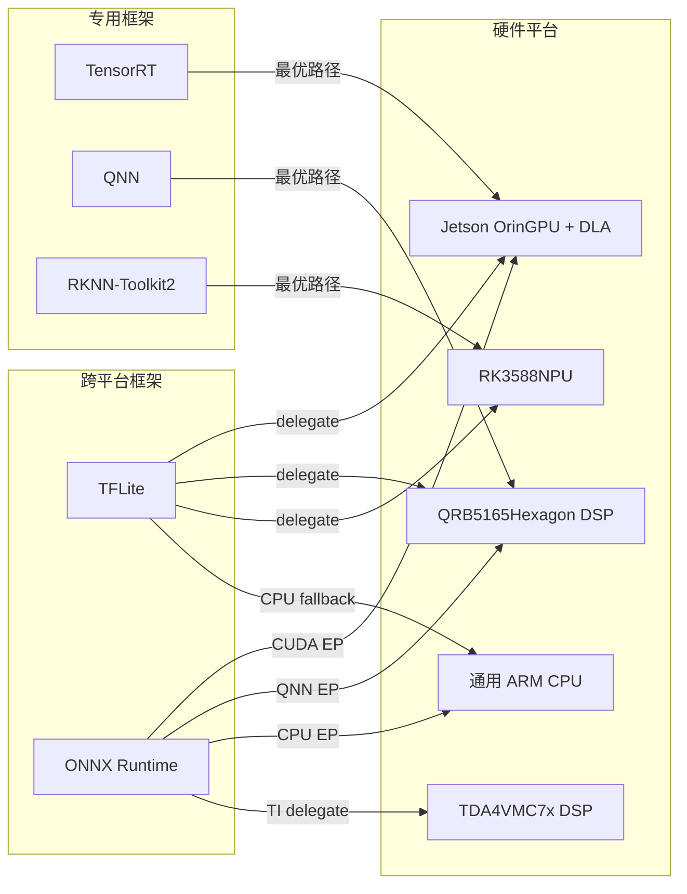
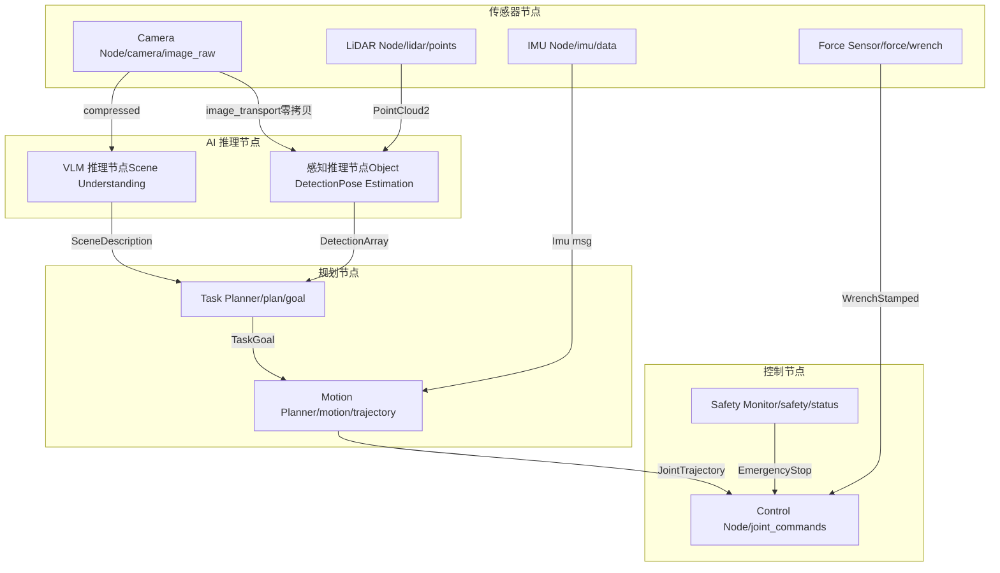

# 1. 机器人端侧算力与框架

*机器人端侧算力平台选型、推理框架对比与 ROS2 集成模式*

> [!TIP]
> **本篇讲什么**
>
> 机器人端侧 AI 的「平台层」，机器人通识系列第 1 篇（共 4 篇）：
>
> - **算力平台全景**：Jetson Orin / RK3588 / QRB5165 / TDA4VM 四平台对比与选型决策框架
> - **推理框架对比**：TensorRT / QNN / RKNN / TFLite / ONNX Runtime 与硬件的映射关系、量化精度权衡
> - **ROS2 集成**：AI 推理节点架构、零拷贝传输、DDS QoS 配置策略
>
> 其余三篇：[感知与 VLA 训练](algorithms.md)、[端侧部署与实时控制](deployment.md)、[端侧 Embodied Agent](embodied-agent.md)。

> [!NOTE]
> **本板块数据口径与锚点模型（机器人通识）**
>
> robot 板块是纯领域通识，不绑定任何具体项目，与全站口径一致：**只讲方法，不给「标准答案」式性能数字**。
>
> - **公开规格**（芯片 TOPS、功耗包络、模型参数量等）直接引用，属公开数据；
> - 文中出现的其余性能数字一律为**示例参数**，仅用于演示推导方法本身（延迟预算分配、KV Cache 公式、decode 带宽模型等），不代表实测，请代入你自己的平台与模型配置计算；
> - **锚点模型 · Qwen3-4B**：端侧 LLM 相关推导统一以公开真实的稠密 4B 模型 Qwen3-4B 为例 —— 36 层、32 个 Q head、8 个 KV head（GQA）、head\_dim 128、hidden 2560。

## 1. 机器人端侧算力平台全景

### 1.1 主流端侧算力平台对比

机器人端侧计算与座舱不同，需要同时满足**多传感器融合**、**实时控制**和**AI 推理**三大需求。当前主流平台各有侧重，选型需根据机器人品类（人形、机械臂、服务机器人）和性能/成本/功耗预算综合判断。

| 平台 | 厂商 | AI 算力 | 典型功耗 | CPU | GPU/NPU | 价格区间 | 适用场景 |
| :--- | :--- | :--- | :--- | :--- | :--- | :--- | :--- |
| **Jetson Orin NX** | NVIDIA | 100 TOPS INT8（16GB 版；8GB 版 70） | 10-25W | 8-core Arm Cortex-A78AE | 1024-core Ampere GPU + 2x NVDLA | $399-$499 | 人形机器人、高精度机械臂、自主导航 |
| **RK3588** | Rockchip | 6 TOPS INT8 | 5-8W | 4x A76 + 4x A55 | Mali-G610 + 6 TOPS NPU | $50-$100 | 服务机器人、低成本巡检机器人 |
| **QRB5165** | Qualcomm | 15 TOPS INT8 | 10-15W | Kryo 585 (1+3+4) | Adreno 650 + Hexagon DSP | $150-$300 | 移动机器人、无人机、巡检 |
| **TDA4VM** | TI | 8 TOPS INT8 | 5-15W | 2x A72 + 6x R5F | C7x DSP + MMA | $80-$200 | 工业机械臂、AGV、安全关键场景 |

> [!WARNING]
> **Orin NX ≠ AGX Orin：算力数字勿混用**
>
> 网上资料常把 **275 TOPS** 安到 Orin NX 头上 —— 那是更大一号的 **Jetson AGX Orin 64GB**（12-core A78AE、2048-core GPU、15-60W、$1000+）的规格。Orin NX 16GB 实为 **100 TOPS**（8GB 版 70 TOPS）。人形机器人若需要更大算力与显存（如跑 7B 级 VLA/LLM），应在预算允许时选 AGX Orin 64GB 或更新的 Orin 系列旗舰，而不是假设 NX 有 275 TOPS。

### 1.2 多维性能雷达图

以下雷达图从六个维度比较四款平台的综合表现。每个维度满分 10 分，分值基于行业公开数据和工程实践经验。

**端侧算力平台多维对比**

| 指标 | Jetson Orin | RK3588 | QRB5165 | TDA4VM |
| :--- | :--- | :--- | :--- | :--- |
| AI 算力 (TOPS) | 10 | 2 | 5 | 3 |
| 能效比 (TOPS/W) | 7 | 5 | 7 | 4 |
| 价格优势 | 3 | 10 | 6 | 7 |
| 生态丰富度 | 10 | 6 | 5 | 4 |
| 实时能力 | 7 | 4 | 5 | 9 |
| 社区支持 | 10 | 7 | 5 | 4 |

### 1.3 选型决策框架

> [!TIP]
> **选型决策矩阵**
>
> **人形机器人**（多自由度控制 + 视觉推理 + LLM）：首选 **Jetson Orin**（Orin NX 16GB 起步，显存预算紧张或要跑大模型时上 AGX Orin），算力充裕，CUDA 生态成熟，可同时跑感知+规划+控制。
>
> **工业机械臂**（安全关键 + 确定性延迟）：首选 **TDA4VM**，具备功能安全认证（ASIL-D），R5F 核心提供硬实时保障。
>
> **服务机器人**（成本敏感 + 中等算力）：首选 **RK3588**，价格仅 $50-100，6 TOPS 足够跑 YOLO + 简单导航。
>
> **移动巡检**（功耗敏感 + 连接性）：首选 **QRB5165**，Hexagon DSP 能效比高，原生支持 5G/WiFi 6。

### 1.4 算力需求参考

不同机器人任务对算力的需求差异巨大。下表为**量级参考**（示例参数），实际取决于具体模型与精度要求：

| 任务类型 | 典型模型 | 所需算力 (TOPS, 量级) | 延迟要求 | 备注 |
| :--- | :--- | :--- | :--- | :--- |
| 2D 物体检测 | YOLOv8s 级 | 0.5-2 | <30ms | RK3588 即可满足 |
| 6DoF 位姿估计 | FoundationPose 级 | 5-15 | <50ms | 需要较强 GPU |
| 语义场景理解 | SAM + CLIP | 20-50 | <100ms | Orin 级别算力 |
| 小型 VLA | Octo (93M) 级 | 5-20 | 5-10Hz 控制 | Orin NX 级即可；RT-2 (12B-55B) 这类大 VLA 属云端模型，端侧不可直接部署，只能蒸馏成小模型 |
| 端侧 LLM (4B 级) | Qwen3-4B INT4 | decode 主要受内存带宽限制，TOPS 非首要瓶颈 | 首 token <500ms | prefill 阶段算力受限，decode 阶段带宽受限（估算方法见 [Embodied Agent 篇](embodied-agent.md)） |

## 2. 端侧推理框架对比

### 2.1 框架全景

端侧推理框架是连接训练好的模型和目标硬件的桥梁。选择合适的框架直接影响推理性能、开发效率和后续维护成本。核心考量因素包括**硬件绑定程度**、**量化支持**、**自定义算子扩展**和**社区活跃度**。

| 框架 | 绑定硬件 | 量化支持 | 自定义算子 | 易用性 | 性能 (相对) | 社区 |
| :--- | :--- | :--- | :--- | :--- | :--- | :--- |
| **TensorRT** | NVIDIA GPU/DLA | FP16/INT8/INT4, PTQ+QAT | Plugin API, 复杂但灵活 | 中等 | 极高 (基准线) | 极活跃 |
| **QNN** | Qualcomm DSP/HTP | INT8/INT16, QAT 为主 | HTP Backend Op Package | 中等偏低 | 高 (DSP 专用优化) | 中等 |
| **RKNN** | Rockchip NPU | INT8/FP16, PTQ 为主 | 有限，RKNN-Toolkit2 | 较高 | 中 (6 TOPS 上限) | 活跃 (国内) |
| **TFLite** | 跨平台 (CPU/GPU/NPU delegate) | INT8/FP16, PTQ+QAT | Custom Op, 较简单 | 高 | 中等 | 活跃 |
| **ONNX Runtime** | 跨平台 (多 EP) | INT8/FP16, 通过 ONNX quantizer | Custom Op 注册 | 高 | 中-高 (取决于 EP) | 极活跃 |

### 2.2 框架与硬件映射关系

每种硬件通常有一条"最优路径"：使用对应的专用框架可以最大化利用硬件加速单元。跨平台框架作为补充，适合快速原型验证和多平台部署。



### 2.3 量化精度与性能权衡

量化是端侧部署的核心技术。不同量化级别对模型精度和推理速度的影响：

| 量化级别 | 模型大小 (相对 FP32) | 推理加速 | 精度损失 | 校准复杂度 | 推荐场景 |
| :--- | :--- | :--- | :--- | :--- | :--- |
| FP32 | 1x | 1x | 无 | 无 | 训练、调试基准 |
| FP16 | 0.5x | 1.5-2x | 极小 | 无 | Orin GPU 默认精度 |
| INT8 PTQ | 0.25x | 2-4x | 小 (通常 <1%) | 需校准数据集 | 生产部署首选 |
| INT8 QAT | 0.25x | 2-4x | 极小 | 需重训练 | 精度敏感任务 |
| INT4 | 0.125x | 3-6x | 中等 (1-3%) | 高 | LLM 权重量化 |

> [!WARNING]
> **实践建议**
>
> 优先尝试 **INT8 PTQ**，90% 的情况下精度损失可接受。仅在 PTQ 精度不达标时才使用 QAT（训练成本增加约 30%）。对于 LLM 类模型，端侧 decode 是**访存受限**而非算力受限，主流方案是 **weight-only 量化 W4A16**（INT4 权重 + FP16 激活参与计算，GPTQ/AWQ 式）—— 压缩权重直接减少每 token 需要从内存搬运的字节数，正中瓶颈。W4A8/W8A8 这类激活量化方案更适合 prefill 或算力受限场景，不是端侧 decode 的默认选择。

## 3. ROS2 + 端侧 AI 集成

### 3.1 ROS2 节点架构设计

在机器人系统中，AI 推理通常作为一个独立的 ROS2 节点存在，通过 DDS 话题和服务与其他节点通信。关键设计决策包括：推理节点是同步还是异步、消息传输是否使用零拷贝、QoS 如何配置。



### 3.2 零拷贝与共享内存传输

图像和点云数据量大（640x480 RGB 图约 900KB，VGA 深度图约 600KB），传统消息序列化会引入 1-3ms 的延迟。ROS2 支持基于共享内存的零拷贝传输（Loaned Messages + iceoryx 类传输层）：

```
// 使用 Loaned Messages 实现零拷贝发布
auto loaned_msg = publisher->borrow_loaned_message();
auto & image = loaned_msg.get();
// 直接写入共享内存，无需拷贝
fill_image_data(image);
publisher->publish(std::move(loaned_msg));

// 配置 DDS 使用共享内存传输
// fastdds_profile.xml:
// <transport_descriptors>
//   <transport_descriptor>
//     <transport_id>shm_transport</transport_id>
//     <type>SHM</type>
//     <segment_size>10485760</segment_size>
//   </transport_descriptor>
// </transport_descriptors>
```

### 3.3 DDS QoS 配置策略

不同数据流对可靠性和时效性的要求不同，需要差异化的 QoS 策略：

| 数据流 | Reliability | History Depth | Deadline | Liveliness | 理由 |
| :--- | :--- | :--- | :--- | :--- | :--- |
| 相机图像 | BEST\_EFFORT | 1 | 33ms (30Hz) | AUTOMATIC | 丢帧可接受，保证时效性 |
| LiDAR 点云 | BEST\_EFFORT | 1 | 100ms (10Hz) | AUTOMATIC | 数据量大，优先最新帧 |
| 检测结果 | RELIABLE | 5 | 50ms | AUTOMATIC | 规划依赖，不可丢失 |
| 关节指令 | BEST\_EFFORT | 1 | 2ms (500Hz) | MANUAL\_BY\_TOPIC | 高频实时流：过期指令应立即丢弃而非重传（迟到的关节指令比丢失更危险），RELIABLE 重传会引入抖动；硬实时伺服环通常走 EtherCAT 等现场总线，DDS 只承载低频目标 |
| 安全状态 | RELIABLE | 10 | 10ms | MANUAL\_BY\_TOPIC | 急停信号，绝对可靠 |

### 3.4 AI 推理节点设计模式

推理节点的回调模式直接影响系统吞吐和延迟：

| 模式 | 实现方式 | 优点 | 缺点 | 适用场景 |
| :--- | :--- | :--- | :--- | :--- |
| **同步回调** | 在 subscription callback 中直接推理 | 实现简单，延迟确定 | 阻塞回调线程，可能丢帧 | 推理 <10ms 的轻量模型 |
| **异步 Executor** | MultiThreadedExecutor + 推理线程池 | 不阻塞回调，高吞吐 | 实现复杂，需处理竞态 | 重模型 (VLM, VLA) |
| **Action Server** | ROS2 Action 接口，长时任务 | 支持反馈和取消 | 开销较大 | LLM 生成式推理 |

> [!NOTE]
> **ROS2 vs ROS1 核心差异（AI 集成视角）**
>
> **DDS 中间件**：ROS2 原生支持实时通信，不依赖 roscore 单点。**生命周期节点**：支持 Configuring → Inactive → Active 状态机，便于 AI 模型热加载。**Component 组合**：多个推理节点可以合并为同进程 Component，避免进程间通信开销。**Action 接口**：原生支持长时异步任务（如 LLM 推理），提供进度反馈和取消能力。
