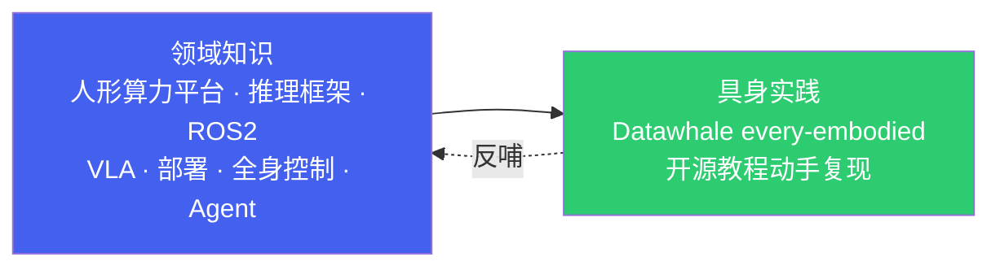

# 具身/人形机器人端侧 AI：从领域知识到具身实践

*一条「领域知识 → 开源教程实战」的完整主线*

> [!TIP]
> **本篇讲什么**
>
> 这是具身/人形机器人板块的**总导读**，把内容串成一个完整故事：先打**领域知识**地基（人形端侧算力平台 / 推理框架 / ROS2 集成 / VLA 模型 / 端侧部署 / 实时控制与全身控制 / Embodied Agent），再通过 **Datawhale 开源教程**动手实践，把知识落到可复现的工程上。
>
> 本板块**只聚焦具身智能与人形机器人**——VLA/扩散策略/遥操作/世界模型、人形全身控制（WBC/MPC）、足式步态、具身操作（含机械臂与灵巧手）；不覆盖服务机器人、工业机械臂、巡检/配送/扫地等非具身主线形态。
>
> 建议按「系统学习 → 面试自测 → 开源教程实战」的顺序阅读；读完能完整理解「具身/人形机器人端侧 AI 从知识到动手」的路径。

## 1. 故事主线

- **第一层 · 领域知识**：理解具身/人形机器人端侧的完整技术栈——人形算力平台（Jetson Orin 系）、推理框架（TensorRT）、ROS2 集成、VLA 模型与 Sim2Real、端侧部署、实时控制链路与全身控制栈（WBC/MPC）、Embodied Agent 架构。
- **第二层 · 具身实践**：通过 Datawhale 开源具身智能教程（every-embodied）动手实践——机器人运动学、CV、运动规划/控制、RL、仿真、VLA/世界模型，工程可复现、仅需 Python 基础。

## 2. 结构与阅读路径

### 2.1 第一层 · 领域知识（通用部分）

| 文档 | 讲什么 |
| :--- | :--- |
| [人形端侧算力与框架](general/platforms.html) | 人形端侧算力平台（Jetson Orin 系）、推理框架（TensorRT）、ROS2 + 端侧 AI 集成 |
| [感知与 VLA 训练](general/algorithms.html) | 感知训练、VLA（π0/OpenVLA/GR00T/RDT）、扩散策略、遥操作、Sim2Real、世界模型 |
| [端侧部署与实时控制](general/deployment.html) | 端侧推理部署、实时控制、传感器融合、MoveIt2、SLAM/状态估计、人形全身控制栈 |
| [端侧 Embodied Agent](general/embodied-agent.html) | Agent 架构、端侧 LLM 引擎、Tool Use、多模态接地、记忆与规划 |
| [具身/人形机器人面试指南](general/interview.html) | 34 道精选题，覆盖平台选型、算法训练、部署实时控制、Agent 大模型与系统设计 |

### 2.2 第二层 · 具身实践（开源教程）

| 文档 | 讲什么 |
| :--- | :--- |
| [Datawhale 具身智能教程 · every-embodied](https://github.com/datawhalechina/every-embodied) | Datawhale 开源具身智能教程（Zero to Hero）：机器人运动学、CV、运动规划/控制、RL、仿真、VLA/世界模型，工程可复现（外部链接，点击直达 GitHub） |

## 3. 一条完整的学习链路

把内容串起来，一条具身/人形机器人端侧 AI 的学习链路是：

1. **懂平台**（领域知识）：理解 Jetson Orin 系等人形端侧算力平台的算力、内存与功耗约束，以及 TensorRT 推理框架的选型。
2. **懂算法**（领域知识）：理解感知模型、VLA 模型、强化学习与 Sim2Real 迁移的训练与适配方法。
3. **懂部署**（领域知识）：理解端侧推理部署、实时控制链路、人形全身控制栈（WBC/MPC）、多传感器融合的工程实现。
4. **懂 Agent**（领域知识）：理解 Embodied Agent 循环、端侧 LLM 推理、Tool Use、多模态接地与记忆规划。
5. **动手练**（开源教程）：跟着 Datawhale every-embodied 教程从零复现，把上述知识落到可运行的工程上。

> [!NOTE]
> **为什么这样组织**
>
> 具身/人形机器人板块聚焦「领域知识 + 开源教程实战」两层——领域知识是可迁移的地基，Datawhale 开源教程是动手实践的抓手。与座舱板块不同，机器人这里没有自研框架层，也没有绑定具体量产项目；它更偏「学习与面试」定位：先建立对具身/人形机器人端侧全栈的完整认知，再通过可复现的开源教程把知识变成动手能力。
