# 通用机器人 — 学习文档

*15 Chapters / 4 Parts — 覆盖人形机器人、机械臂、服务机器人的端侧 AI 全栈技术*

Part A: 平台与基础设施

## 1. 机器人端侧算力平台全景

### 1.1 主流端侧算力平台对比

机器人端侧计算与座舱不同，需要同时满足**多传感器融合**、**实时控制**和**AI 推理**三大需求。当前主流平台各有侧重，选型需根据机器人品类（人形、机械臂、服务机器人）和性能/成本/功耗预算综合判断。

| 平台 | 厂商 | AI 算力 | 典型功耗 | CPU | GPU/NPU | 价格区间 | 适用场景 |
| :--- | :--- | :--- | :--- | :--- | :--- | :--- | :--- |
| **Jetson Orin NX** | NVIDIA | 275 TOPS INT8 | 15-60W | 8-core Arm Cortex-A78AE | 1024-core Ampere GPU + 2x NVDLA | $399-$999 | 人形机器人、高精度机械臂、自主导航 |
| **RK3588** | Rockchip | 6 TOPS INT8 | 5-8W | 4x A76 + 4x A55 | Mali-G610 + 6 TOPS NPU | $50-$100 | 服务机器人、低成本巡检机器人 |
| **QRB5165** | Qualcomm | 15 TOPS INT8 | 10-15W | Kryo 585 (1+3+4) | Adreno 650 + Hexagon DSP | $150-$300 | 移动机器人、无人机、巡检 |
| **TDA4VM** | TI | 8 TOPS INT8 | 5-15W | 2x A72 + 6x R5F | C7x DSP + MMA | $80-$200 | 工业机械臂、AGV、安全关键场景 |

### 1.2 多维性能雷达图

以下雷达图从六个维度比较四款平台的综合表现。每个维度满分 10 分，分值基于行业公开数据和工程实践经验。

**端侧算力平台多维对比**

| 指标 | Jetson Orin | RK3588 | QRB5165 | TDA4VM |
| :--- | :--- | :--- | :--- | :--- |
| AI 算力 (TOPS) | 10 | 2 | 5 | 3 |
| 能效比 (TOPS/W) | 7 | 5 | 7 | 4 |
| 价格优势 | 3 | 10 | 6 | 7 |
| 生态丰富度 | 10 | 6 | 5 | 4 |
| 实时能力 | 7 | 4 | 5 | 9 |
| 社区支持 | 10 | 7 | 5 | 4 |

### 1.3 选型决策框架

> [!TIP]
> **选型决策矩阵**
>
> **人形机器人**（多自由度控制 + 视觉推理 + LLM）：首选 **Jetson Orin**，算力充裕，CUDA 生态成熟，可同时跑感知+规划+控制。
>
> **工业机械臂**（安全关键 + 确定性延迟）：首选 **TDA4VM**，具备功能安全认证（ASIL-D），R5F 核心提供硬实时保障。
>
> **服务机器人**（成本敏感 + 中等算力）：首选 **RK3588**，价格仅 $50-100，6 TOPS 足够跑 YOLO + 简单导航。
>
> **移动巡检**（功耗敏感 + 连接性）：首选 **QRB5165**，Hexagon DSP 能效比高，原生支持 5G/WiFi 6。

### 1.4 算力需求参考

不同机器人任务对算力的需求差异巨大：

| 任务类型 | 典型模型 | 所需算力 (TOPS) | 延迟要求 | 备注 |
| :--- | :--- | :--- | :--- | :--- |
| 2D 物体检测 | YOLOv8s | 0.5-2 | <30ms | RK3588 即可满足 |
| 6DoF 位姿估计 | FoundationPose | 5-15 | <50ms | 需要较强 GPU |
| 语义场景理解 | SAM + CLIP | 20-50 | <100ms | Orin 级别算力 |
| VLA 实时推理 | Octo / RT-2 | 50-200 | <200ms | 需 Orin AGX 级别 |
| 端侧 LLM (4B) | Qwen3-Omni-4B INT4 | 15-40 | 首 token <500ms | prefill 阶段是瓶颈 |

## 2. 端侧推理框架对比

### 2.1 框架全景

端侧推理框架是连接训练好的模型和目标硬件的桥梁。选择合适的框架直接影响推理性能、开发效率和后续维护成本。核心考量因素包括**硬件绑定程度**、**量化支持**、**自定义算子扩展**和**社区活跃度**。

| 框架 | 绑定硬件 | 量化支持 | 自定义算子 | 易用性 | 性能 (相对) | 社区 |
| :--- | :--- | :--- | :--- | :--- | :--- | :--- |
| **TensorRT** | NVIDIA GPU/DLA | FP16/INT8/INT4, PTQ+QAT | Plugin API, 复杂但灵活 | 中等 | 极高 (基准线) | 极活跃 |
| **QNN** | Qualcomm DSP/HTP | INT8/INT16, QAT 为主 | HTP Backend Op Package | 中等偏低 | 高 (DSP 专用优化) | 中等 |
| **RKNN** | Rockchip NPU | INT8/FP16, PTQ 为主 | 有限，RKNN-Toolkit2 | 较高 | 中 (6 TOPS 上限) | 活跃 (国内) |
| **TFLite** | 跨平台 (CPU/GPU/NPU delegate) | INT8/FP16, PTQ+QAT | Custom Op, 较简单 | 高 | 中等 | 活跃 |
| **ONNX Runtime** | 跨平台 (多 EP) | INT8/FP16, 通过 ONNX quantizer | Custom Op 注册 | 高 | 中-高 (取决于 EP) | 极活跃 |

### 2.2 框架与硬件映射关系

每种硬件通常有一条"最优路径"：使用对应的专用框架可以最大化利用硬件加速单元。跨平台框架作为补充，适合快速原型验证和多平台部署。

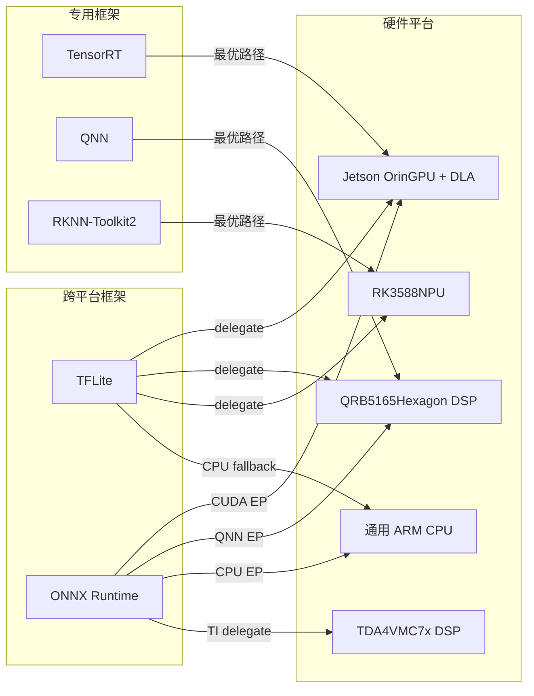

### 2.3 量化精度与性能权衡

量化是端侧部署的核心技术。不同量化级别对模型精度和推理速度的影响：

| 量化级别 | 模型大小 (相对 FP32) | 推理加速 | 精度损失 | 校准复杂度 | 推荐场景 |
| :--- | :--- | :--- | :--- | :--- | :--- |
| FP32 | 1x | 1x | 无 | 无 | 训练、调试基准 |
| FP16 | 0.5x | 1.5-2x | 极小 | 无 | Orin GPU 默认精度 |
| INT8 PTQ | 0.25x | 2-4x | 小 (通常 <1%) | 需校准数据集 | 生产部署首选 |
| INT8 QAT | 0.25x | 2-4x | 极小 | 需重训练 | 精度敏感任务 |
| INT4 | 0.125x | 3-6x | 中等 (1-3%) | 高 | LLM 权重量化 |

> [!WARNING]
> **实践建议**
>
> 优先尝试 **INT8 PTQ**，90% 的情况下精度损失可接受。仅在 PTQ 精度不达标时才使用 QAT（训练成本增加约 30%）。对于 LLM 类模型，**INT4 权重 + INT8 激活值（W4A8）** 是当前最佳平衡点。

## 3. ROS2 + 端侧 AI 集成

### 3.1 ROS2 节点架构设计

在机器人系统中，AI 推理通常作为一个独立的 ROS2 节点存在，通过 DDS 话题和服务与其他节点通信。关键设计决策包括：推理节点是同步还是异步、消息传输是否使用零拷贝、QoS 如何配置。

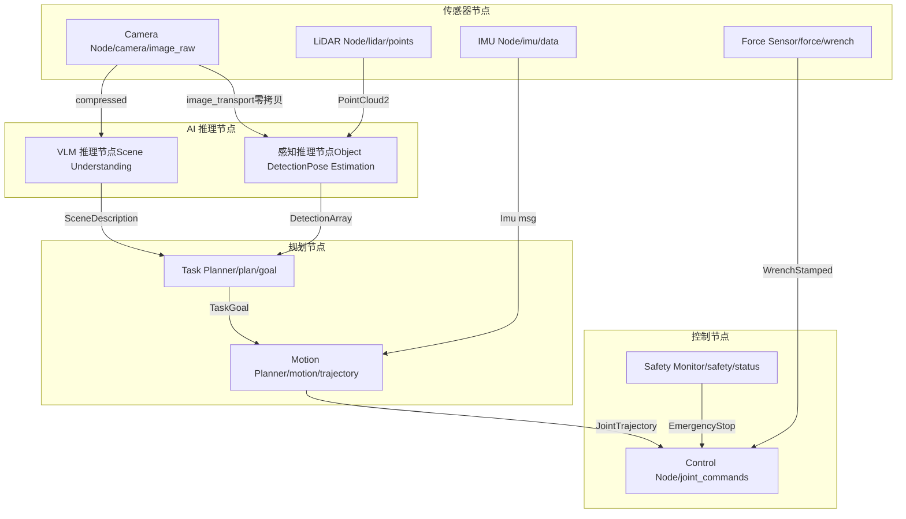

### 3.2 零拷贝与共享内存传输

图像和点云数据量大（640x480 RGB 图约 900KB，VGA 深度图约 600KB），传统消息序列化会引入 1-3ms 的延迟。ROS2 Humble 以上支持基于共享内存的零拷贝传输：

```
// 使用 Loaned Messages 实现零拷贝发布
auto loaned_msg = publisher->borrow_loaned_message();
auto & image = loaned_msg.get();
// 直接写入共享内存，无需拷贝
fill_image_data(image);
publisher->publish(std::move(loaned_msg));

// 配置 DDS 使用共享内存传输
// fastdds_profile.xml:
// <transport_descriptors>
//   <transport_descriptor>
//     <transport_id>shm_transport</transport_id>
//     <type>SHM</type>
//     <segment_size>10485760</segment_size>
//   </transport_descriptor>
// </transport_descriptors>
```

### 3.3 DDS QoS 配置策略

不同数据流对可靠性和时效性的要求不同，需要差异化的 QoS 策略：

| 数据流 | Reliability | History Depth | Deadline | Liveliness | 理由 |
| :--- | :--- | :--- | :--- | :--- | :--- |
| 相机图像 | BEST\_EFFORT | 1 | 33ms (30Hz) | AUTOMATIC | 丢帧可接受，保证时效性 |
| LiDAR 点云 | BEST\_EFFORT | 1 | 100ms (10Hz) | AUTOMATIC | 数据量大，优先最新帧 |
| 检测结果 | RELIABLE | 5 | 50ms | AUTOMATIC | 规划依赖，不可丢失 |
| 关节指令 | RELIABLE | 1 | 2ms (500Hz) | MANUAL\_BY\_TOPIC | 安全关键，严格实时 |
| 安全状态 | RELIABLE | 10 | 10ms | MANUAL\_BY\_TOPIC | 急停信号，绝对可靠 |

### 3.4 AI 推理节点设计模式

推理节点的回调模式直接影响系统吞吐和延迟：

| 模式 | 实现方式 | 优点 | 缺点 | 适用场景 |
| :--- | :--- | :--- | :--- | :--- |
| **同步回调** | 在 subscription callback 中直接推理 | 实现简单，延迟确定 | 阻塞回调线程，可能丢帧 | 推理 <10ms 的轻量模型 |
| **异步 Executor** | MultiThreadedExecutor + 推理线程池 | 不阻塞回调，高吞吐 | 实现复杂，需处理竞态 | 重模型 (VLM, VLA) |
| **Action Server** | ROS2 Action 接口，长时任务 | 支持反馈和取消 | 开销较大 | LLM 生成式推理 |

> [!NOTE]
> **ROS2 vs ROS1 核心差异（AI 集成视角）**
>
> **DDS 中间件**：ROS2 原生支持实时通信，不依赖 roscore 单点。**生命周期节点**：支持 Configuring → Inactive → Active 状态机，便于 AI 模型热加载。**Component 组合**：多个推理节点可以合并为同进程 Component，避免进程间通信开销。**Action 接口**：原生支持长时异步任务（如 LLM 推理），提供进度反馈和取消能力。

Part B: 算法训练与微调

## 4. 机器人感知模型训练

### 4.1 数据飞轮

机器人感知系统的核心竞争力不在单次模型训练的精度，而在于**数据飞轮的转速**。一个高效运转的数据飞轮能够持续提升模型性能，自动发现和修复 corner case。

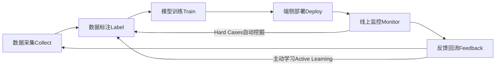

### 4.2 Few-shot 学习与快速适配

机器人在新环境部署时，经常遇到训练集中不存在的物体。Few-shot 学习允许用少量样本（5-20 张图）快速适配新类别：

| 方法 | 样本需求 | 适配时间 | 精度 | 是否需端侧训练 | 适用场景 |
| :--- | :--- | :--- | :--- | :--- | :--- |
| **Metric Learning** | 5-10 shot | 即时推理 | 中等 | 否（特征比对） | 物体识别 |
| **Prompt Tuning** | 1-5 shot | 即时推理 | 中-高 | 否（文本引导） | 开放词汇检测 |
| **LoRA 微调** | 10-50 | 5-30 min | 高 | 可选 (边缘训练) | 精度敏感任务 |
| **域适应 (Domain Adaptation)** | 无标注 (目标域) | 1-4 hours | 中-高 | 通常云端 | 光照/场景迁移 |

### 4.3 Sim2Real 迁移策略

仿真数据几乎无限且标注免费，但"仿真-现实差距"（Sim2Real Gap）是落地的最大障碍。核心策略：

| 策略 | 原理 | 效果 | 代价 |
| :--- | :--- | :--- | :--- |
| **域随机化 (DR)** | 在仿真中随机化纹理、光照、物理参数 | 提高泛化性 | 仿真时间增加 2-5x |
| **域适应 (DA)** | 对抗训练对齐仿真/真实特征分布 | 减少分布偏移 | 需少量真实数据 |
| **渐进式迁移** | 仿真预训练 → 小规模真实微调 | 最优精度 | 需要真实标注数据 |
| **Photo-realistic Sim** | 使用高保真渲染器 (Isaac Sim, Habitat) | 缩小视觉差距 | GPU 资源消耗大 |

> [!TIP]
> **数据质量 > 数据数量**
>
> 在机器人感知领域，**500 张高质量标注 > 50000 张噪声标注**。高质量意味着：标注边界精确、覆盖多样场景、包含典型 hard case。建议投入 60% 的数据预算在质量控制上，而非单纯扩大数量。自动标注工具（如 SAM + CLIP 自动标注流水线）可以在保持质量的同时降低成本。

## 5. VLA 模型训练与适配

### 5.1 VLA 架构解析

Vision-Language-Action (VLA) 模型将视觉理解、语言理解和机器人动作生成统一到一个端到端框架中。核心思想是将机器人动作"token 化"，使语言模型能够直接输出机器人控制指令。

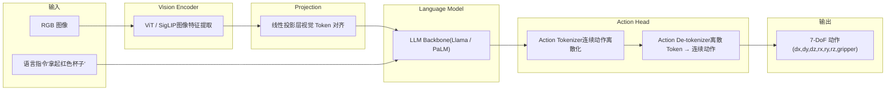

### 5.2 主流 VLA 模型参数规模

端侧部署的关键挑战是将 VLA 模型压缩到可接受的规模，同时保持操作精度。

**VLA 模型参数量对比 (对数刻度)**

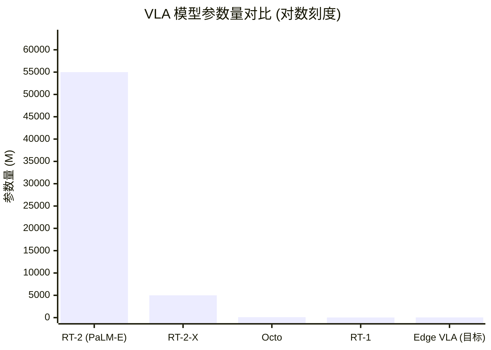

### 5.3 边缘压缩 Pipeline

将云端 VLA 模型压缩到端侧可运行的规模，需要多阶段联合优化：

| 阶段 | 技术 | 压缩率 | 精度损失 | 说明 |
| :--- | :--- | :--- | :--- | :--- |
| 1. 结构化剪枝 | 移除注意力头、FFN 通道 | 2-4x 参数减少 | 3-8% | 需要微调恢复精度 |
| 2. 知识蒸馏 | 大模型 Teacher → 小模型 Student | 5-10x 参数减少 | 2-5% | 学习中间表征效果更好 |
| 3. 量化 | INT8/INT4 权重量化 | 2-4x 内存减少 | 0.5-2% | PTQ 通常即可 |
| 4. 算子融合 | Attention + LayerNorm 融合 | 1.3-2x 速度提升 | 0% | 框架级优化 |

> [!WARNING]
> **VLA 端侧部署的现实挑战**
>
> 当前最小可用的 VLA 模型（如 Octo 93M）在 Jetson Orin 上推理延迟约 80-120ms，勉强满足 5-10Hz 的控制频率要求。若要达到 30Hz 实时控制（如灵巧操作），仍需进一步压缩到 <50M 参数。**Action Chunking**（一次预测多步动作）是当前最有效的缓解策略 —— 模型以 5Hz 运行但每次输出未来 10 步动作，等效控制频率达到 50Hz。

## 6. 强化学习与 Sim2Real

### 6.1 RL 训练流程总览

机器人强化学习的核心难点在于样本效率和安全性 —— 真实机器人不可能像游戏 AI 那样试错百万次。因此，"仿真训练 + Sim2Real 迁移" 成为标准范式。

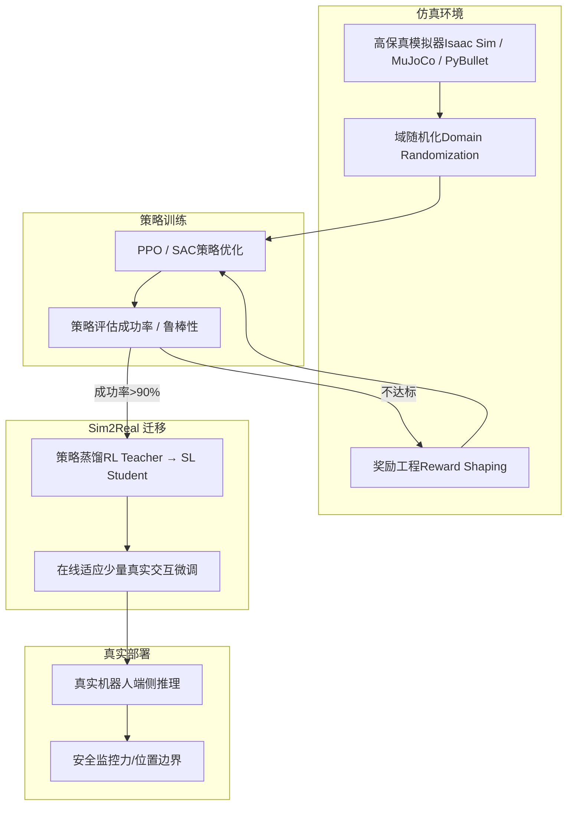

### 6.2 策略蒸馏：RL Teacher → SL Student

RL 策略通常是大型神经网络，且依赖仿真中的特权信息（如精确物体位姿）。策略蒸馏将其压缩为可在端侧运行的轻量模型，同时去除对特权信息的依赖：

```
# 策略蒸馏伪代码
# 1. 收集 Teacher 轨迹
teacher_policy = load_rl_policy("ppo_grasp_v3.pt")  # 大模型, 使用特权信息
trajectories = []
for episode in range(10000):
    obs_privileged = env.get_privileged_obs()  # 包含精确位姿
    obs_student = env.get_visual_obs()          # 仅 RGB 图像
    action = teacher_policy(obs_privileged)
    trajectories.append((obs_student, action))

# 2. 训练 Student (行为克隆)
student_policy = LightweightCNN(input="RGB", output="7DoF_action")
for obs, action in DataLoader(trajectories):
    pred_action = student_policy(obs)
    loss = F.mse_loss(pred_action, action)  # + 正则项
    loss.backward()
```

### 6.3 域随机化技术

域随机化通过在仿真中引入大范围的环境变化，迫使策略学习不依赖特定视觉/物理特征的鲁棒行为：

| 随机化类型 | 随机化参数 | 典型范围 | 对 Sim2Real 的影响 |
| :--- | :--- | :--- | :--- |
| **视觉随机化** | 纹理、光照方向/强度、相机位姿、背景 | 纹理:随机图案, 光照:0.2-5x, 相机:±10cm/±5° | 消除视觉域偏差，最关键 |
| **动力学随机化** | 摩擦系数、物体质量、关节阻尼 | 摩擦:0.1-2.0, 质量:0.5-2x, 阻尼:0.8-1.2x | 适应真实物理参数不确定性 |
| **物理随机化** | 重力方向微扰、仿真步长、接触刚度 | 重力:±5%, 步长:1-4ms | 提高对仿真器误差的鲁棒性 |
| **任务随机化** | 目标位置、初始构型、障碍物布局 | 全工作空间采样 | 提高泛化能力 |

> [!CAUTION]
> **Sim2Real Gap 是第一大挑战**
>
> 即使使用了全面的域随机化，仿真中 95% 的成功率在真实世界通常只能达到 60-80%。差距主要来自：**接触物理建模不准确**（软物体、柔性物体）、**传感器噪声模型不完善**（深度相机在反光表面失效）、**执行器延迟和响应差异**。最有效的弥补方法是在真实环境中进行少量（50-200 episodes）的微调适应。

## 7. 持续学习与在线适应

### 7.1 端侧增量学习

服务机器人在用户家中部署后，会不断遇到新物体和新场景。端侧增量学习允许机器人在不回传数据的情况下持续提升能力：

| 能力 | 技术方案 | 计算开销 | 内存开销 | 适用性 |
| :--- | :--- | :--- | :--- | :--- |
| 新物体识别 | 特征库扩展 + Nearest Neighbor | 极低（前向推理） | 每物体约 2KB | 所有平台 |
| 新场景适应 | Batch Norm 统计量更新 | 低（仅统计量） | 可忽略 | 所有平台 |
| 新技能学习 | LoRA 微调 + Replay Buffer | 中（需 GPU） | LoRA 约 1-5MB | Orin 级别 |
| 偏好学习 | 人类反馈 (RLHF-lite) | 中（在线更新） | 反馈缓冲区约 10MB | Orin 级别 |

### 7.2 灾难性遗忘缓解

增量学习的核心问题是**灾难性遗忘** —— 学习新任务时遗忘旧任务。三种主流缓解策略：

| 方法 | 原理 | 额外存储 | 计算开销 | 效果 |
| :--- | :--- | :--- | :--- | :--- |
| **EWC (Elastic Weight Consolidation)** | 用 Fisher 信息矩阵约束重要权重 | 与模型参数等大 | 中等 | 对简单任务序列有效 |
| **Experience Replay** | 保存旧任务小样本，混合训练 | Replay Buffer (50-500 样本) | 低 | 最实用、效果稳定 |
| **Progressive Networks** | 为新任务添加新列，通过横向连接复用旧知识 | 线性增长 | 推理时增加 | 无遗忘，但不可扩展 |

### 7.3 边缘联邦学习

多台机器人在不共享原始数据的前提下协同提升模型性能。这对家庭服务机器人尤其重要 —— 用户隐私数据（家庭布局、个人物品）绝不能上传。

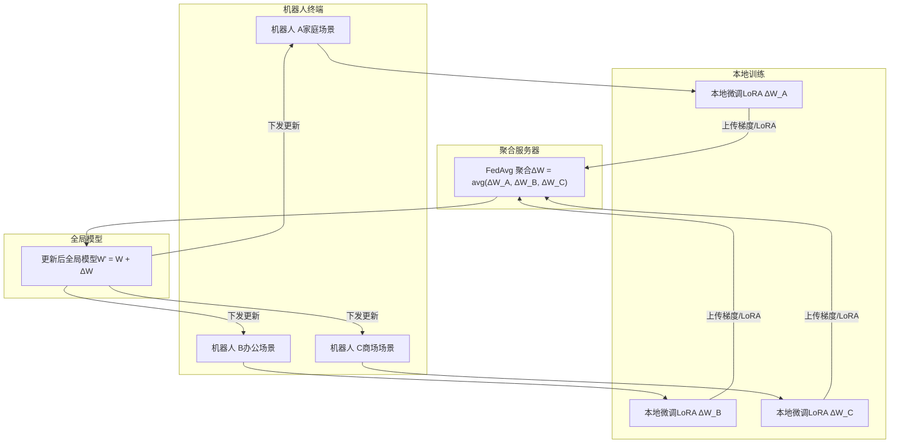

> [!NOTE]
> **隐私保护学习对服务机器人至关重要**
>
> 家庭服务机器人处理的数据包含**家庭成员面孔、居住布局、生活习惯**等高度隐私信息。联邦学习 + 差分隐私是当前最实用的技术组合：仅上传模型梯度更新（而非原始数据），并在梯度上添加可控噪声。LoRA 微调天然适合联邦学习 —— 上传的参数量仅为全量模型的 0.1-1%，通信带宽可控。

Part C: 部署与实时控制

## 8. 端侧推理部署实战

### 8.1 TensorRT 优化 Pipeline

以 Jetson Orin 平台为例，从 PyTorch 训练好的模型到端侧高性能推理的完整流程：

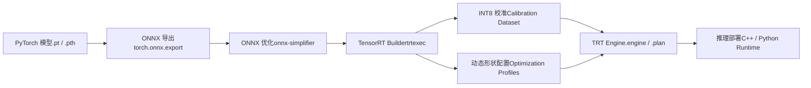

### 8.2 关键优化技术

```
# TensorRT INT8 校准示例
import tensorrt as trt

# 1. 创建 Builder
builder = trt.Builder(TRT_LOGGER)
network = builder.create_network(1 << int(trt.NetworkDefinitionCreationFlag.EXPLICIT_BATCH))
parser = trt.OnnxParser(network, TRT_LOGGER)
parser.parse_from_file("model.onnx")

# 2. 配置 INT8 量化
config = builder.create_builder_config()
config.set_flag(trt.BuilderFlag.INT8)
config.int8_calibrator = MyCalibrator(
    data_dir="calibration_data/",  # 500-1000 张代表性图像
    batch_size=32,
    cache_file="calibration.cache"
)

# 3. 动态形状（支持不同输入尺寸）
profile = builder.create_optimization_profile()
profile.set_shape("input",
    min=(1, 3, 224, 224),     # 最小 batch
    opt=(4, 3, 640, 640),     # 最优 batch（TRT 针对此优化）
    max=(8, 3, 1280, 1280))   # 最大 batch
config.add_optimization_profile(profile)

# 4. 构建引擎
engine = builder.build_serialized_network(network, config)
```

### 8.3 多模型内存规划

机器人系统通常需要同时运行多个 AI 模型（检测、分割、位姿估计、VLM 等），GPU 内存是最稀缺的资源：

| 策略 | 描述 | 内存节省 | 延迟影响 | 适用场景 |
| :--- | :--- | :--- | :--- | :--- |
| **静态分配** | 所有模型常驻内存 | 无 | 无额外延迟 | 内存充裕 (Orin 32GB) |
| **动态加载** | 按需加载/卸载模型 | 50-70% | 首次加载 200-500ms | 内存受限，任务互斥 |
| **权重共享** | Backbone 共享，多 Head | 30-50% | 无额外延迟 | 同系列模型 |
| **CUDA Stream 并行** | 多模型在不同 Stream 并行执行 | 无（但提高利用率） | 降低总延迟 | 独立任务并行 |

> [!TIP]
> **部署检查清单**
>
> 1. 模型转换后与 PyTorch 原始输出逐层对比，确保误差 < 1e-3 (FP16) 或 < 0.01 (INT8)。2. 使用 `trtexec --best` 基准测试，确认达到目标 FPS。3. 用 `nsys profile` 分析 GPU 利用率，消除 CPU-GPU 同步等待。4. 监控推理过程中的内存峰值，预留 20% 安全余量。5. 长时间压力测试（24h+），检查内存泄漏和热降频。

## 9. 实时控制链路

### 9.1 延迟预算分配

机器人控制链路的端到端延迟直接决定操作精度和安全性。不同机器人类型对延迟的容忍度差异很大：

**机器人控制链路延迟预算分配 (ms)**

| 类别 | 感知推理 | 决策规划 | 控制执行 | 安全余量 | 预算上限 |
| :--- | :--- | :--- | :--- | :--- | :--- |
| 机械臂 @30Hz | 15 | 5 | 2 | 11 | 33 |
| 人形行走 @200Hz | 3 | 1 | 0.5 | 0.5 | 5 |
| 移动机器人 @20Hz | 30 | 10 | 5 | 5 | 50 |

### 9.2 实时操作系统选型

标准 Linux 内核的调度延迟在 1-10ms 波动，无法满足高频控制的确定性要求。三种主流方案对比：

| 方案 | 原理 | 最坏延迟 | 开发难度 | 生态兼容性 | 适用场景 |
| :--- | :--- | :--- | :--- | :--- | :--- |
| **标准 Linux** | CFS 调度器, SCHED\_FIFO 可选 | 1-10ms | 低 | 完全兼容 | 服务机器人、导航 |
| **RT-PREEMPT** | 将 Linux 内核大部分中断线程化 | 50-100us | 中 | 高（主线 Linux 合并中） | 机械臂 1kHz 控制 |
| **Xenomai** | 双内核：实时内核 + Linux 内核 | 10-30us | 高 | 中（需专用 API） | 高速运动控制、CNC |

### 9.3 控制环路架构

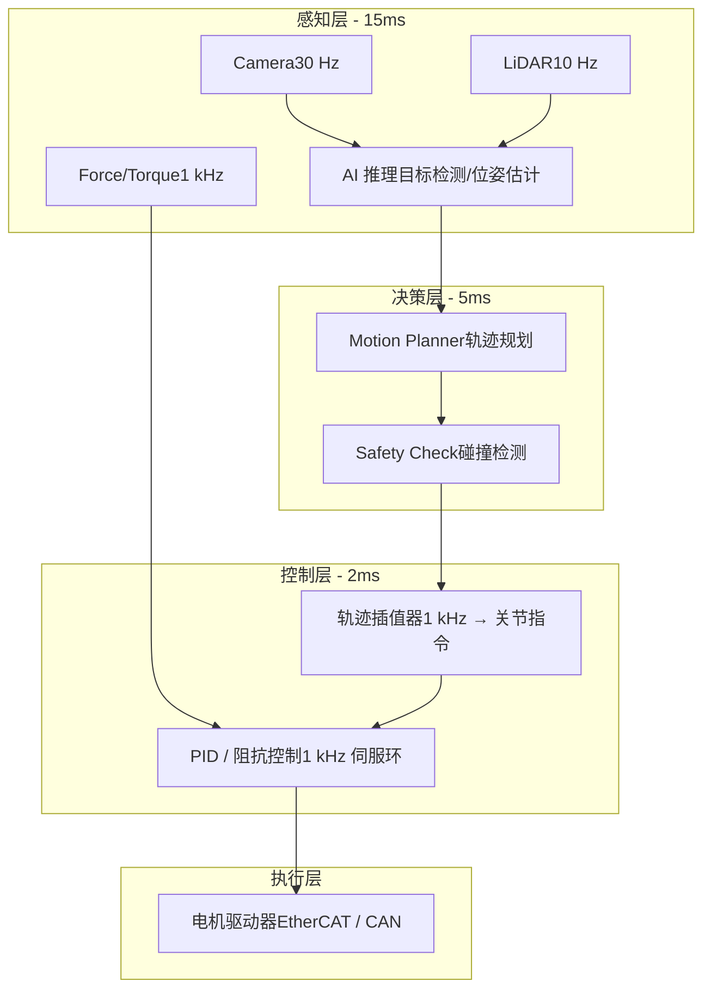

### 9.4 不同机器人类型的实时要求

| 机器人类型 | 控制频率 | 允许最大延迟 | 实时等级 | 推荐方案 |
| :--- | :--- | :--- | :--- | :--- |
| 移动服务机器人 | 20-50 Hz | 50-100ms | 软实时 | 标准 Linux + SCHED\_FIFO |
| 协作机械臂 (6-DoF) | 500-1000 Hz | 1-2ms | 硬实时 | RT-PREEMPT |
| 人形机器人行走 | 200-500 Hz | 2-5ms | 硬实时 | RT-PREEMPT / Xenomai |
| 灵巧手操作 | 1000-5000 Hz | 0.2-1ms | 硬实时 | Xenomai / FPGA |
| 视觉伺服 | 30-60 Hz | 15-33ms | 软实时 | 标准 Linux |

> [!WARNING]
> **AI 推理与实时控制的矛盾**
>
> AI 模型推理（10-200ms）与控制环路（1-5ms）的频率差距是根本矛盾。解决方案：**分频架构** —— AI 推理以低频（5-30Hz）提供目标和约束，控制器以高频（500-1000Hz）在目标引导下进行轨迹跟踪。两者通过共享内存解耦，控制器在 AI 结果更新前使用上一帧的预测做外推。

## 10. 传感器融合 Pipeline

### 10.1 多传感器时间同步

传感器融合的第一步也是最难的一步 —— 确保不同传感器的数据在时间轴上精确对齐。典型延迟源：

| 传感器 | 典型延迟 | 频率 | 同步难点 |
| :--- | :--- | :--- | :--- |
| RGB 相机 | 30-50ms（含曝光+传输） | 30 Hz | Rolling shutter 导致帧内时间不一致 |
| 深度相机 | 50-80ms | 30 Hz | 与 RGB 帧对齐需要硬件触发 |
| 2D LiDAR | 5-20ms | 10-40 Hz | 扫描时间 25-100ms，不同角度对应不同时刻 |
| 3D LiDAR | 50-100ms | 10-20 Hz | 旋转一周的数据跨越 50-100ms 时间窗 |
| IMU | <1ms | 200-1000 Hz | 几乎无延迟，作为时间参考基准 |
| 力/力矩传感器 | <1ms | 1-8 kHz | 与控制环路同步更关键 |

### 10.2 融合架构对比

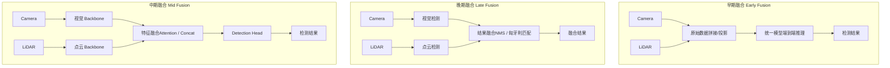

### 10.3 传感器模态对比

| 传感器 | 有效距离 | 精度 | 成本 | 天气/光照鲁棒性 | 信息维度 | 典型用途 |
| :--- | :--- | :--- | :--- | :--- | :--- | :--- |
| **RGB 相机** | 0.5-100m | 像素级 | $10-100 | 低（暗光/强光差） | 纹理、颜色、语义 | 物体识别、语义分割 |
| **深度相机** | 0.2-10m | mm 级 | $100-500 | 中（室内佳，强光差） | 3D 几何 | 抓取位姿、避障 |
| **2D LiDAR** | 0.1-30m | cm 级 | $100-500 | 高 | 2D 距离 | 导航、避障 |
| **3D LiDAR** | 0.5-200m | cm 级 | $500-10000 | 高 | 3D 点云 | 建图、3D 检测 |
| **IMU** | N/A | 高 (短期) | $5-50 | 极高 | 加速度、角速度 | 姿态估计、里程计 |
| **力/力矩传感器** | 接触 | mN 级 | $200-2000 | 极高 | 6D 力/力矩 | 力控操作、碰撞检测 |

> [!CAUTION]
> **时间同步比算法设计更难**
>
> 工程实践中，80% 的传感器融合 Bug 来自时间同步问题，而非算法本身。关键经验：1. 使用 **PTP (IEEE 1588)** 或 **硬件触发**实现微秒级同步，不要依赖软件时间戳。2. 在 ROS2 中使用 `message_filters::ApproximateTimeSynchronizer` 而非手动缓冲。3. 所有传感器数据必须带**硬件时间戳**（sensor timestamp），而非接收时间戳（arrival timestamp）。4. 建立时间同步监控告警，偏差超过阈值立即降级。

Part D: 端侧 Agent 框架

## 11. 机器人端侧 Agent 架构

### 11.1 Embodied Agent 循环

与纯软件 Agent 不同，机器人 Embodied Agent 必须与物理世界交互。每一步"行动"都有不可逆性 —— 打碎的杯子无法 undo。这使得安全性和鲁棒性成为架构设计的首要考量。

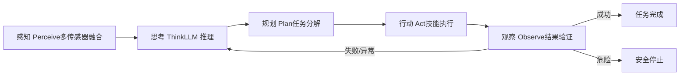

### 11.2 端侧 LLM vs 传统状态机

传统机器人使用有限状态机（FSM）或行为树（BT）进行决策，而端侧 LLM Agent 使用自然语言推理。两种范式各有优劣：

| 维度 | 传统状态机/行为树 | 端侧 LLM Agent |
| :--- | :--- | :--- |
| **灵活性** | 固定逻辑，新场景需重新编程 | 自然语言指令，零样本适配新任务 |
| **可预测性** | 高 —— 行为可枚举、可验证 | 低 —— 输出不确定，需要 guardrail |
| **开发效率** | 低 —— 大量 if-else / 状态转移 | 高 —— 自然语言描述技能和约束 |
| **计算开销** | 极低 (<1ms) | 高 (100-1000ms per token) |
| **安全性** | 可形式化验证 | 需要额外安全层 (sandbox) |
| **可解释性** | 状态图直观 | 思维链 (CoT) 部分可解释 |
| **适用阶段** | 成熟产品，安全关键 | 研发原型，开放场景 |

> [!NOTE]
> **混合架构是当前最佳实践**
>
> 推荐**"LLM 高层决策 + 状态机底层执行"**的混合架构：LLM 负责理解用户意图和高层任务规划（5-10Hz），状态机/行为树负责底层技能执行和安全监控（100-1000Hz）。底层安全逻辑（力限制、碰撞检测、工作空间边界）绝不经过 LLM，而是硬编码在实时控制层。

## 12. 端侧 LLM 推理引擎

### 12.1 主流引擎对比

端侧 LLM 推理引擎需要在有限算力下最大化 token 生成速度，同时控制内存占用。

| 引擎 | 核心优化 | 硬件支持 | 支持模型 | 量化支持 | 内存管理 | 特点 |
| :--- | :--- | :--- | :--- | :--- | :--- | :--- |
| **llama.cpp** | CPU SIMD, Metal, CUDA | CPU / GPU / Apple Silicon | Llama, Qwen, Phi, Gemma 等 | Q2-Q8, GGUF 格式 | mmap 按需加载 | 最广泛的模型支持，社区最活跃 |
| **MLC-LLM** | TVM 编译优化, GPU/NPU kernel | CUDA / Vulkan / OpenCL / Metal | Llama, Qwen, Phi 等 | INT4/INT8 (编译时) | 静态内存规划 | 编译优化，GPU 利用率高 |
| **ExecuTorch** | XNNPACK, CoreML, QNN delegate | CPU / GPU / NPU (delegate) | Llama 系列为主 | INT8/INT4 (PTQ) | Memory Planning | Meta 主推，与 PyTorch 生态融合 |
| **QNN LLM** | Hexagon HTP 专用优化 | Qualcomm HTP/DSP | Llama, Qwen (需转换) | INT8/INT4 (W4A16) | DSP 内存池 | 高通平台最优性能 |

### 12.2 3B 模型 INT4 推理速度对比

以 Qwen3-Omni-4B INT4 模型在 Jetson Orin NX (16GB) 上的推理速度为基准：

**Qwen3-Omni-4B INT4 推理速度对比 (Jetson Orin NX)**

| 类别 | Prefill (tok/s) | Decode (tok/s) |
| :--- | :--- | :--- |
| #1 | 120 | 8 |
| #2 | 180 | 12 |
| #3 | 350 | 22 |
| #4 | 420 | 28 |

### 12.3 内存优化关键技术

端侧 LLM 推理的内存瓶颈在于 KV Cache。以 3B 模型为例：

```
# KV Cache 内存计算
# Qwen3-Omni-4B: ~40 layers, 32 heads, 128 head_dim
# 序列长度 2048, FP16 存储

kv_cache_size = 2 * 36 * 32 * 128 * 2048 * 2  # bytes (2 for K and V, 2 for FP16)
# = 2 * 36 * 32 * 128 * 2048 * 2
# = 1,207,959,552 bytes ≈ 1.13 GB

# 优化手段:
# 1. GQA (Grouped Query Attention): KV heads 4 instead of 32 → 8x 节省
# 2. KV Cache 量化 (INT8): 再减 2x
# 3. Sliding Window: 限制上下文长度
# 优化后: 1.13 GB / 8 / 2 ≈ 72 MB (可接受)
```

> [!TIP]
> **引擎选型建议**
>
> **Jetson Orin 平台**：优先 **MLC-LLM**（CUDA kernel 优化最好），备选 llama.cpp（CUDA backend）。**Qualcomm 平台**：使用 **QNN LLM**（Hexagon HTP 独占优化）。**跨平台原型**：使用 **llama.cpp**（一份代码跑遍所有平台）。**与 PyTorch 深度集成**：使用 **ExecuTorch**（训练-部署一体化）。

## 13. 端侧 Tool Use & Function Calling

### 13.1 机器人技能库抽象

将机器人的底层控制能力抽象为 LLM 可调用的"工具函数"（技能），是 Embodied Agent 的核心设计模式。每个技能封装了完整的感知-规划-执行逻辑：

| 技能名称 | 参数 | 前置条件 | 执行时间 | 安全等级 |
| :--- | :--- | :--- | :--- | :--- |
| `grasp(object_id)` | 目标物体 ID | 物体已检测、可达 | 3-8s | 中 (力控保护) |
| `place(position)` | 目标位置 (x,y,z) | 手中有物体 | 3-6s | 中 |
| `navigate(goal)` | 目标位置/区域名 | 地图已建立 | 10-60s | 低 (避障保护) |
| `inspect(object_id)` | 目标物体 ID | 物体已检测 | 2-5s | 低 |
| `handover(target)` | 交接对象 (人/机器人) | 手中有物体 | 5-15s | 高 (人机安全) |
| `scan_area(region)` | 扫描区域 | 无 | 10-30s | 低 |

### 13.2 Tool Use 调用流程

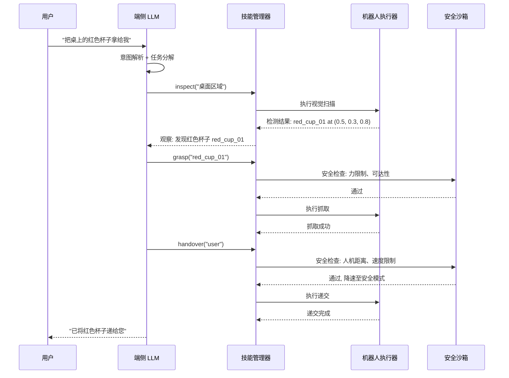

### 13.3 动态工具注册

机器人在运行时可能获得新能力（如安装了新末端执行器），Agent 框架需要支持动态注册新技能：

```
# 动态技能注册示例
class SkillRegistry:
    def __init__(self):
        self.skills = {}

    def register(self, name, func, schema, safety_level="low"):
        """运行时注册新技能"""
        self.skills[name] = {
            "function": func,
            "schema": {          # OpenAI Function Calling 格式
                "name": name,
                "description": schema["description"],
                "parameters": schema["parameters"]
            },
            "safety_level": safety_level
        }
        # 更新 LLM 的 system prompt 中的可用工具列表
        self.update_llm_tools()

    def get_tool_descriptions(self):
        """生成 LLM 可理解的工具描述"""
        return [s["schema"] for s in self.skills.values()]

# 运行时发现新末端执行器 → 注册新技能
registry.register(
    name="vacuum_pick",
    func=vacuum_gripper.pick,
    schema={
        "description": "使用真空吸盘吸取平面物体",
        "parameters": {
            "type": "object",
            "properties": {
                "object_id": {"type": "string", "description": "目标物体ID"},
                "suction_force": {"type": "number", "description": "吸力(N)", "default": 10}
            },
            "required": ["object_id"]
        }
    },
    safety_level="medium"
)
```

### 13.4 安全沙箱机制

| 安全等级 | 描述 | 检查内容 | 确认方式 | 示例操作 |
| :--- | :--- | :--- | :--- | :--- |
| **Level 0: 安全** | 不涉及物理运动 | 无 | 自动执行 | inspect, scan, query |
| **Level 1: 低风险** | 低速运动，远离人 | 工作空间边界、碰撞检测 | 自动执行 | navigate, pick (空旷区域) |
| **Level 2: 中风险** | 力控操作、精密操作 | 力限制、速度限制、物体脆弱性 | LLM 自检 + 日志 | grasp (易碎品), pour |
| **Level 3: 高风险** | 人机交互、不可逆操作 | 人机距离、速度降档、力矩饱和 | 人工确认 | handover, cut, heat |
| **Level 4: 禁止** | 超出安全边界 | — | 拒绝执行 | 离开工作区域、高速接近人 |

> [!CAUTION]
> **安全优先原则**
>
> 机器人 Agent 与软件 Agent 的根本区别：**物理动作不可撤销**。设计原则：1. 安全检查在 LLM 之外，用确定性代码实现，不依赖 LLM 判断。2. 力矩/速度限制硬编码在控制器层，即使 LLM 发出危险指令也无法突破。3. 新技能默认 Level 3（人工确认），经验证后才降级。4. 所有操作记录审计日志，支持事后追溯。

## 14. 多模态理解与接地

### 14.1 视觉-语言接地 (Visual-Language Grounding)

"接地"(Grounding) 是将自然语言中的指代（如"红色杯子"、"左边那个"）映射到物理世界中具体物体或位置的过程。这是 Embodied Agent 能否正确执行指令的关键环节。

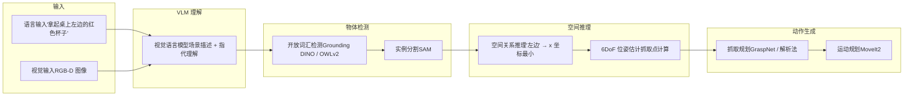

### 14.2 开放词汇操作

传统机器人只能操作训练集中见过的物体类别。结合视觉-语言模型，机器人可以理解和操作从未见过的物体：

| 技术 | 原理 | 优点 | 局限 | 端侧可行性 |
| :--- | :--- | :--- | :--- | :--- |
| **CLIP + Detection** | CLIP 特征匹配 + 检测框 | 零样本，无需训练 | 空间分辨率低 | 高 (CLIP ViT-B 约 150M) |
| **Grounding DINO** | 文本引导的检测器 | 精确定位，开放词汇 | 模型较大 (172M) | 中 (需 INT8 量化) |
| **OWLv2** | 开放世界检测器 | one-shot 支持 | 速度中等 | 中 |
| **SAM + CLIP** | SAM 分割所有 + CLIP 分类 | 最强泛化 | 两阶段，延迟高 | 低 (需 Orin 级别) |

### 14.3 空间推理与指代消解

用户指令中的空间关系（"左边"、"上面"、"靠近"）需要在 3D 空间中解析。关键处理步骤：

```
# 空间指代消解示例
class SpatialReasoner:
    def resolve_reference(self, text, detections, camera_params):
        """将语言中的空间指代解析为具体物体"""
        # 1. 提取空间关系词
        relations = self.parse_spatial_relations(text)
        # e.g., {"attribute": "红色", "relation": "左边", "anchor": "桌子"}

        # 2. 属性过滤
        candidates = [d for d in detections
                       if self.match_attribute(d, relations["attribute"])]

        # 3. 空间关系过滤
        if relations["relation"] == "左边":
            # 在相机坐标系中，左边 = x 坐标较小
            anchor = self.find_object(detections, relations["anchor"])
            candidates = [c for c in candidates
                          if c.position_3d.x < anchor.position_3d.x]

        # 4. 歧义消解：如果仍有多个候选，选最近的
        if len(candidates) > 1:
            candidates.sort(key=lambda c: c.distance_to_robot)

        return candidates[0] if candidates else None
```

> [!TIP]
> **接地精度直接决定操作成功率**
>
> 实验数据显示：接地正确率 90% 时，端到端操作成功率约 70%（每步 90% 累积多步衰减）；接地正确率 99% 时，操作成功率提升至 90%+。**提升接地精度 10% 比提升运动规划精度 10% 对最终成功率的贡献大得多**。建议投入更多工程资源在感知和接地环节，而非纯粹的控制算法优化。

## 15. Agent 记忆与规划

### 15.1 三层记忆架构

长时间运行的机器人 Agent 需要结构化的记忆系统，而非仅依赖 LLM 的上下文窗口。三层记忆架构是当前最实用的设计：

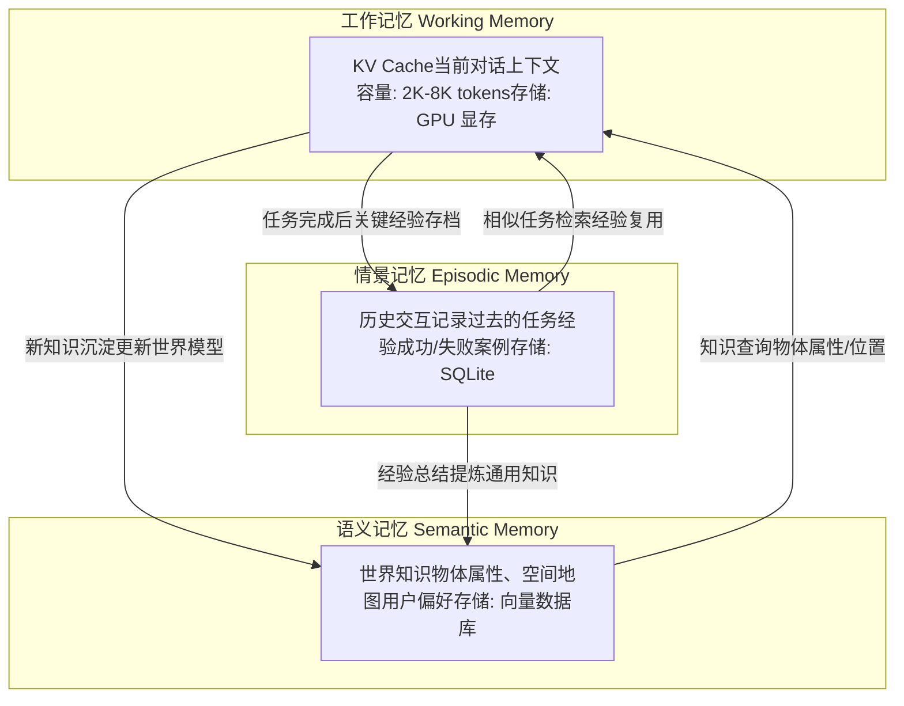

### 15.2 各层记忆实现细节

| 记忆层 | 存储介质 | 数据格式 | 容量 | 检索方式 | 更新频率 |
| :--- | :--- | :--- | :--- | :--- | :--- |
| **工作记忆** | GPU 显存 | KV Cache (FP16/INT8) | 2K-8K tokens | Attention 自动 | 每个 token |
| **情景记忆** | eMMC/SSD (SQLite) | 结构化记录 (JSON) | 10K-100K 条 | SQL 查询 + 向量相似度 | 每个任务 |
| **语义记忆** | eMMC/SSD (向量库) | 嵌入向量 + 元数据 | 10K-1M 向量 | ANN 近似最近邻 | 按需 |

### 15.3 层次化任务规划

复杂任务（如"整理桌面"）需要多层次分解：LLM 进行高层语义规划，中层选择技能序列，底层执行运动控制。

```
# 层次化任务规划示例
# 用户指令: "把桌上的东西整理到柜子里"

# Level 1: LLM 高层规划 (自然语言)
"""
计划:
1. 扫描桌面，识别所有物体
2. 对每个物体:
   a. 判断其类别和归属位置
   b. 抓取物体
   c. 放置到对应柜子隔层
3. 确认桌面已清空
"""

# Level 2: 技能序列 (函数调用)
plan = [
    {"skill": "scan_area", "params": {"region": "table_top"}},
    # 返回: [cup_01, book_02, pen_03, phone_04]
    {"skill": "grasp", "params": {"object_id": "cup_01"}},
    {"skill": "place", "params": {"position": "cabinet_shelf_1"}},
    {"skill": "grasp", "params": {"object_id": "book_02"}},
    {"skill": "place", "params": {"position": "cabinet_shelf_2"}},
    # ... 对每个物体重复
    {"skill": "scan_area", "params": {"region": "table_top"}},
    # 确认: 桌面无物体 → 完成
]

# Level 3: 运动控制 (轨迹点)
# 由 MoveIt2 / 运动规划器生成
# grasp("cup_01") → 50 个关节角度指令 @100Hz
```

### 15.4 端侧向量数据库

语义记忆需要高效的向量检索能力。端侧可用的轻量级方案：

| 方案 | 索引类型 | 内存占用 | 检索速度 (10K 向量) | 持久化 | 适用场景 |
| :--- | :--- | :--- | :--- | :--- | :--- |
| **FAISS (flat)** | 暴力搜索 | 低 | <1ms | 手动序列化 | 小规模 (<10K) |
| **Hnswlib** | HNSW 图索引 | 中 | <0.1ms | 支持 | 中规模 (10K-1M) |
| **SQLite + VSS** | SQLite 向量扩展 | 低 | <5ms | 原生 | 与结构化数据融合 |
| **LanceDB** | Lance 列存 + IVF | 低 (磁盘存储) | <2ms | 原生 | 多模态数据 |

> [!NOTE]
> **记忆管理是长时任务的关键差异化能力**
>
> 短任务（<1 分钟）LLM 的上下文窗口足够支撑。但长时任务（清洁整个房间、持续数小时的巡检）需要跨对话的记忆能力。关键设计原则：1. **选择性记忆**：不是所有信息都值得存储，按"对未来任务有用"的标准过滤。2. **记忆衰减**：旧的、不再准确的信息逐渐降权（物体可能已被移动）。3. **主动回忆**：在任务开始前，主动检索相关历史经验，注入工作记忆。4. **失败记忆优先**：失败经验比成功经验更有学习价值。
